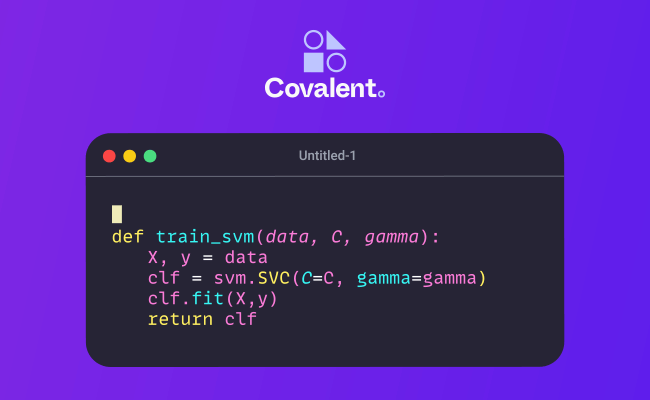

&nbsp;

<div align="center">


[](https://github.com/AgnostiqHQ/covalent/blob/develop/CHANGELOG.md)
[](https://github.com/AgnostiqHQ/covalent)
[](https://github.com/AgnostiqHQ/covalent/actions/workflows/tests.yml)
[](https://covalent.readthedocs.io/en/latest/?badge=latest)
[](https://codecov.io/gh/AgnostiqHQ/covalent)
[](https://www.gnu.org/licenses/agpl-3.0.en.html)

</div>


</img>

## 🤔  What is Covalent?

Covalent is a Pythonic workflow tool for computational scientists, AI/ML software engineers, and anyone who needs to run experiments on limited or expensive computing resources including quantum computers, HPC clusters, GPU arrays, and cloud services.

Covalent enables a researcher to run computation tasks on an advanced hardware platform – such as a quantum computer or serverless HPC cluster – using a single line of code.

## 💭 Why Covalent?

Covalent overcomes computational and operational challenges inherent in AI/ML experimentation.

| **Computational challenges**  | **Operational challenges**    |
|:------------------------------|:------------------------------|
| <ul><li>Advanced compute hardware is expensive, and access is often limited – shared with other researchers, for example.</li><li>You'd like to iterate quickly, but running large models takes time.</li><li>Parallel computation speeds execution, but requires careful attention to data relationships.</li></ul>|<ul><li>Proliferation of models, datasets, and hardware trials.</li><li> Switching between development tools, including notebooks, scripts, and submission queues.</li><li>Tracking, repeating, and sharing results.</li></ul>|

With Covalent, you:
- Assign functions to appropriate resources: Use advanced hardware (quantum computers, HPC clusters) for the heavy lifting and commodity hardware for bookkeeping.
- Test functions on local servers before shipping them to advanced hardware.
- Let Covalent's services analyze functions for data independence and automatically parallelize them.
- Run experiments from a Jupyter notebook (or whatever your preferred interactive Python environment is).
- Track workflows and examine results in a browser-based GUI.

## How Does It Work?

Covalent has three main components:
- A Python module containing an API that you use to build manageable workflows out of new or existing Python functions.
- A set of services that run locally or on a server to dispatch and execute workflow tasks.
- A browser-based UI from which to to manage workflows and view results.

You compose workflows using the Covalent API and submit them to the Covalent server. The server analyzes the workflow to determine dependencies between tasks, then dispatches each task to its specified execution backend. Independent tasks are executed concurrently if resources are available.

The Covalent UI displays the progress of each workflow at the level of individual tasks.

### The Covalent API

The Covalent API is a Python module containing a small collection of classes that implement server-based workflow management. The key elements are two decorators that wrap functions to create managed *tasks* and *workflows*.

The task decorator is called an *electron*. The electron decorator simply turns the function into a dispatchable task.

The workflow decorator is called a *lattice*. The lattice decorator turns a function composed of electrons into a manageable workflow.


### Covalent Services

The Covalent server is a lightweight service that runs on your local machine or a server. A dispatcher analyzes workflows (lattices) and hands its component functions (electrons) off to executors. Each executor is an adaptor to a backend hardware resource. Covalent has a growing list of turn-key executors for common compute backends. If no executor exists yet for your compute platform, Covalent supports writing your own.

### The Covalent GUI

The Covalent user interface runs as a web server on the machine where the Covalent server is running. The GUI dashboard shows a list of dispatched workflows. From there, you can drill down to workflow details or a graphical view of the workflow. You can also view logs, settings, and result sets.

Ready to try it? Go to the [Getting Started](https://covalent.readthedocs.io/en/latest/getting_started/index.html) guide in the documentation.

For a more in-depth description of Covalent's features and how they work, see the [Concepts](https://covalent.readthedocs.io/en/latest/concepts/concepts.html) page in the documentation.


## 📦 Installation

Covalent is developed using Python version 3.8 on Linux and macOS. The easiest way to install Covalent is using the PyPI package manager:

```console
pip install covalent
```

Refer to the [Getting Started](https://covalent.readthedocs.io/en/latest/getting_started/index.html) guide for detailed setup instructions. For a full list of supported platforms, see the Covalent [compatibility matrix](https://covalent.readthedocs.io/en/latest/getting_started/compatibility.html).

## 📚 Documentation

The official documentation includes tips on getting started, high level concepts, tutorials, and the API documentation, and more. To learn more, see the [Covalent documentation](https://covalent.readthedocs.io/en/latest/).

## ✔️  Contributing

To contribute to Covalent, refer to the [Contribution Guidelines](https://github.com/AgnostiqHQ/covalent/blob/master/CONTRIBUTING.md). We use GitHub's [issue tracking](https://github.com/AgnostiqHQ/covalent/issues) to manage known issues, bugs, and pull requests. Get started by forking the develop branch and submitting a pull request with your contributions. Improvements to the documentation, including tutorials and how-to guides, are also welcome from the community. Participation in the Covalent community is governed by the [Code of Conduct](https://github.com/AgnostiqHQ/covalent/blob/master/CODE_OF_CONDUCT.md).

## 📝 What's New?

This latest release includes major improvements to the Covalent GUI. You can now use the GUI to:
- View, download, and search the Covalent logs
- Edit configuration files and modify settings
- Open a command line terminal within the GUI
- View sublattices and their corresponding graphs on the main lattice page
- Screenshot workflows in the GUI
- Filter, sort, and delete dispatches from the dispatch list

And finally, the GUI theme has been modified to improve legibility and clarity.

For a detailed history of changes, see the [Changelog](https://github.com/AgnostiqHQ/covalent/blob/master/CHANGELOG.md).

## ⚓ Citation

Please use the following citation in any publications:

> https://doi.org/10.5281/zenodo.5903364

## 📃 License

Covalent is licensed under the GNU Affero GPL 3.0 License. Covalent may be distributed under other licenses upon request. See the [LICENSE](https://github.com/AgnostiqHQ/covalent/blob/master/LICENSE) file or contact the [support team](mailto:support@agnostiq.ai) for more details.
