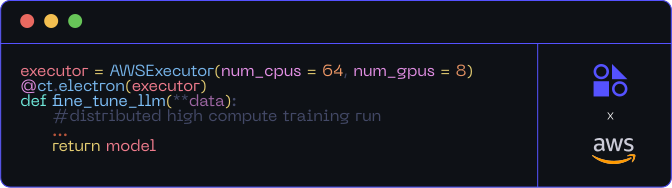
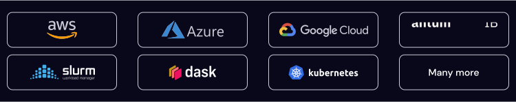
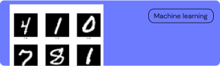
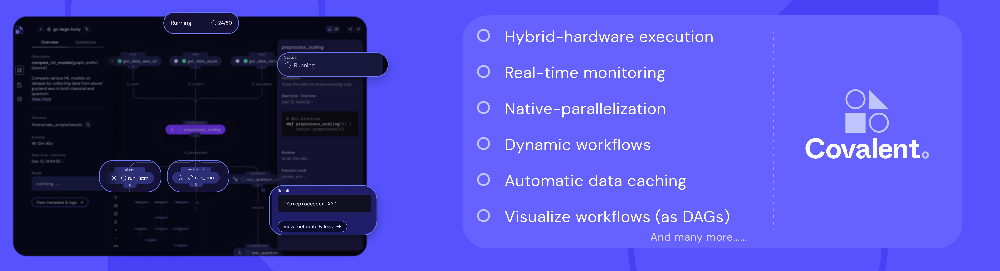

<!-- <div  style="border: 1px solid #43444A; border-radius:4px;   align:center; padding:28px;"> -->

 <div align="center">
  
 </div>

<div align="center" style="margin-top:200px">

[](https://github.com/AgnostiqHQ/covalent/blob/develop/CHANGELOG.md)
[](https://github.com/AgnostiqHQ/covalent)
[](https://github.com/AgnostiqHQ/covalent/actions/workflows/tests.yml)
[](https://covalent.readthedocs.io/en/latest/?badge=latest)
[](https://codecov.io/gh/AgnostiqHQ/covalent)
[](https://www.apache.org/licenses/LICENSE-2.0)

 <div>
 <style>
  div {
    font-size:14px;
    color:pink;
    margin-bottom:20px
  }
   </style>
 Empowering Research on Limited Resources –   Quantum, HPC, GPU, Cloud
 </div>

 <div>  </div>

</div>

 <div align="center">
  
 </div>

 <div style="font-size:14px;margin:0 0 15px 0">
  Covalent is a Pythonic workflow tool for computational scientists, AI/ML software engineers, and anyone who needs to run experiments on limited or expensive computing resources including quantum computers, HPC clusters, GPU arrays, and cloud services.
 </div>

 <div style="font-size:14px; margin-bottom:20px">
  Covalent enables a researcher to run computation tasks on an advanced hardware platform – such as a quantum computer or serverless HPC cluster – using a single line of code.
 </div>

 <div  align="center" style="margin-bottom:20px">
   <video  controls>
   <source src="./doc/source/_static/readme.mp4" type="video/mp4">
  Your browser does not support the video tag.
</video>
 </div>

  <div align="center">
  </img>
 </div>

  <div style="border:1px solid #5552FF;
  border-radius:10px;">
   <div style="display: grid;
    grid-template-columns: repeat(3, 1fr);
    grid-template-rows: repeat(2, 1fr);
    gap: 10px; ">
     <div style="
      display:flex;
      flex-direction:column;
      align-items:center;
      padding:20px;
      text-align:center">
       
       <div style="color:#6D7CFF;
        margin:25px 0 0 0;
        font-size:14px;
        font-weight:500">
        Rapid Deployment
       </div>
       <div style="font-size:14px;
       color:#F9F9F9">Seamlessly transition from experiments to production within Covalent.
       </div>
     </div>
     <div style="
      display:flex;
      flex-direction:column;
      align-items:center;
      padding:20px;
      text-align:center">
       
       <div style="color:#6D7CFF;
        margin:25px 0 0 0;
        font-size:14px;
        font-weight:500">
        API for High Compute
       </div>
       <div style="font-size:14px;
       color:#F9F9F9">Expose functions and solvers from generative AI to quantum using Covalent.
       </div>
     </div>
        <div style="
      display:flex;
      flex-direction:column;
      align-items:center;
      padding:20px;
      text-align:center">
       
       <div style="color:#6D7CFF;
        margin:25px 0 0 0;
        font-size:14px;
        font-weight:500">
        Intuitive Monitoring
       </div>
       <div style="font-size:14px;
       color:#F9F9F9">Oversee workflows across clouds with real-time tracking via a user-friendly UI.
       </div>
     </div>
     <div style="
      display:flex;
      flex-direction:column;
      align-items:center;
      padding:20px;
      text-align:center">
       
       <div style="color:#6D7CFF;
        margin:25px 0 0 0;
        font-size:14px;
        font-weight:500">
        Seamless Orchestration
       </div>
       <div style="font-size:14px;
       color:#F9F9F9">From local prototypes to multi-cloud applications, manage with ease.
       </div>
     </div>
      <div style="
      display:flex;
      flex-direction:column;
      align-items:center;
      padding:20px;
      text-align:center">
       
       <div style="color:#6D7CFF;
        margin:25px 0 0 0;
        font-size:14px;
        font-weight:500">
        Adaptive Workflows
       </div>
       <div style="font-size:14px;
       color:#F9F9F9">Real-time workflow adjustments with dynamic resource allocation.
       </div>
     </div>
      <div style="
      display:flex;
      flex-direction:column;
      align-items:center;
      padding:20px;
      text-align:center">
       
       <div style="color:#6D7CFF;
        margin:25px 0 0 0;
        font-size:14px;
        font-weight:500">
        Rapid Deployment
       </div>
       <div style="font-size:14px;
       color:#F9F9F9">Seamlessly transition from experiments to production within Covalent.
       </div>
     </div>
    </div>
  </div>

 <div style="display:flex;margin:38px 0 20px 0">
  <div style="width:50%; padding:5px">
   <div style="color:#F9F9F9; font-size:24px; font-weight:500;">
    Installation
   </div>
   <div style="color:#CBCBD7; font-size:14px; font-weight:400; margin:21px 0 0 0">
    Covalent is developed using Python version 3.8 on Linux and macOS. The easiest way to install Covalent is using the PyPI package manager:
    </div>
    <div style="margin:20px 0 0 0;width:50%;border-radius:6px;background:#171B21;color:#89BEFA;padding:12px 10px;display:flex;justify-content:space-between"><div>$ pip install covalent</div></div>

  </div>
  <div style="width:50%;  padding:5px">
   <div style="color:#F9F9F9; font-size:24px; font-weight:500;">
    Getting Started
   </div>
   <div style="color:#CBCBD7; font-size:14px; font-weight:400; margin:21px 0 0 0">
    Ready to try it?
    Refer to the  <a href="https://docs.covalent.xyz/docs/get-started/quick-start/">Quick Start</a>  guide for quick setup instructions, or to the <a href="https://docs.covalent.xyz/docs/get-started/first-experiment/">First Experiment</a>  guide for a more thorough approach. For a full list of supported platforms, see the Covalent <a href="https://docs.covalent.xyz/docs/user-documentation/compatibility/">compatibility matrix.</a>
    </div>
     <div style="color:#CBCBD7; font-size:14px; font-weight:400; margin:21px 0 0 0">
    For a more in-depth description of Covalent's features and how they work, see the <a href="https://docs.covalent.xyz/docs/user-documentation/concepts/concepts-index/">Concepts</a> page in the documentation.
    </div>
  </div>
 </div>

  <div style="height:1px; background:#43444A; margin:38px 0 38px 0;"></div>

 <div style="color:#F9F9F9; font-size:24px;">
  Know More
 </div>

 <div style="color:#CBCBD7; font-size:14px; margin:10px 0 0 0">
  For a more in-depth description of Covalent's features and how they work, see the Concepts page in the documentation.
 </div>

 <div style=
 "display:flex;
 margin:20px 0 0 0;">

  <div style="width:25%;height:80px;
  display:flex;
  flex-direction:column;
  align-items:center;">
   
    <a href="https://www.covalent.xyz/what-is-covalent/" style="margin:20px 0 0 0">What is Covalent</a>
  </div>

  <div style="width:25%; height:80px;
  display:flex;
  flex-direction:column;
  align-items:center;
  text-align:center">
   
    <a href="https://www.covalent.xyz/navigating-the-modern-hpc-landscape/" style="margin:20px 0 0 0">Covalent in the era of cloud-HPC</a>
  </div>

  <div style="width:25%; height:80px;
  display:flex;
  flex-direction:column;
  align-items:center;
  text-align:center;">
   
    <a href="https://docs.covalent.xyz/docs/user-documentation/concepts/covalent-basics/" style="margin:20px 0 0 0">Basic Concepts of Covalent</a>
  </div>

  <div style="width:25%; height:80px;
  display:flex;
  flex-direction:column;
  align-items:center;
  text-align:center;">
   
    <a href="https://github.com/AgnostiqHQ/covalent/blob/develop/README.md#how-does-it-work" style="margin:20px 0 0 0">How does Covalent work?</a>
  </div>
 </div>

   <div style="height:1px; background:#43444A; margin:108px 0 38px 0;"></div>

  <div style="color:#F9F9F9; font-size:24px; font-weight:500">
   Tutorials
  </div>

  <div  style="display: grid;
         grid-template-columns: repeat(2, 1fr);
    grid-template-rows: repeat(2, 1fr);
         cursor:pointer;
         padding:0 20px;">
    <div style=" padding: 10px;">
     <div onclick="location.href='www.google.com';" style="border:1px solid #5552FF;
     border-radius:8px;
     padding:20px 10px;
     height:185px;">
     
     <div style="color:#FFF;font-size:16px;">
      MNIST Classifier
     </div>
    </div>
    </div>
     <div style=" padding: 10px;">
     <div style="border:1px solid #5552FF;
     border-radius:8px;
     padding:20px 10px;
     height:185px;">
     
     <div style="color:#FFF;font-size:16px;">
     Dynamic Quantum Chemistry Workflow
     </div>
    </div>
    </div>
    <div style=" padding: 10px;">
     <div style="border:1px solid #5552FF;
     border-radius:8px;
     padding:20px 10px;
     height:185px;">
     
     <div style="color:#FFF;font-size:16px;">
      Dynamic Quantum Chemistry Workflow
     </div>
    </div>
    </div>
     <div style=" padding: 10px;">
     <div style="border:1px solid #5552FF;
     border-radius:8px;
     padding:20px 10px;
     height:185px;">
     
     <div style="color:#FFF;font-size:16px;">
      Building Scalable API Backends with Covalent for LLM and Generative AI..
     </div>
    </div>
    </div>
</div>

  <div style="height:1px; background:#43444A; margin:38px 0 38px 0;"></div>

 <div style="color:#CBCBD7; font-size:14px;
 display:grid; place-items:center">
  <div>Covalent’s serverless HPC architecture allows you to easily scale jobs from your laptop to your HPC/Cloud
  </div>
 </div>

 <div align="center">
  
 </div>


  <div style="height:1px; background:#43444A; margin:38px 0 38px 0;"></div>

   <div style="color:#F9F9F9; font-size:24px; font-weight:500" >Contributing</div>

   <div style="color:#CBCBD7; font-size:14px; font-weight:400">To contribute to Covalent, refer to the <a href="https://github.com/AgnostiqHQ/covalent/blob/master/CONTRIBUTING.md">Contribution Guidelines</a>. We use GitHub's <a href="https://github.com/AgnostiqHQ/covalent/issues">issue tracking</a>. to manage known issues, bugs, and pull requests. Get started by forking the develop branch and submitting a pull request with your contributions. Improvements to the documentation, including tutorials and how-to guides, are also welcome from the community. For more more information on adding tutorials, check the <a href="https://github.com/AgnostiqHQ/covalent/blob/master/doc/TUTORIAL_GUIDELINES.md">Tutorial Guidelines</a> Participation in the Covalent community is governed by the <a href="https://github.com/AgnostiqHQ/covalent/blob/master/CODE_OF_CONDUCT.md">Code of Conduct</a>.</div>

  <div style="height:1px; background:#43444A; margin:38px 0 38px 0;"></div>

  <div style="color:#F9F9F9; font-size:24px; font-weight:500;" >Citation</div>

   <div style="color:#CBCBD7; font-size:14px; font-weight:400">Please use the following citation in any publications</div>

  <div style="color:#CBCBD7; font-size:14px; font-weight:400">
  <a href="https://zenodo.org/record/8369670"> https://doi.org/10.5281/zenodo.5903364
  </div>

  <div style="height:1px; background:#43444A; margin:38px 0 38px 0;"></div>

  <div style="color:#F9F9F9; font-size:24px; font-weight:500" >License</div>

   <div style="color:#CBCBD7; font-size:14px; font-weight:400">Covalent is licensed under the Apache 2.0 License. See the LICENSE file or contact the support team for more details.
For a detailed history of changes and new features, see the Changelog.</div>

<!-- </div> -->

<!-- &nbsp;

<div align="center">


[](https://github.com/AgnostiqHQ/covalent/blob/develop/CHANGELOG.md)
[](https://github.com/AgnostiqHQ/covalent)
[](https://github.com/AgnostiqHQ/covalent/actions/workflows/tests.yml)
[](https://covalent.readthedocs.io/en/latest/?badge=latest)
[](https://codecov.io/gh/AgnostiqHQ/covalent)
[](https://www.apache.org/licenses/LICENSE-2.0)

</div>


## 🤔  What is Covalent?

Covalent is a Pythonic workflow tool for computational scientists, AI/ML software engineers, and anyone who needs to run experiments on limited or expensive computing resources including quantum computers, HPC clusters, GPU arrays, and cloud services.

Covalent enables a researcher to run computation tasks on an advanced hardware platform – such as a quantum computer or serverless HPC cluster – using a single line of code.
<p align="center">
</img>
</p>

## 💭 Why Covalent?

Covalent overcomes computational and operational challenges inherent in AI/ML experimentation.

| **Computational challenges**                                                                                                                                                                                                                                                                                         | **Operational challenges**                                                                                                                                                                                                     |
| :------------------------------------------------------------------------------------------------------------------------------------------------------------------------------------------------------------------------------------------------------------------------------------------------------------------- | :----------------------------------------------------------------------------------------------------------------------------------------------------------------------------------------------------------------------------- |
| <ul><li>Advanced compute hardware is expensive, and access is often limited – shared with other researchers, for example.</li><li>You'd like to iterate quickly, but running large models takes time.</li><li>Parallel computation speeds execution, but requires careful attention to data relationships.</li></ul> | <ul><li>Proliferation of models, datasets, and hardware trials.</li><li> Switching between development tools, including notebooks, scripts, and submission queues.</li><li>Tracking, repeating, and sharing results.</li></ul> |

<p align="center">
</img>
</p>

With Covalent, you:
- Assign functions to appropriate resources: Use advanced hardware (quantum computers, HPC clusters) for the heavy lifting and commodity hardware for bookkeeping.
- Test functions on local servers before shipping them to advanced hardware.
- Let Covalent's services analyze functions for data independence and automatically parallelize them.
- Run experiments from a Jupyter notebook (or whatever your preferred interactive Python environment is).
- Track workflows and examine results in a browser-based GUI.


## 📦 Installation

Covalent is developed using Python version 3.8 on Linux and macOS. The easiest way to install Covalent is using the PyPI package manager:

```console
pip install covalent
```

Refer to the [Quick Start](https://docs.covalent.xyz/docs/get-started/quick-start) guide for quick setup instructions, or to the [First Experiment](https://docs.covalent.xyz/docs/get-started/first-experiment) guide for a more thorough approach. For a full list of supported platforms, see the Covalent [compatibility matrix](https://docs.covalent.xyz/docs/user-documentation/compatibility).

## 🚀 Getting started

Ready to try it? Go to the [First Experiment](https://docs.covalent.xyz/docs/get-started/first-experiment) guide in the documentation.

For a more in-depth description of Covalent's features and how they work, see the [Concepts](https://docs.covalent.xyz/docs/user-documentation/concepts/concepts-index) page in the documentation.

<table border="0">
 <tr>
    <td><b style="font-size:30px">📚 Know more !&nbsp;&nbsp;&nbsp;&nbsp;&nbsp;&nbsp;&nbsp;&nbsp;&nbsp;&nbsp;&nbsp;&nbsp;&nbsp;&nbsp;&nbsp;&nbsp;&nbsp;&nbsp;&nbsp;&nbsp;&nbsp;&nbsp;&nbsp;&nbsp;&nbsp;&nbsp;&nbsp;&nbsp;&nbsp;&nbsp;&nbsp;&nbsp;&nbsp;&nbsp;&nbsp;&nbsp;&nbsp;&nbsp;&nbsp;&nbsp;&nbsp;&nbsp;&nbsp;&nbsp;&nbsp;&nbsp;&nbsp;&nbsp;&nbsp;&nbsp;&nbsp;&nbsp;&nbsp;&nbsp;&nbsp;&nbsp;</b></td>
    <td><b style="font-size:30px">✍️ Tutorials and Examples&nbsp;&nbsp;&nbsp;&nbsp;&nbsp;&nbsp;&nbsp;&nbsp;&nbsp;&nbsp;&nbsp;&nbsp;&nbsp;&nbsp;&nbsp;&nbsp;&nbsp;&nbsp;&nbsp;&nbsp;&nbsp;&nbsp;&nbsp;&nbsp;&nbsp;&nbsp;&nbsp;&nbsp;&nbsp;&nbsp;&nbsp;&nbsp;&nbsp;&nbsp;&nbsp;&nbsp;&nbsp;&nbsp;&nbsp;&nbsp;&nbsp;&nbsp;&nbsp;&nbsp;&nbsp;&nbsp;&nbsp;&nbsp;&nbsp;&nbsp;&nbsp;&nbsp;&nbsp;&nbsp;&nbsp;&nbsp;</b></td>
 </tr>
 <tr>
    <td>

  - [What is Covalent?](https://www.covalent.xyz/what-is-covalent/)
  - [Covalent in the era of cloud-HPC](https://www.covalent.xyz/navigating-the-modern-hpc-landscape/)
  - [Basic Concepts of Covalent](https://docs.covalent.xyz/docs/user-documentation/concepts/covalent-basics)
  - [How does Covalent work?](#how-does-it-work)
</td>
    <td>

  - [Covalent with pytorch for classical machine learning](https://docs.covalent.xyz/docs/user-documentation/tutorials/mnist)
  - [Covalent with pennylane for quantum machine learning](https://docs.covalent.xyz/docs/user-documentation/tutorials/quantumembedding)
  - [Covalent with Qiskit for quantum-SVM](https://docs.covalent.xyz/docs/user-documentation/tutorials/svm/)
  - [Covalent with Dask for scaling Ensemble classification](https://docs.covalent.xyz/docs/user-documentation/tutorials/ensemble/)
  - [Covalent for Deep Neural Network on AWS](https://docs.covalent.xyz/docs/user-documentation/tutorials/dnn_comparison/)
</td>
 </tr>
</table>


## How Does It Work?

Covalent has three main components:

- A Python module containing an API that you use to build manageable workflows out of new or existing Python functions.
- A set of services that run locally or on a server to dispatch and execute workflow tasks.
- A browser-based UI from which to manage workflows and view results.

You compose workflows using the Covalent API by simply adding a single line of python decorator and submit them to the Covalent server. The server analyzes the workflow to determine dependencies between tasks, then dispatches each task to its specified execution backend. Independent tasks are executed concurrently if resources are available.

The Covalent UI displays the progress of each workflow at the level of individual tasks.

<details>
<summary> <h3> The Covalent API </h3> </summary>
The Covalent API is a Python module containing a small collection of classes that implement server-based workflow management. The key elements are two decorators that wrap functions to create managed *tasks* and *workflows*.

The task decorator is called an *electron*. The electron decorator simply turns the function into a dispatchable task.

The workflow decorator is called a *lattice*. The lattice decorator turns a function composed of electrons into a manageable workflow.
</details>
<details>
<summary> <h3>  Covalent Services </h3> </summary>
The Covalent server is a lightweight service that runs on your local machine or a server. A dispatcher analyzes workflows (lattices) and hands its component functions (electrons) off to executors. Each executor is an adaptor to a backend hardware resource. Covalent has a growing list of turn-key executors for common compute backends. If no executor exists yet for your compute platform, Covalent supports writing your own.
</details>
<details>
<summary> <h3>  The Covalent GUI </h3> </summary>
The Covalent user interface runs as a web server on the machine where the Covalent server is running. The GUI dashboard shows a list of dispatched workflows. From there, you can drill down to workflow details or a graphical view of the workflow. You can also view logs, settings, and result sets.
</details>

## 📚 Documentation

The official documentation includes tips on getting started, high-level concepts, tutorials, and the API documentation, and more. To learn more, see the [Covalent documentation](https://docs.covalent.xyz/docs).

## Troubleshooting

Solutions to common issues can be found in the [Troubleshooting Guide](https://docs.covalent.xyz/docs/user-documentation/troubleshooting).

## ✔️  Contributing

To contribute to Covalent, refer to the [Contribution Guidelines](https://github.com/AgnostiqHQ/covalent/blob/master/CONTRIBUTING.md). We use GitHub's [issue tracking](https://github.com/AgnostiqHQ/covalent/issues) to manage known issues, bugs, and pull requests. Get started by forking the develop branch and submitting a pull request with your contributions. Improvements to the documentation, including tutorials and how-to guides, are also welcome from the community. For more more information on adding tutorials, check the [Tutorial Guidelines](https://github.com/AgnostiqHQ/covalent/blob/master/doc/TUTORIAL_GUIDELINES.md) Participation in the Covalent community is governed by the [Code of Conduct](https://github.com/AgnostiqHQ/covalent/blob/master/CODE_OF_CONDUCT.md).

## ⚓ Citation

Please use the following citation in any publications:

> https://doi.org/10.5281/zenodo.5903364

## 📃 License

Covalent is licensed under the Apache 2.0 License. See the [LICENSE](https://github.com/AgnostiqHQ/covalent/blob/master/LICENSE) file or contact the [support team](mailto:support@agnostiq.ai) for more details.


>For a detailed history of changes and new features, see the [Changelog](https://github.com/AgnostiqHQ/covalent/blob/master/CHANGELOG.md).
