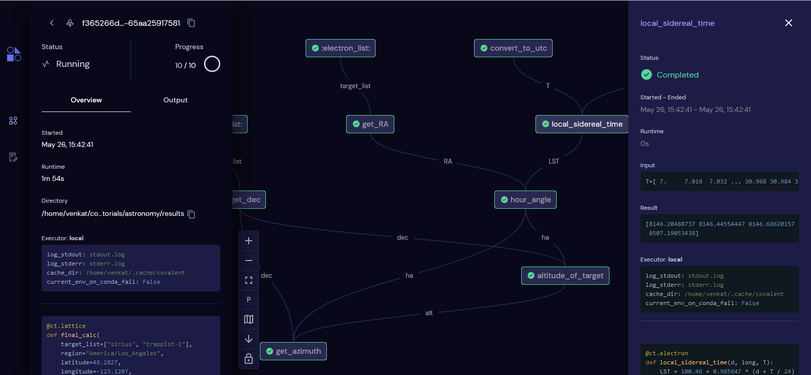

&nbsp;

<div align="center">


[](https://github.com/AgnostiqHQ/covalent)
[](https://github.com/AgnostiqHQ/covalent)
[](https://github.com/AgnostiqHQ/covalent/actions/workflows/tests.yml)
[](https://covalent.readthedocs.io/en/latest/?badge=latest)
[](https://codecov.io/gh/AgnostiqHQ/covalent)
[](https://www.gnu.org/licenses/agpl-3.0.en.html)

</div>

## 🤔 What is Covalent?

Covalent is a Pythonic workflow tool used to execute HPC and quantum tasks in heterogenous environments. Computational scientists and engineers use Covalent to...

- rapidly iterate prototypes and exploratory research models
- automate, manage, and share reproducible experiments
- visualize data and task dependencies in an interactive user interface
- run code in heterogenous compute environments, including in hybrid-cloud and hybrid-quantum configurations
- understand where time and money is spent across a project

Covalent may be deployed locally or on a remote server. Covalent is rapidly expanding to include support for a variety of cloud interfaces, including HPC infrastructure tools developed by major cloud providers and emerging quantum APIs. It has never been easier to deploy your code on the world's most advanced computing hardware with Covalent.

Read more in the official [documentation](https://covalent.readthedocs.io/en/latest/).

## ✨ Features

- **Purely Pythonic**: No need to learn any new syntax or mess around with YAML. Construct your complex workflow programmatically with native Python functions. By just adding one-line decorators to your functions, you can supercharge your experiments.
- **Native parallelization**: Covalent natively parallelizes mutually independent parts of your workflow.
- **Monitor with UI**: Covalent provides an intuitive and aesthetically beautiful browser-based user interface to monitor and manage your workflows.
- **Abstracted dataflow**: No need to worry about the details of the underlying data structures. Covalent takes care of data dependencies in the background while you concentrate on understanding the big picture.
- **Result management**: Covalent manages the results of your workflows. Whenever you need to modify parts of your workflow, from inputs to components, Covalent stores and saves the run of every experiment in a reproducible format.
- **Little-to-no overhead**: Covalent is designed to be as lightweight as possible and is optimized for the most common use cases. Covalent's overhead is less than 0.1% of the total runtime for typical high compute applications and often has a constant overhead of ~ 10-100μs -- and this is constantly being optimized.
- **Interactive**: Unlike other workflow tools, Covalent is interactive. You can view, modify, and re-submit workflows directly within a Jupyter notebook.

<div align="center">


</div>

For a more in-depth description of Covalent's features and how they work, refer to the [Concepts](https://covalent.readthedocs.io/en/latest/concepts/concepts.html) page in the documentation.

## 📖 Example

Begin by starting the Covalent servers:

```console
covalent start
```

Navigate to the user interface at `http://localhost:48008` to monitor workflow execution progress.

In your Python code, it's as simple as adding a few decorators!  Consider the following example which uses a support vector machine (SVM) to classify types of iris flowers.

<table style='margin-left: auto; margin-right: auto; word-wrap: break-word;'>
<tr>
<th style='text-align:center;'>Without Covalent</th>
<th style='text-align:center;'>With Covalent</th>
</tr>

<tr>
<td valign="top">

``` python
from numpy.random import permutation
from sklearn import svm, datasets

def load_data():
    iris = datasets.load_iris()
    perm = permutation(iris.target.size)
    iris.data = iris.data[perm]
    iris.target = iris.target[perm]
    return iris.data, iris.target

def train_svm(data, C, gamma):
    X, y = data
    clf = svm.SVC(C=C, gamma=gamma)
    clf.fit(X[90:], y[90:])
    return clf

def score_svm(data, clf):
    X_test, y_test = data
    return clf.score(
    	X_test[:90],
	y_test[:90]
    )

def run_experiment(C=1.0, gamma=0.7):
    data = load_data()
    clf = train_svm(
    	data=data,
	C=C,
	gamma=gamma
    )
    score = score_svm(data=data, clf=clf)
    return score

result=run_experiment(C=1.0, gamma=0.7)
```
</td>
<td valign="top">


```python
from numpy.random import permutation
from sklearn import svm, datasets
import covalent as ct

@ct.electron
def load_data():
    iris = datasets.load_iris()
    perm = permutation(iris.target.size)
    iris.data = iris.data[perm]
    iris.target = iris.target[perm]
    return iris.data, iris.target

@ct.electron
def train_svm(data, C, gamma):
    X, y = data
    clf = svm.SVC(C=C, gamma=gamma)
    clf.fit(X[90:], y[90:])
    return clf

@ct.electron
def score_svm(data, clf):
    X_test, y_test = data
    return clf.score(
    	X_test[:90],
	y_test[:90]
    )

@ct.lattice
def run_experiment(C=1.0, gamma=0.7):
    data = load_data()
    clf = train_svm(
    	data=data,
	C=C,
	gamma=gamma
    )
    score = score_svm(
    	data=data,
	clf=clf
    )
    return score

dispatchable_func = ct.dispatch(run_experiment)

dispatch_id = dispatchable_func(
    	C=1.0,
    	gamma=0.7
    )
result = ct.get_result(dispatch_id)
```
</td>
</tr>
<tr>
<td valign="top">

```python
>>> print(result)
0.988888888
```
</td>
<td valign="top">

```python
>>> print(f"""
... status     = {result.status}
... input      = {result.inputs}
... result     = {result.result}
... """)
status     = Status(STATUS='COMPLETED')
input      = {'C': 1.0, 'gamma': 0.7}
result     = 0.988888888
```
</td>
</tr>
</table>


For more examples, please refer to the [Covalent tutorials](https://covalent.readthedocs.io/en/latest/tutorials/tutorials.html).

## 📦 Installation

Covalent is developed using Python version 3.8 on Linux and macOS. The easiest way to install Covalent is using the PyPI package manager:

```console
pip install cova
```

Refer to the [Getting Started](https://covalent.readthedocs.io/en/latest/getting_started/index.html) guide for more details on setting up. For a full list of supported platforms, consult the Covalent [compatibility matrix](https://covalent.readthedocs.io/en/latest/getting_started/compatibility.html). Read [this guide](https://covalent.readthedocs.io/en/latest/getting_started/#migration-guide-from-0-3x) if you are migrating from `cova` version `0.3x`.

## 🔧 How it Works

Users compose workflows using the Covalent SDK and submit them to the Covalent server. Upon receiving a workflow, the server analyzes the dependencies between tasks and dispatches each task to its specified execution backend. Independent tasks may be executed concurrently. The Covalent UI displays the execution progress of each workflow at the level of individual tasks.

<div align="center">


</div>

## 📚 Documentation

The official documentation includes tips on getting started, some high level concepts, a handful of tutorials, and the API documentation. To learn more, please refer to the [Covalent documentation](https://covalent.readthedocs.io/en/latest/).

## ✔️  Contributing

To contribute to Covalent, refer to the [Contribution Guidelines](https://github.com/AgnostiqHQ/covalent/blob/master/CONTRIBUTING.md). We use GitHub's [issue tracking](https://github.com/AgnostiqHQ/covalent/issues) to manage known issues, bugs, and pull requests. Get started by forking the develop branch and submitting a pull request with your contributions. Improvements to the documentation, including tutorials and how-to guides, are also welcome from the community. Participation in the Covalent community is governed by the [Code of Conduct](https://github.com/AgnostiqHQ/covalent/blob/master/CODE_OF_CONDUCT.md).

## 📝 Release Notes

### Release 0.106.0 (current release)

The latest release of Covalent OS is now out and available for community use. It comes with new additions, including support for local execution of workflows with a [Dask](https://docs.dask.org/en/latest/) plugin, remote execution of workflows with Simple Linux Utility for Resource Management ([Slurm](https://slurm.schedmd.com/documentation.html)) and SSH plugins, and new updates to the user interface. A summary of the feature releases is provided below:

- Support for workflow execution on a local Dask cluster is now available in Covalent
- Support for workflow execution on remote machines with SSH access and Slurm
- The UI now includes a revamp in the color, theme, workflow graph and other visual elements

Check out the summary table for the list of added features and read the subsections to find out more:

| Feature | Summary |
| --- | --- |
| Dask plugin | plugin that interfaces Covalent with a Dask Cluster |
| SSH plugin | plugin that interfaces Covalent with other machines accessible to the user over SSH |
| Slurm plugin | plugin that interfaces Covalent with HPC systems managed by Slurm |

#### 💻 Execution on a Local Dask Cluster

In previous releases, Covalent workflows could be dispatched for execution on the host machine. Starting with release v104.0, a Dask executor plugin interfaces with a running [Dask Cluster](https://docs.dask.org/en/latest/deploying.html) allowing users to deploy tasks to the cluster by providing the scheduler address to the executor object. A user can customize the execution of electrons within a workflow by specifying the scheduler address of the local Dask cluster as the electron’s executor

In order to dispatch workflows to a Dask cluster, the user has to install the Dask plugin using pip:

```bash
pip install covalent-dask-plugin
```

After installing the Dask plugin, the following command should be run to start a Dask cluster with Python and retrieve the scheduler address:

```python
from dask.distributed import LocalCluster

cluster = LocalCluster()
print(cluster.scheduler_address)
```

The local Dask cluster’s scheduler address looks like `tcp://127.0.0.1:59183`. Note that the Dask cluster does not persist when the process terminates.

This cluster can be used with Covalent by providing the scheduler address:

```python
from covalent.executor import DaskExecutor

dask_executor = DaskExecutor(scheduler_address=cluster.scheduler_address)

@ct.electron(executor=dask_executor)
def my_custom_task(x, y):
    return x + y
```

A workflow containing the electron can be constructed and dispatched as usual. This will execute the workflow’s electron on the local Dask cluster:

```python
@ct.lattice
def workflow(y,z):
	value = my_custom_task(y, z)
	return value

dispatch_id = ct.dispatch(workflow)(1, 2)
```

After executing the electron, the results of the workflow can be retrieved as usual:

```python
result = ct.get_result(dispatch_id=dispatch_id)
```

*Note: Instead of having independent executors for each electrons, if you are using the same executor for the entire workflow, executors can be defined at the lattice level with electrons simply having `@ct.electron` decorator. For example,*

```python
*@ct.lattice(executor=dask_executor)
def workflow(y,z):
	....*
```

 *will cascade make `dask_executor` the default for all electrons inside `workflow`*

#### 🔌 [Execution on a remote machine via SSH](https://github.com/AgnostiqHQ/covalent-ssh-plugin)

In this release, Covalent provides support for dispatching workflows to remote machines. The SSH executor plugin interfaces Covalent with other machines accessible to the user over SSH. Some common use cases for this plugin are to distribute tasks to one or more compute backends which are not controlled by a cluster management system, such as computers on a LAN, or even a collection of small-form-factor Linux-based devices such as Raspberry Pis, NVIDIA Jetsons, or Xeon Phi co-processors.

In order to use the SSH executor plugin, the user has to install the plugin with pip:

```bash
pip install covalent-ssh-plugin
```

The following shows an example of how a user might modify their Covalent configuration to support this plugin:

```bash
[executors.ssh]
username = "user"
hostname = "host.hostname.org"
remote_dir = "/home/user/.cache/covalent"
ssh_key_file = "/home/user/.ssh/id_rsa"
```

This setup assumes the user has the ability to connect to the remote machine using `ssh -i /home/user/.ssh/id_rsa user@host.hostname.org` and has write-permissions on the remote directory `/home/user/.cache/covalent` (if it exists) or the closest parent directory (if it does not).

The user can decorate an electron within a workflow by passing “ssh” as the electron’s executor argument

```python
import covalent as ct

@ct.electron(executor="ssh")
def my_task():
    import socket
    return socket.gethostname()
```

Alternatively, the user can declare a class object to customize behavior within particular tasks::

```python
from covalent.executor import SSHExecutor

executor = SSHExecutor(
    username="user",
    hostname="host2.hostname.org",
    remote_dir="/tmp/covalent",
    ssh_key_file="/home/user/.ssh/host2/id_rsa",
)

@ct.electron(executor=executor)
def my_custom_task(x, y):
    return x + y

```

The user may now execute the electron on the remote machine.

#### 🖥️ [Execution on a Slurm machine](https://github.com/AgnostiqHQ/covalent-slurm-plugin)

This release also includes a plugin that interfaces Covalent with HPC systems managed by [Slurm](https://slurm.schedmd.com/documentation.html). In order for workflows to be deployable, users must have SSH access to the Slurm login node, writable storage space on the remote filesystem, and permissions to submit jobs to Slurm.

In order to use the Slurm plugin, simply the plugin install with pip:

```bash
pip install covalent-slurm-plugin
```

The following snippet illustrates how a user might modify their Covalent configuration to support Slurm:

```bash
[executors.slurm]
username = "user"
address = "login.cluster.org"
ssh_key_file = "/home/user/.ssh/id_rsa"
remote_workdir = "/scratch/user"
cache_dir = "/tmp/covalent"
conda_env = ""

[executors.slurm.options]
partition = "general"
cpus-per-task = 4
gres = "gpu:v100:4"
exclusive = ""
parsable = ""
```

The first block describes default connection parameters for a user who is able to successfully connect to the Slurm login node using `ssh -i /home/user/.ssh/id_rsa user@login.cluster.org`. The second block describes default parameters which are used to construct a Slurm submit script. In this example, the submit script would contain the following preamble:

```bash
#!/bin/bash
#SBATCH --partition=general
#SBATCH --cpus-per-task=4
#SBATCH --gres=gpu:v100:4
#SBATCH --exclusive
#SBATCH --parsable
```

The user can decorate an electron in a workflow using the above settings:

```python
import covalent as ct

@ct.electron(executor="slurm")
def my_task(x, y):
    return x + y
```

Alternatively, by using a class object to customize behavior scoped to specific tasks:

```python
from covalent.executor import SlurmExecutor

executor = SlurmExecutor(
    remote_workdir="/scratch/user/experiment1",
    conda_env="covalent",
    options={
        "partition": "compute",
	"cpus-per-task": 8
    }
)

@ct.electron(executor=executor)
def my_custom_task(x, y):
    return x + y
```

#### ✨ A New User Interface

Covalent’s UI has been revamped with more awesome themes and elements that displays a more elegant transport graph for running/completed workflows. The transport graph for a sample workflow looks like the image below:



#### 🩹 Known issues

- Performance can degrade when running workflows with large numbers of electrons. We recommend keeping the number of electrons under 50 for now. The underlying inefficiencies will be addressed in a future release.
- The Covalent server sporadically returns HTTP 500 Internal Server Error when submitting a workflow, even while other workflows can be submitted. The underlying causes are being investigated. A temporary workaround is to restart the server (please wait until ongoing workflows are completed).
- `covalent status` [sometimes incorrectly reports that the Covalent server is running](https://github.com/AgnostiqHQ/covalent/issues/547). The underlying bug has been identified and will be patched in a future release.

See the Issues page for others.

## 🫶 **Contributors**

This release would not have been possible without the hard work of the team at Agnostiq and our contributors:

Casey Jao, Okechukwu Ochia, Oktay Goktas, Sankalp Sanand, Santosh Radha, Venkat Bala


Release notes are available in the [Changelog](https://github.com/AgnostiqHQ/covalent/blob/master/CHANGELOG.md).

## 💥 Known Issues

- Performance currently scales poorly with the number of electrons. We recommend keeping the number of electrons under 50 for now. The underlying inefficiencies will be addressed in a future release.
- The Covalent server sporadically returns HTTP 500 Internal Server Error when submitting a workflow, even while other workflows can be submitted. The underlying causes are being investigated. A temporary workaround is to restart the server (but wait until ongoing workflows are completed).
- `covalent status` sometimes incorrectly reports that the Covalent server is running. The underlying bug has been identified and will be patched in a future release.


## ⚓ Citation

Please use the following citation in any publications:

> W. J. Cunningham, S. K. Radha, F. Hasan, J. Kanem, S. W. Neagle, and S. Sanand.
> *Covalent.* Zenodo, 2022. https://doi.org/10.5281/zenodo.5903364

## 📃 License

Covalent is licensed under the GNU Affero GPL 3.0 License. Covalent may be distributed under other licenses upon request. See the [LICENSE](https://github.com/AgnostiqHQ/covalent/blob/master/LICENSE) file or contact the [support team](mailto:support@agnostiq.ai) for more details.
