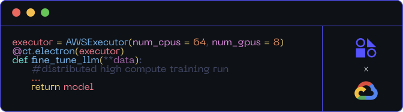

 
  
 

 

   

 

  
 

Covalent is a Pythonic workflow tool for computational scientists, AI/ML software engineers, and anyone who needs to run experiments on limited or expensive computing resources including quantum computers, HPC clusters, GPU arrays, and cloud services.

Covalent enables a researcher to run computation tasks on an advanced hardware platform – such as a quantum computer or serverless HPC cluster – using a single line of code.

  

   <video  controls>
   <source src="./doc/readme-assets/readme.mp4" type="video/mp4">
  Your browser does not support the video tag.
</video> 
 

 

  </img>
 

  

  </img>
 

  

Know More

For a more in-depth description of Covalent's features and how they work, see the Concepts page in the documentation.

  

Covalent’s serverless HPC architecture allows you to easily scale jobs from your laptop to your HPC/Cloud

 

  
 

 

 

 <!-- 
To contribute to Covalent, refer to the <a href="https://github.com/AgnostiqHQ/covalent/blob/master/CONTRIBUTING.md">Contribution Guidelines</a>. We use GitHub's <a href="https://github.com/AgnostiqHQ/covalent/issues">issue tracking</a>. to manage known issues, bugs, and pull requests. Get started by forking the develop branch and submitting a pull request with your contributions. Improvements to the documentation, including tutorials and how-to guides, are also welcome from the community. For more more information on adding tutorials, check the <a href="https://github.com/AgnostiqHQ/covalent/blob/master/doc/TUTORIAL_GUIDELINES.md">Tutorial Guidelines</a> Participation in the Covalent community is governed by the <a href="https://github.com/AgnostiqHQ/covalent/blob/master/CODE_OF_CONDUCT.md">Code of Conduct</a>.
 -->

  

 <!-- 
Citation

   
Please use the following citation in any publications

  

  <a href="https://zenodo.org/record/8369670"> https://doi.org/10.5281/zenodo.5903364
  
 -->

  

   

<!-- 

  

 -->