<div align="center">
  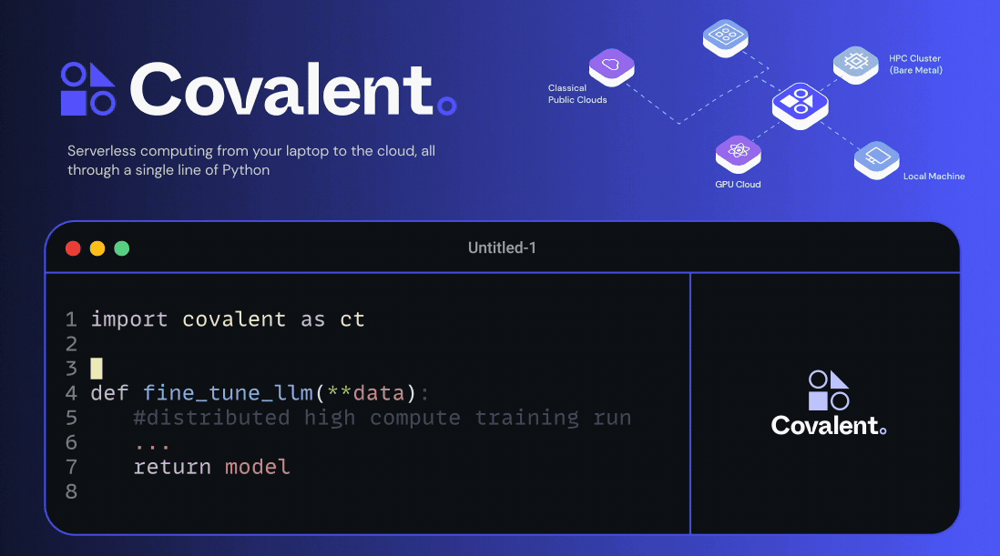
</div>
</br>
<div align="center">

[](https://github.com/AgnostiqHQ/covalent/blob/develop/CHANGELOG.md)
[](#)
[](https://github.com/AgnostiqHQ/covalent/actions/workflows/tests.yml)
[](https://docs.covalent.xyz/docs/)
[](https://codecov.io/gh/AgnostiqHQ/covalent)
[](https://www.apache.org/licenses/LICENSE-2.0)</div>

<div align="center"><b>Run AI, ML, and Scientific Research Code on Any Cloud or On-Prem Cluster with a Single Line</b></div>
</br>
 <div align="center">
<a href="https://docs.covalent.xyz/docs/get-started/quick-start"></a>
&nbsp&nbsp
<a href="https://docs.covalent.xyz/docs/"></a>
&nbsp&nbsp
<a href="https://docs.covalent.xyz/docs/user-documentation/tutorials/"></a>
&nbsp&nbsp
<a href="https://covalentworkflows.slack.com/join/shared_invite/zt-1ew7f2rfk-dKSXVQmRniu5mQW4Z_eQuw#/shared-invite/email"></a>
</div>
</br>


```bash
pip install covalent --upgrade
```
Check our [Quick Start Guide](https://docs.covalent.xyz/docs/get-started/quick-start/) for setup instructions or dive into your [First Experiment](https://docs.covalent.xyz/docs/get-started/first-experiment/). Learn more on the [Concepts](https://docs.covalent.xyz/docs/user-documentation/concepts/concepts-index/).

### What is Covalent?

Covalent is a Python library for AI/ML engineers, developers, and researchers. It provides a straightforward approach to running compute jobs, like LLMs, generative AI, and scientific research, on various cloud platforms or on-prem clusters.


<details>
<summary><i><b>Run Code Anywhere:</b> Execute Python functions in any cloud or on-prem cluster by changing just a single line of code.</i></summary>
<br>

It is as simple as swapping the decorator with our executor plugins. Choose from [existing plugins](https://docs.covalent.xyz/docs/plugin) or [create custom ones](https://github.com/AgnostiqHQ/covalent-executor-template) for tailored interactions with any infrastructure.
<div align="center">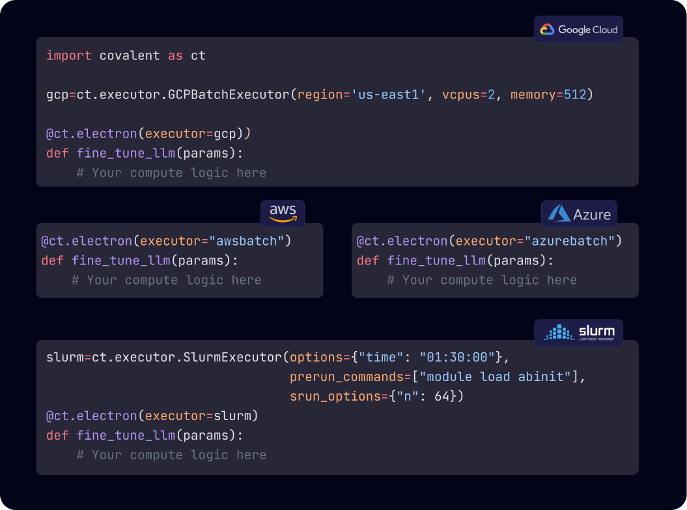</div>
</details>

<details>
<summary><i><b>Abstraction of Infrastructure Management:</b> Abstract the complexities of cloud consoles, terraform, or IaC in the background.</i> </summary>
<br>
<div align="center">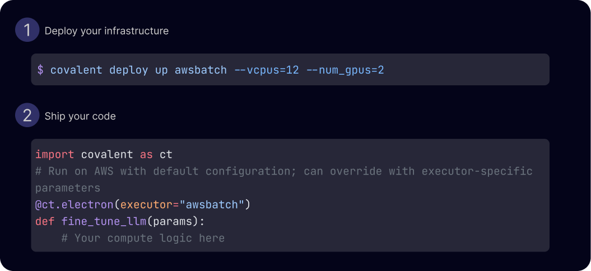</div>
</details>

<details>
<summary><i><b>Serverless Infrastructure:</b> Automatically converts any infrastructure, including on-prem SLURM clusters or cloud compute, into a serverless setup.</i></summary>
<br>
<div align="center">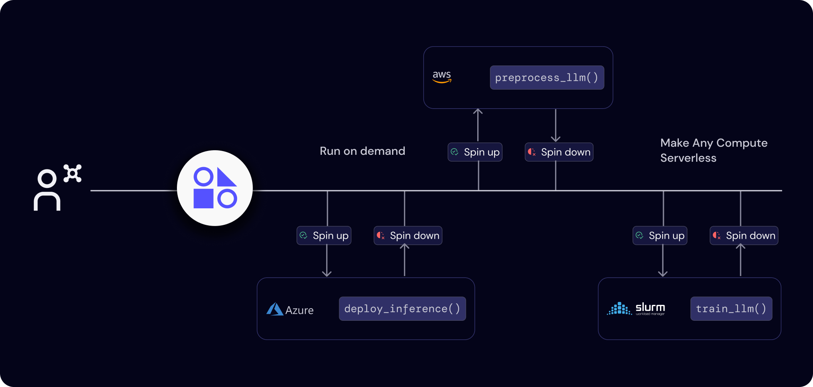</div>
</details>


If you find Covalent useful or interesting, feel free to give us a ⭐ on GitHub! Your support helps us to continue developing and improving this framework.


</br>
<table border="0">
 <tr>
    <td><b style="font-size:18px; padding-right: 20px;">For AI/ML Practitioners and Developers</b></td>
    <td><b style="font-size:18px; padding-left: 20px;">For Researchers</b></td>
 </tr>
 <tr>
    <td valign="top">
        <ul style="font-size:16px; list-style-type: circle; padding-right: 20px;">
            <li><b>Robust Compute Backend:</b> Ideal as a backend compute framework for AI/ML applications, Large Language Models (LLMs), Generative AI, and more.</li>
            <li><b>Cloud-Agnostic Execution:</b> Execute high-compute tasks seamlessly across different cloud environments.</li>
            <li><b>Infrastructure Abstraction:</b> Directly use computing resources while keeping your business code independent from the infrastructure/resource definitions.</li>
        </ul>
    </td>
    <td valign="top">
        <ul style="font-size:16px; list-style-type: circle; padding-left: 20px;">
            <li><b>Local-Like Access:</b> Effortlessly connect to compute resources from your laptop, eliminating the need for SSH or complex scripts.</li>
            <li><b>Unified Interface Across Environments:</b> Consistent experience with on-prem HPC clusters and cloud platforms like SLURM, PBS, LSF, AWS, GCP, Azure.</li>
            <li><b>Real-Time Monitoring Monitoring:</b> <a href="http://demo.covalent.xyz/"> User-friendly UI </a> for real-time monitoring, enabling cost-effective and iterative R&D.</li>
        </ul>
    </td>
 </tr>
</table>

### Out-of-box observability - [Try out the demo](http://demo.covalent.xyz/)

If you find Covalent useful or interesting, feel free to give us a ⭐ on GitHub! Your support helps us to continue developing and improving this framework.

<!-- https://github.com/AgnostiqHQ/covalent/assets/116076079/87268cc8-4d53-4053-b739-1d03f2eafa7c -->
<div align="center">
  
</div>


### Explore Covalent Through Examples

Jump right into practical examples to see Covalent in action. These tutorials cover a range of applications, giving you a hands-on experience:

<div align="center">
  <a href="https://docs.covalent.xyz/docs/user-documentation/tutorials/generativeai/">
    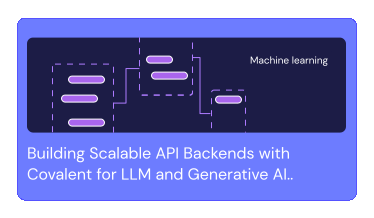
  </a>
  <a href="https://docs.covalent.xyz/docs/user-documentation/tutorials/mnist/">
    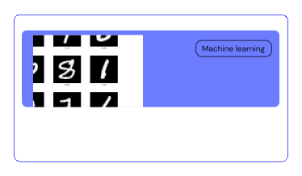
  </a>
  <a href="https://docs.covalent.xyz/docs/user-documentation/tutorials/quantumchemistry/">
    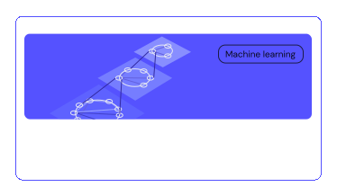
  </a>
</div>

### Explore Our Extensive Plugin Ecosystem

Covalent integrates seamlessly with a variety of platforms. Discover our range of plugins to enhance your Covalent experience:

</br>
  <div align="center">
<a href="https://docs.covalent.xyz/docs/user-documentation/api-reference/executors/aws-plugins/"></a>
<a href="https://docs.covalent.xyz/docs/user-documentation/api-reference/executors/azurebatch/"></a>
<a href="https://docs.covalent.xyz/docs/user-documentation/api-reference/executors/gcp/"></a>
<a href="https://docs.covalent.xyz/docs"></a>
</div>
<div align="center"><a href="https://docs.covalent.xyz/docs/user-documentation/api-reference/executors/slurm/"></a>
<a href="https://docs.covalent.xyz/docs/user-documentation/api-reference/executors/dask/"></a>
<a href="https://docs.covalent.xyz/docs/user-documentation/api-reference/executors/ibmq/"></a>
<a href="https://docs.covalent.xyz/docs/plugin"></a></div>

### Key Features at a Glance

Get a quick overview of what Covalent offers. Our infographic summarizes the main features, providing you with a snapshot of our capabilities:

</br>
  <div align="center">
  <a href="https://docs.covalent.xyz/docs/">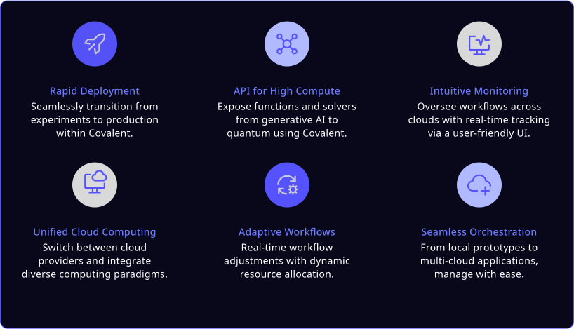</img></a>
 </div>

</br>

---

### Know More About Covalent

For a more in-depth description of Covalent's features and how they work, see the [Concepts](https://docs.covalent.xyz/docs/user-documentation/concepts/concepts-index/) page in the documentation.

</br>

<div align="center">
<a href="https://www.covalent.xyz/what-is-covalent/">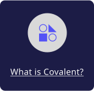</a>
<a href="https://www.covalent.xyz/navigating-the-modern-hpc-landscape/">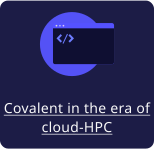</a>
<a href="https://docs.covalent.xyz/docs/user-documentation/concepts/covalent-basics/">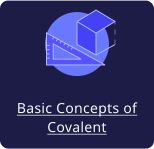</a>
<a href="https://docs.covalent.xyz/docs/user-documentation/concepts/covalent-arch/covalent-architecture">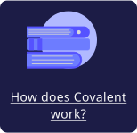</a>
</div>

<div >

### Installation

Covalent is developed using Python on Linux and macOS. The easiest way to install Covalent is by using the PyPI package manager.

```
pip install covalent --upgrade
```

For other methods of installation, please [check the docs.](https://docs.covalent.xyz/docs/get-started/install/)

**Deployments**

<div>
Covalent offers flexible deployment options, from Docker image/AMIs for self-hosting to pip package for local installations, accommodating various use cases
</div>

</br>

<div align="center">

<a href="https://docs.covalent.xyz/docs/user-documentation/server-deployment"></a>
<a href="https://docs.covalent.xyz/docs/user-documentation/sd-docker"></a>
<a href="https://docs.covalent.xyz/docs/user-documentation/sd-systemd"></a>

</div>

</br>
</div>

### Contributing

 <!-- <div></div> -->

To contribute to Covalent, refer to the [Contribution Guidelines](https://github.com/AgnostiqHQ/covalent/blob/master/CONTRIBUTING.md). We use GitHub's [issue tracking](https://github.com/AgnostiqHQ/covalent/issues) to manage known issues, bugs, and pull requests. Get started by forking the `develop` branch and submitting a pull request with your contributions. Improvements to the documentation, including tutorials and how-to guides, are also welcome from the community. For more information on adding tutorials, check the [Tutorial Guidelines](https://github.com/AgnostiqHQ/covalent/blob/master/doc/TUTORIAL_GUIDELINES.md). Participation in the Covalent community is governed by the [Code of Conduct](https://github.com/AgnostiqHQ/covalent/blob/master/CODE_OF_CONDUCT.md).

### Citation

Please use the following citation in any publications.

[https://doi.org/10.5281/zenodo.5903364](https://zenodo.org/records/8369670)

### License

Covalent is licensed under the Apache 2.0 License. See the [LICENSE](https://github.com/AgnostiqHQ/covalent/blob/master/LICENSE) file or contact the [support team](mailto:support@aqnostic.ai) for more details.

For a detailed history of changes and new features, see the [Changelog](https://github.com/AgnostiqHQ/covalent/blob/master/CHANGELOG.md).
