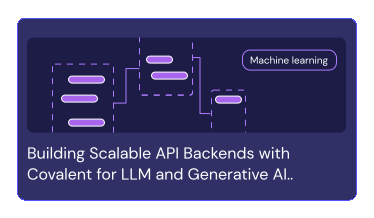

<div align="center"> 
  
 </div>
</br>
<div align="center">

[](https://github.com/AgnostiqHQ/covalent/blob/develop/CHANGELOG.md)
[](#)
[](https://github.com/AgnostiqHQ/covalent/actions/workflows/tests.yml)
[](https://docs.covalent.xyz/docs/)
[](https://codecov.io/gh/AgnostiqHQ/covalent)
[](https://www.apache.org/licenses/LICENSE-2.0)</div>

<div align="center">Serverless high-performance computing from your laptop to the cloud, all through a single line of Python</div>
</br>
 <div align="center"> 
<a href="https://docs.covalent.xyz/docs/get-started/quick-start"></a> 
&nbsp&nbsp
<a href="https://docs.covalent.xyz/docs/"></a> 
&nbsp&nbsp
<a href="https://docs.covalent.xyz/docs/user-documentation/tutorials/"></a> 
&nbsp&nbsp
<a href="https://covalentworkflows.slack.com/join/shared_invite/zt-1ew7f2rfk-dKSXVQmRniu5mQW4Z_eQuw#/shared-invite/email"></a>
</div>
</br>
 <div align="center">
  
 </div>
</br>
Covalent is a Pythonic framework designed for AI/ML practitioners, computational scientists, and developers, offering abstracted and easy access to a wide array of high-performance computing resources. It facilitates integration with advanced computing platforms, from quantum computers and HPC clusters to GPU arrays and diverse cloud services, providing serverless access to all of them.

</br>

- **For AI/ML Practitioners and Developers:** Covalent serves as a robust compute backend framework, enabling seamless, cloud-agnostic execution of high-compute tasks. Ideal solution for powering AI/ML applications, Large Language Models (LLMs), Generative AI, and other compute-intensive processes, all without the hassle of infrastructure management.

- **For Researchers:** Covalent empowers researchers to directly tap into advanced computing resources from their laptops or Jupyter notebooks. Whether the need is for cloud platforms or HPC systems like SLURM, PBS, or LSF, [Covalent plugins](https://docs.covalent.xyz/docs/plugin) offers instant connectivity and unparalleled ease of use.

Check out the [quick start guide](https://docs.covalent.xyz/docs/get-started/quick-start/) to get started.

https://github.com/AgnostiqHQ/covalent/assets/116076079/87268cc8-4d53-4053-b739-1d03f2eafa7c

</br>
  <div align="center"> 
<a href="https://docs.covalent.xyz/docs/user-documentation/api-reference/executors/aws-plugins/"></a> 
<a href="https://docs.covalent.xyz/docs/user-documentation/api-reference/executors/azurebatch/"></a> 
<a href="https://docs.covalent.xyz/docs/user-documentation/api-reference/executors/gcp/"></a> 
<a href="https://docs.covalent.xyz/docs"></a> 
</div>
<div align="center"><a href="https://docs.covalent.xyz/docs/user-documentation/api-reference/executors/slurm/"></a> 
<a href="https://docs.covalent.xyz/docs/user-documentation/api-reference/executors/dask/"></a> 
<a href="https://docs.covalent.xyz/docs/user-documentation/api-reference/executors/ibmq/"></a>
<a href="https://docs.covalent.xyz/docs/plugin"></a></div>

</br>
  <div align="center">
  </img>
 </div>
 
</br>

### Installation

Covalent is developed using Python version 3.8 on Linux and macOS. The easiest way to install Covalent is using the PyPI package manager.

```
pip install covalent --upgrade
```

For other methods of installation please [check the docs.](https://docs.covalent.xyz/docs/get-started/install/)

</br>

### Getting Started

Ready to try it?\
Refer to the [Quick Start](https://docs.covalent.xyz/docs/get-started/quick-start/) guide for quick setup instructions, or to the [First Experiment](https://docs.covalent.xyz/docs/get-started/first-experiment/) guide for a more thorough approach. For a more in-depth description of Covalent's features and how they work, see the [Concepts](https://docs.covalent.xyz/docs/user-documentation/concepts/concepts-index/) page in the documentation.

</br>

---

### Know More

For a more in-depth description of Covalent's features and how they work, see the Concepts page in the documentation.

</br>

<div align="center"> 
<a href="https://www.covalent.xyz/what-is-covalent/"></a> 
<a href="https://www.covalent.xyz/navigating-the-modern-hpc-landscape/"></a> 
<a href="https://docs.covalent.xyz/docs/user-documentation/concepts/covalent-basics/"></a> 
<a href="https://docs.covalent.xyz/docs/user-documentation/concepts/covalent-arch/covalent-architecture"></a>
</div>

</br>

---

### Tutorials

<div mt="1000"> 
<a href="https://docs.covalent.xyz/docs/user-documentation/tutorials/generativeai/"></a>
<a href="https://docs.covalent.xyz/docs/user-documentation/tutorials/mnist/"></a> 
<a href="https://docs.covalent.xyz/docs/user-documentation/tutorials/quantumchemistry/"></a>
 </div>

---

<div >
</br>

<div align="center"> 
Covalent’s serverless HPC architecture allows you to easily scale jobs from your laptop to your HPC/Cloud
</div>

</br>

<div align="center"> 
  
<a href="https://docs.covalent.xyz/docs/user-documentation/server-deployment"></a> 
<a href="https://docs.covalent.xyz/docs/user-documentation/server-deployment"></a>

</div>

</br>
</div>

---

### Contributing

 <!-- <div></div> -->

To contribute to Covalent, refer to the [Contribution Guidelines](https://github.com/AgnostiqHQ/covalent/blob/master/CONTRIBUTING.md). We use GitHub's [issue tracking](https://github.com/AgnostiqHQ/covalent/issues) to manage known issues, bugs, and pull requests. Get started by forking the develop branch and submitting a pull request with your contributions. Improvements to the documentation, including tutorials and how-to guides, are also welcome from the community. For more information on adding tutorials, check the [Tutorial Guidelines](https://github.com/AgnostiqHQ/covalent/blob/master/doc/TUTORIAL_GUIDELINES.md). Participation in the Covalent community is governed by the [Code of Conduct](https://github.com/AgnostiqHQ/covalent/blob/master/CODE_OF_CONDUCT.md).

---

### Citation

Please use the following citation in any publications

[https://doi.org/10.5281/zenodo.5903364](https://zenodo.org/records/8369670)

</br>

### License

Covalent is licensed under the Apache 2.0 License. See the [LICENSE](https://github.com/AgnostiqHQ/covalent/blob/master/LICENSE) file or contact the [support team](mailto:support@aqnostic.ai) for more details.

For a detailed history of changes and new features, see the [Changelog](https://github.com/AgnostiqHQ/covalent/blob/master/CHANGELOG.md).
