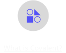
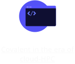

 
  
 

 

   

 

  
 

Covalent is a Pythonic workflow tool for computational scientists, AI/ML software engineers, and anyone who needs to run experiments on limited or expensive computing resources including quantum computers, HPC clusters, GPU arrays, and cloud services.

Covalent enables a researcher to run computation tasks on an advanced hardware platform – such as a quantum computer or serverless HPC cluster – using a single line of code.
  

   <video  controls>
   <source src="./doc/readme-assets/readme.mp4" type="video/mp4">
  Your browser does not support the video tag.
</video> 
<!--  -->
<!-- https://github.com/Vamsi-Batchu/testing_readme-main/assets/126048258/410b2333-9d68-4930-b18f-a6f70ded6032 -->
 

 

  </img>
 

  

  </img>
 

  <!--  -->

  

    

        Installation
    

    

        Covalent is developed using Python version 3.8 on Linux and macOS. The
        easiest way to install Covalent is using the PyPI package manager:
    

    

        
$ pip install covalent

          <svg width="22" height="22" viewBox="0 0 22 22" fill="none"
          xmlns="http://www.w3.org/2000/svg">
          <rect x="0.5" y="0.5" width="15.0769" height="17.3333" rx="1.5"
              stroke="#86869A" />
          <rect x="6.4231" y="4.16662" width="15.0769" height="17.3333"
              rx="1.5"
              stroke="#86869A" />
        </svg>
    

  

  

    

        Getting Started
    

    

        Ready to try it? Refer to the <a
            href="https://docs.covalent.xyz/docs/get-started/quick-start/">Quick
        Start</a> guide for quick setup instructions, or to the <a
            href="https://docs.covalent.xyz/docs/get-started/first-experiment/">First
        Experiment</a> guide for a more thorough approach. For a full list of
        supported platforms, see the Covalent <a
            href="https://docs.covalent.xyz/docs/user-documentation/compatibility/">compatibility
        matrix.</a>
    

    

        For a more in-depth description of Covalent's features and how they work,
        see the <a
            href="https://docs.covalent.xyz/docs/user-documentation/concepts/concepts-index/">
        Concepts</a> page in the documentation. 

Know More

For a more in-depth description of Covalent's features and how they work, see the Concepts page in the documentation.

<!-- 

  

 -->

    
    
    
    
  

  

  

    Tutorials

  

    
    
    
  

Covalent’s serverless HPC architecture allows you to easily scale jobs from your laptop to your HPC/Cloud

 

  
 

 

 <!-- 

 -->

  

    Contributing

 
To contribute to Covalent, refer to the <a href="https://github.com/AgnostiqHQ/covalent/blob/master/CONTRIBUTING.md">Contribution Guidelines</a>. We use GitHub's <a href="https://github.com/AgnostiqHQ/covalent/issues">issue tracking</a>. to manage known issues, bugs, and pull requests. Get started by forking the develop branch and submitting a pull request with your contributions. Improvements to the documentation, including tutorials and how-to guides, are also welcome from the community. For more more information on adding tutorials, check the <a href="https://github.com/AgnostiqHQ/covalent/blob/master/doc/TUTORIAL_GUIDELINES.md">Tutorial Guidelines</a> Participation in the Covalent community is governed by the <a href="https://github.com/AgnostiqHQ/covalent/blob/master/CODE_OF_CONDUCT.md">Code of Conduct</a>.

  

  <!-- 

 -->

 
Citation

   
Please use the following citation in any publications

  

  <a href="https://zenodo.org/record/8369670"> https://doi.org/10.5281/zenodo.5903364
  

  <!-- 

 -->
  

  <!-- 

 -->

    

        License
    

    
Covalent is licensed under the Apache 2.0 License. See the  <a href="https://github.com/AgnostiqHQ/covalent/blob/master/LICENSE" >LICENSE</a>  file or contact the <a href="https://github.com/AgnostiqHQ/covalent/blob/master/LICENSE" class="anch">support team</a> for more details.

    
For a detailed history of changes and new features, see the <a href="https://github.com/AgnostiqHQ/covalent/blob/master/CHANGELOG.md" >Changelog</a>

  

   <!-- 

 -->
