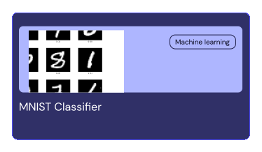
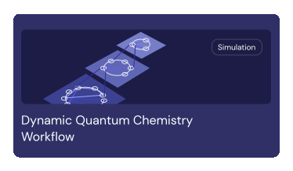

<div align="center">
  
</div>
</br>
<div align="center">

[](https://github.com/AgnostiqHQ/covalent/blob/develop/CHANGELOG.md)
[](#)
[](https://github.com/AgnostiqHQ/covalent/actions/workflows/tests.yml)
[](https://docs.covalent.xyz/docs/)
[](https://codecov.io/gh/AgnostiqHQ/covalent)
[](https://www.apache.org/licenses/LICENSE-2.0)</div>

<div align="center"><b>Run AI, ML, and Scientific Research Code on Any Cloud or On-Prem Cluster with a Single Line</b></div>
</br>
 <div align="center">
<a href="https://docs.covalent.xyz/docs/get-started/quick-start"></a>
&nbsp&nbsp
<a href="https://docs.covalent.xyz/docs/"></a>
&nbsp&nbsp
<a href="https://docs.covalent.xyz/docs/user-documentation/tutorials/"></a>
&nbsp&nbsp
<a href="https://covalentworkflows.slack.com/join/shared_invite/zt-1ew7f2rfk-dKSXVQmRniu5mQW4Z_eQuw#/shared-invite/email"></a>
</div>
</br>


```bash
pip install covalent --upgrade
```
Check our [Quick Start Guide](https://docs.covalent.xyz/docs/get-started/quick-start/) for setup instructions or dive into your [First Experiment](https://docs.covalent.xyz/docs/get-started/first-experiment/). Learn more on the [Concepts](https://docs.covalent.xyz/docs/user-documentation/concepts/concepts-index/).

### What is Covalent?

Covalent is a Python library built for AI/ML engineers, developers, and researchers. It provides a straightforward approach to run compute jobs, like LLMs, generative AI, and scientific research, on various cloud platforms or on-prem clusters.


<details>
<summary><b>Run Code Anywhere:</b> Execute Python functions in any cloud or on-prem cluster by changing just a single line of code.</summary>
<br>

Its as simple as swapping the decorator with our executor plugins. Choose from [existing plugins](https://docs.covalent.xyz/docs/plugin) or [create custom ones](https://github.com/AgnostiqHQ/covalent-executor-template) for tailored interactions with any infrastructure.
<div align="center"></div>
</details>

<details>
<summary><b>Abstraction of Infrastructure Management:</b> Abstract the complexities of cloud consoles, terraform, or IaC in the background.</summary>
<br>
<div align="center"></div>
</details>

<details>
<summary><b>Serverless Infrastructure:</b> Automatically converts any infrastructure, including on-prem SLURM clusters or cloud compute, into a serverless setup.</summary>
<br>
<div align="center"></div>
</details>


<!-- <details>
<summary><b>Run Code Anywhere:</b> Execute Python functions in any cloud or on-prem cluster by changing just a single line of code.</summary>
<br>

Its as simple as swapping the decorator with our executor plugins. Choose from [existing plugins](https://docs.covalent.xyz/docs/plugin) or [create custom ones](https://github.com/AgnostiqHQ/covalent-executor-template) for tailored interactions with any infrastructure.


```python
import covalent as ct

# To execute on Azure, replace the executor line with:
# @ct.electron(executor="azurebatch")

# To execute on Google Cloud Platform, replace the executor line with,
# you can even use a custom configuration:
#gcp=ct.executor.GCPBatchExecutor(region='us-east1', vcpus=2, memory=512
# @ct.electron(executor=gcp))

# Define your function
@ct.electron(executor="awsbatch")  # Execute on AWS
def fine_tune_llm(params):
    # Your compute logic here
```
</details>

<details>
<summary><b>Abstraction of Infrastructure Management:</b> Lets developers focus on their code, abstracting the complexities of cloud consoles, terraform, or IaC in the background.</summary>
<br>

Using cloud compute is no more than two steps, without the need to write any infrastructure code or even containers for your code. Covalent handles the rest.

1. Deploy your infrastructure with ease:

```shell
covalent deploy up awsbatch --vcpus=12 --num_gpus=2
```

2. Ship your code :

```python
import covalent as ct

@ct.electron(executor="awsbatch")  # Run on AWS with default configuration; can override with executor-specific parameters
def fine_tune_llm(params):
    # Your compute logic here
```
To learn more, check out the docs

</details>

<details>
<summary><b>Serverless Infrastructure:</b> Automatically converts any infrastructure, including on-prem SLURM clusters or cloud compute, into a serverless setup.</summary>
<br>
Covalent simplifies infrastructure management, making it serverless and scalable. This feature allows you to leverage the full potential of cloud computing or on-premises clusters without the overhead of manual configuration.

<!-- Insert image or additional information here if needed
</details> -->


If you find Covalent useful or interesting, feel free to give us a ⭐ on GitHub! Your support helps us to continue developing and improving this framework.


### Covalent at work

<div align="center">
  
 </div>
</br>

</br>
<table border="0">
 <tr>
    <td><b style="font-size:18px; padding-right: 20px;">For AI/ML Practitioners and Developers</b></td>
    <td><b style="font-size:18px; padding-left: 20px;">For Researchers</b></td>
 </tr>
 <tr>
    <td valign="top">
        <ul style="font-size:16px; list-style-type: circle; padding-right: 20px;">
            <li><b>Robust Compute Backend:</b> Ideal for AI/ML applications, Large Language Models (LLMs), Generative AI, and more.</li>
            <li><b>Cloud-Agnostic Execution:</b> Execute high-compute tasks seamlessly across different cloud environments.</li>
            <li><b>Infrastructure Abstraction:</b> Decouple business code from infrastructure/resource definitions.</li>
        </ul>
    </td>
    <td valign="top">
        <ul style="font-size:16px; list-style-type: circle; padding-left: 20px;">
            <li><b>Local-Like Access:</b> Effortlessly connect to compute resources from your laptop, eliminating the need for SSH or complex scripts.</li>
            <li><b>Unified Interface Across Environments:</b> Consistent experience with on-prem HPC clusters and cloud platforms like SLURM, PBS, LSF, AWS, GCP, Azure.</li>
            <li><b>Real-Time Monitoring Monitoring:</b> <a href="http://demo.covalent.xyz/"> User-friendly UI </a> for real-time monitoring, facilitating cost-effective and iterative R&D.</li>
        </ul>
    </td>
 </tr>
</table>

### Out-of-box observability - [Try out the demo](http://demo.covalent.xyz/)

https://github.com/AgnostiqHQ/covalent/assets/116076079/87268cc8-4d53-4053-b739-1d03f2eafa7c

### Explore Covalent Through Examples

Jump right into practical examples to see Covalent in action. These tutorials cover a range of applications, giving you a hands-on experience:

<div align="center">
  <a href="https://docs.covalent.xyz/docs/user-documentation/tutorials/generativeai/">
    
  </a>
  <a href="https://docs.covalent.xyz/docs/user-documentation/tutorials/mnist/">
    
  </a>
  <a href="https://docs.covalent.xyz/docs/user-documentation/tutorials/quantumchemistry/">
    
  </a>
</div>

### Explore Our Extensive Plugin Ecosystem

Covalent integrates seamlessly with a variety of platforms. Discover our range of plugins to enhance your Covalent experience:

</br>
  <div align="center">
<a href="https://docs.covalent.xyz/docs/user-documentation/api-reference/executors/aws-plugins/"></a>
<a href="https://docs.covalent.xyz/docs/user-documentation/api-reference/executors/azurebatch/"></a>
<a href="https://docs.covalent.xyz/docs/user-documentation/api-reference/executors/gcp/"></a>
<a href="https://docs.covalent.xyz/docs"></a>
</div>
<div align="center"><a href="https://docs.covalent.xyz/docs/user-documentation/api-reference/executors/slurm/"></a>
<a href="https://docs.covalent.xyz/docs/user-documentation/api-reference/executors/dask/"></a>
<a href="https://docs.covalent.xyz/docs/user-documentation/api-reference/executors/ibmq/"></a>
<a href="https://docs.covalent.xyz/docs/plugin"></a></div>

### Key Features at a Glance

Get a quick overview of what Covalent offers. Our infographic summarizes the main features, providing you with a snapshot of our capabilities:

</br>
  <div align="center">
  <a href="https://docs.covalent.xyz/docs/"></img></a>
 </div>

</br>

---

### Know More About Covalent

For a more in-depth description of Covalent's features and how they work, see the [Concepts](https://docs.covalent.xyz/docs/user-documentation/concepts/concepts-index/) page in the documentation.

</br>

<div align="center">
<a href="https://www.covalent.xyz/what-is-covalent/"></a>
<a href="https://www.covalent.xyz/navigating-the-modern-hpc-landscape/"></a>
<a href="https://docs.covalent.xyz/docs/user-documentation/concepts/covalent-basics/"></a>
<a href="https://docs.covalent.xyz/docs/user-documentation/concepts/covalent-arch/covalent-architecture"></a>
</div>

<div >

### Installation

Covalent is developed using Python on Linux and macOS. The easiest way to install Covalent is using the PyPI package manager.

```
pip install covalent --upgrade
```

For other methods of installation please [check the docs.](https://docs.covalent.xyz/docs/get-started/install/)

**Deployments**

<div>
Covalent offers flexible deployment options, from Docker image/AMIs for self-hosting to pip package for local installations, accommodating various use cases
</div>

</br>

<div align="center">

<a href="https://docs.covalent.xyz/docs/user-documentation/server-deployment"></a>
<a href="https://docs.covalent.xyz/docs/user-documentation/server-deployment"></a>
<a href="https://docs.covalent.xyz/docs/user-documentation/server-deployment"></a>

</div>

</br>
</div>

### Contributing

 <!-- <div></div> -->

To contribute to Covalent, refer to the [Contribution Guidelines](https://github.com/AgnostiqHQ/covalent/blob/master/CONTRIBUTING.md). We use GitHub's [issue tracking](https://github.com/AgnostiqHQ/covalent/issues) to manage known issues, bugs, and pull requests. Get started by forking the develop branch and submitting a pull request with your contributions. Improvements to the documentation, including tutorials and how-to guides, are also welcome from the community. For more information on adding tutorials, check the [Tutorial Guidelines](https://github.com/AgnostiqHQ/covalent/blob/master/doc/TUTORIAL_GUIDELINES.md). Participation in the Covalent community is governed by the [Code of Conduct](https://github.com/AgnostiqHQ/covalent/blob/master/CODE_OF_CONDUCT.md).

### Citation

Please use the following citation in any publications

[https://doi.org/10.5281/zenodo.5903364](https://zenodo.org/records/8369670)

### License

Covalent is licensed under the Apache 2.0 License. See the [LICENSE](https://github.com/AgnostiqHQ/covalent/blob/master/LICENSE) file or contact the [support team](mailto:support@aqnostic.ai) for more details.

For a detailed history of changes and new features, see the [Changelog](https://github.com/AgnostiqHQ/covalent/blob/master/CHANGELOG.md).
