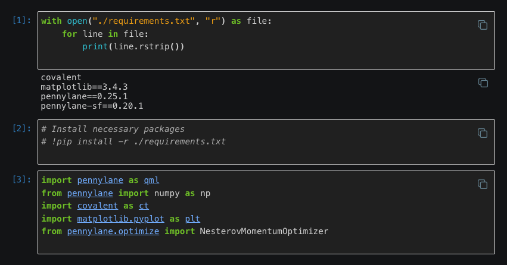
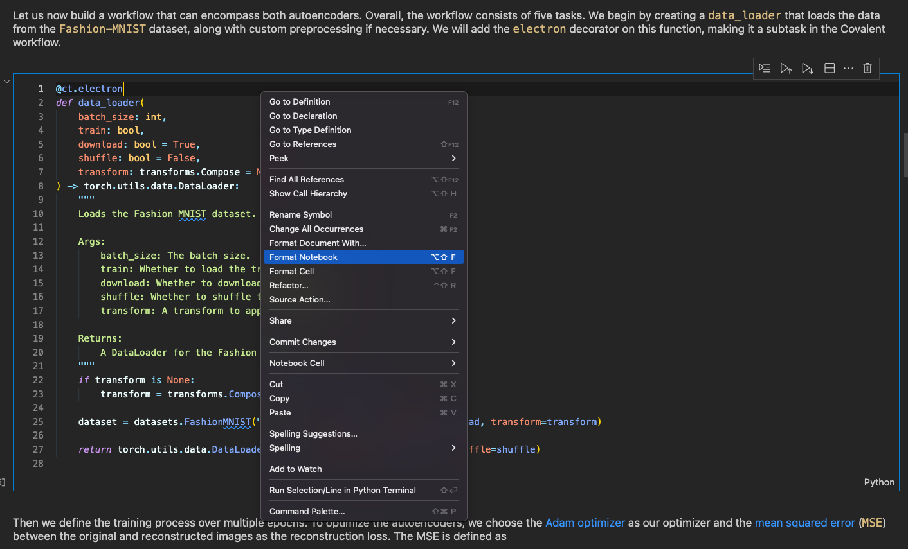

# Tutorial Guidelines

Covalent tutorials are a useful guide for users looking to get hands on experience with the software. Additionally, they are important as functional tests since they cover most of the major features available. These guidelines are crucial to follow so that the tutorials are self-contained, easy to understand, and can be run as functional tests in a GitHub workflow.


## I. Content Guideline

This guide covers best practices for Covalent tutorials. These principles are intended to guide but not constrain the author.

### Set the scope

Good tutorials are small and self-contained. They do not overcomplicate things and cater to a mixed audience. Any examples highlighted should be straightforward and friendly to beginners.

### Introduce the example

Introduce background material and describe what we will be trying to achieve in the tutorial. Separate the logical components and show what purpose each of them serves.

### Prototype the solution

Write code with commented explanations wherever necessary. Write it without Covalent, in a functional manner, where it is clear what each of the components is doing in the context of the example.

### Run the workflows

Add decorators to the functions without changing their definitions. Show representative screenshots of the UI to help readers understand the problem being solved. A good tutorial also provides typical input parameters and the corresponding typical runtimes.

### Analyze the results

View the results in the Covalent UI, and query them programmatically as well.  Summarize the findings using a meaningful plot or chart. Discuss the metadata returned in the result object.


### Discuss the concepts

Highlight how different components of Covalent are used to accomplish objectives or to obey constraints.


## II. Technical Guidelines


### Folder structure and file naming

Every tutorial should be inside a folder corresponding to the _tutorial name_ and contain (see example below):
1. A subfolder named `assets`
2. A Jupyter notebook called `source.ipynb`
3. A requirements file, `requirements.txt`, listing the python packages and their version numbers required to execute the tutorial.
4. Datasets should be stored in the `assets` folder.

```
- tutorial_example
    - assets
        - data.npy
        - requirements.txt
        - figures.png
    - source.ipynb
```

**Note**: Covalent should be added in `requirements.txt` but without a version number.

For example:

```
covalent
matplotlib==3.6.3
pennylane==0.25.1
scikit-learn==1.0.2
torch==1.13.1
```

### Tutorial requirements

1. Include a print statement listing the packages in the requirements file before the import statements via:

```{code}
with open("./requirements.txt", "r") as file:
    for line in file:
        print(line.rstrip())

```

2. There should be a commented out line in the cell below that installs all the required packages:

```{code}
# Install necessary packages
# !pip install -r ./requirements.txt

```

Here's an example:


<div align="center">

</div>

### File paths and other configurable values

1. File paths, provisioned cloud resource names such as AWS s3 buckets etc. need to be configurable.
**Note**: It is imperative that there are no hard coded variables that need to be configured by the user.

2. The environment variables should be read near the top of the tutorial using `os.getenv()`. For example,
```
batch_s3_bucket_name = os.getenv("BATCH_S3_BUCKET_NAME")
image_folder = os.getenv("IMAGE_FOLDER")

```


### Memory and compute resource config values

Some tutorials have specific memory and compute resource requirements in order to execute successfully. For example, `covalent start` might not suffice and instead the dispatcher server might need to be started with `covalent start -n 4 -m "2GB"`. The author of the tutorial should specify the necessary default values in the section where the config values are read:

```{code}
COVALENT_NUM_WORKER = os.getenv("COVALENT_NUM_WORKER", 4)
COVALENT_MEM_WORKER = os.getenv("COVALENT_MEM_WORKER", "2GB")
COVALENT_THREADS_PER_WORKER = os.getenv("COVALENT_THREADS_PER_WORKER", 1)

```

While this format suffices when starting Covalent on the self-hosted instance where the tutorials will be run as functional tests, it might also be pertinent to mention the bash command above since the user might be executing the workflows in their local machine.


### Assert statements checking that workflow executed successfully

It is entirely possible for a tutorial to execute without raising an errors and yet be broken. In order to avoid this, after every `covalent.get_result()` include an assert statement checking that the workflow executed successfully.

For example,

```{code}
res = covalent.get_result(dispatch_id, wait=True)
assert res.status

```


### Upload necessary datasets to s3 buckets

Some Machine learning tutorials might be demonstrating how the training and test dataset can be read from an s3 bucket using the file transfer module. This assumes that there is a pre-existing s3 bucket with the requisite data. The tutorial should also have a cell where the data is uploaded into an s3 bucket before it is attempted to be read. The guiding principle here is that the tutorial should be as self-contained as possible both for functional testing and to be more accessible to users.


### Tutorial cleanup and formatting

1. Check that there are no empty cells in the tutorial.
2. Format the notebook cells. This is an example for VS Code:

<div align="center">

</div>

3. The final version of the tutorial that goes into the RTD should have the cells go from `1, ..., n`.

4. Include additional information such as resetting the maximum number of open files via `ulimit -n 10240`. Since, this is a MacOS specific issue, it is more useful for the users than for functional testing.
