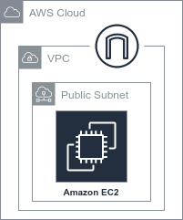

.. _awsec2_executor:

AWS EC2 Executor
"""""""""""""""""""""""""""

Covalent is a Pythonic workflow tool used to execute tasks on advanced computing hardware.

This plugin allows tasks to be executed in an AWS EC2 instance (which is auto-created) when you execute your workflow with covalent.

===========================================
1. Installation
===========================================

To use this plugin with Covalent, simply install it using :code:`pip`:

.. code:: bash

   pip install covalent-ec2-plugin

.. note::

   Users will also need to have `Terraform <https://www.terraform.io/downloads>`_ installed on their local machine in order to use this plugin.

===========================================
2. Usage Example
===========================================

This is a toy example of how a workflow can be adapted to utilize the EC2 Executor. Here we train a Support Vector Machine (SVM) and spin up an EC2 automatically to execute the :code:`train_svm` electron. We also note we require :doc:`DepsPip <../../concepts/concepts>` to install the dependencies on the EC2 instance.

.. code-block:: python

    from numpy.random import permutation
    from sklearn import svm, datasets
    import covalent as ct

    deps_pip = ct.DepsPip(
        packages=["numpy==1.23.2", "scikit-learn==1.1.2"]
    )

    executor = ct.executor.EC2Executor(
        instance_type="t2.micro",
        volume_size=8, #GiB
        ssh_key_file="~/.ssh/ec2_key" # default key_name will be "ec2_key"
    )

    # Use executor plugin to train our SVM model.
    @ct.electron(
        executor=executor,
        deps_pip=deps_pip
    )
    def train_svm(data, C, gamma):
        X, y = data
        clf = svm.SVC(C=C, gamma=gamma)
        clf.fit(X[90:], y[90:])
        return clf

    @ct.electron
    def load_data():
        iris = datasets.load_iris()
        perm = permutation(iris.target.size)
        iris.data = iris.data[perm]
        iris.target = iris.target[perm]
        return iris.data, iris.target

    @ct.electron
    def score_svm(data, clf):
        X_test, y_test = data
        return clf.score(
            X_test[:90],
            y_test[:90]
        )

    @ct.lattice
    def run_experiment(C=1.0, gamma=0.7):
        data = load_data()
        clf = train_svm(
            data=data,
            C=C,
            gamma=gamma
        )
        score = score_svm(
            data=data,
            clf=clf
        )
        return score

    # Dispatch the workflow
    dispatch_id = ct.dispatch(run_experiment)(
        C=1.0,
        gamma=0.7
    )

    # Wait for our result and get result value
    result = ct.get_result(dispatch_id=dispatch_id, wait=True).result

    print(result)

During the execution of the workflow one can navigate to the UI to see the status of the workflow, once completed however the above script should also output a value with the score of our model.

.. code-block:: python

    0.8666666666666667

===========================================
3. Overview of Configuration
===========================================

.. list-table::
   :widths: 2 1 2 3
   :header-rows: 1

   * - Config Key
     - Is Required
     - Default
     - Description
   * - profile
     - No
     - default
     - Named AWS profile used for authentication
   * - region
     - No
     - us-east-1
     - AWS Region to use to for client calls to AWS
   * - credentials_file
     - Yes
     - ~/.aws/credentials
     - The path to the AWS credentials file
   * - ssh_key_file
     - Yes
     - ~/.ssh/id_rsa
     - The path to the private key that corresponds to the EC2 Key Pair
   * - instance_type
     - Yes
     - t2.micro
     - The `EC2 instance type <https://aws.amazon.com/ec2/instance-types/>`_ that will be spun up automatically.
   * - key_name
     - Yes
     - Name of key specified in :code:`ssh_key_file`.
     - The name of the AWS EC2 Key Pair that will be used to SSH into EC2 instance
   * - volume_size
     - No
     - 8
     - The size in GiB of the GP2 SSD disk to be provisioned with EC2 instance.
   * - vpc
     - No
     - (Auto created)
     - The VPC ID that will be associated with the EC2 instance, if not specified a VPC will be created.
   * - subnet
     - No
     - (Auto created)
     - The Subnet ID that will be associated with the EC2 instance, if not specified a public Subnet will be created.
   * - remote_cache
     - No
     - ~/.cache/covalent
     - The location on the EC2 instance where covalent artifacts will be created.

This plugin can be configured in one of two ways:

#. Configuration options can be passed in as constructor keys to the executor class :code:`ct.executor.EC2Executor`

#. By modifying the `covalent configuration file <https://covalent.readthedocs.io/en/latest/how_to/config/customization.html>`_ under the section :code:`[executors.ec2]`

The following shows an example of how a user might modify their `covalent configuration file <https://covalent.readthedocs.io/en/latest/how_to/config/customization.html>`_  to support this plugin:

.. code:: shell

    [executors.ec2]
    ssh_key_file = "/home/user/.ssh/ssh_key.pem"
    key_name = "ssh_key"

.. autoclass:: covalent.executor.EC2Executor
    :members:
    :inherited-members:

===========================================
4. Required Cloud Resources
===========================================

This plugin requires users have an AWS account. New users can follow instructions `here <https://aws.amazon.com/premiumsupport/knowledge-center/create-and-activate-aws-account/>`_ to create a new account. In order to run workflows with Covalent and the AWS EC2 plugin, there are a few notable resources that need to be provisioned first. Whenever interacting with AWS resources, users strongly recommended to follow :doc:`best practices <../../credentials>` for managing cloud credentials. Users are recommended to follow the principle of least privilege. For this executor, users who wish to deploy required infrastructure may use the AWS Managed Policy `AmazonEC2FullAccess <https://docs.aws.amazon.com/AWSEC2/latest/UserGuide/security-iam-awsmanpol.html>`_ although some administrators may wish to further restrict instance families, regions, or other options according to their organization's cloud policies.

The required resources include an EC2 Key Pair, and optionally a VPC & Subnet that can be used instead of the EC2 executor automatically creating it.

.. list-table::
   :widths: 2 1 2 3
   :header-rows: 1

   * - Resource
     - Is Required
     - Config Key
     - Description
   * - AWS EC2 Key Pair
     - Yes
     - :code:`key_name`
     - An EC2 Key Pair must be created and named corresponding to the :code:`key_name` config value. This key pair is used by the executor to connect to the EC2 instance via SSH. This key must also be present in the user's local machine that is dispatching the workflow and it's filepath specified under the :code:`ssh_key_file` config value.
   * - VPC
     - No
     - :code:`vpc`
     - A VPC ID can be provided corresponding to the :code:`vpc` config value. Otherwise a VPC will be auto-created for each electron.
   * - Subnet
     - No
     - :code:`subnet`
     - A Subnet ID can be provided corresponding to the :code:`subnet` config value. Otherwise a public Subnet will be auto-created for each electron.
   * - Security Group
     - No
     - (Auto Created)
     - A security group will be auto created and attached to the VPC in order to give the local machine (dispatching workflow) SSH access to the EC2 instance.
   * - EC2 Instance
     - No
     - (Auto Created)
     - An EC2 Instance will be automatically provisioned for each electron in the workflow that utilizes this executor.

#. To create an AWS EC2 Key pair refer to the following `AWS documentation <https://docs.aws.amazon.com/AWSEC2/latest/UserGuide/create-key-pairs.html>`_.
#. To create a VPC & Subnet refer to the following `AWS documentation <https://docs.aws.amazon.com/directoryservice/latest/admin-guide/gsg_create_vpc.html>`_.

When tasks are run using this executor, the following infrastructure is ephemerally deployed.

This includes the minimal infrastructure needed to deploy an EC2 instance in a public subnet connected to an internet gateway. Users can validate that resources are correctly provisioned by monitoring the EC2 dashboard in the AWS Management Console. The overhead added by using this executor is on the order of several minutes, depending on the complexity of any additional user-specified runtime dependencies. Users are advised not to use any sensitive data with this executor without careful consideration of security policies. By default, data in transit is cached on the EBS volume attached to the EC2 instance in an unencrypted format.

These resources are torn down upon task completion and not shared across tasks in a workflow. Deployment of these resources will incur charges for EC2 alone; refer to `AWS EC2 pricing <https://aws.amazon.com/ec2/pricing/>`_ for details.
Note that this can be deployed in any AWS region in which the user is otherwise able to deploy EC2 instances.
Some users may encounter quota limits when using EC2; this can be addressed by opening a support ticket with AWS.

.. ===========================================
.. 5. Source
.. ===========================================

.. autoclass:: covalent.executor.EC2Executor
    :members:
    :inherited-members:
