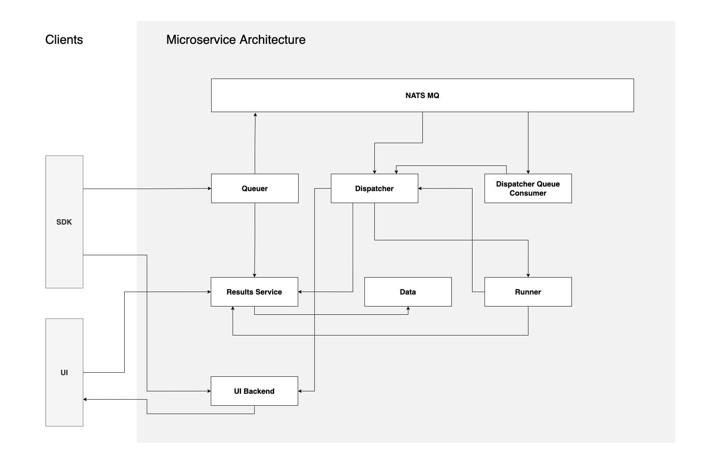

*********
Microservices
*********

.. note::

  This documentation is for debugging and/or extending the functionallity of covalent.

===========================================
Architecture
===========================================

Covalent is composed of a set of services which expose APIs and orchistrate the running of workflows.

The services are as follows:

- :ref:`data_api`
- :ref:`queuer_api`
- :ref:`dispatcher_api`
- :ref:`runner_api`
- :ref:`results_api`
- :ref:`ui_backend_api`
- :ref:`nats`

.. _data_api:

Data API
"""""""""""""""""""""""""""
The Data API documentation is located in `here <https://app.swaggerhub.com/apis/agnostiq/Covalent_Data_Service_API/0.1.0>`_

.. _queuer_api:

Queuer API
"""""""""""""""""""""""""""
The Queuer API documentation is located in `here <https://app.swaggerhub.com/apis/agnostiq/Covalent_Queue_Service_API/0.1.0>`_

.. _dispatcher_api:

Dispatcher API
"""""""""""""""""""""""""""
The Dispatcher API documentation is located in `here <https://app.swaggerhub.com/apis/agnostiq/Covalent_Dispatcher_Service_API/0.1.0>`_

.. _runner_api:

Runner API
"""""""""""""""""""""""""""
The Runner API documentation is located in `here <https://app.swaggerhub.com/apis/agnostiq/Covalent_Runner_Service_API/0.1.0>`_

.. _results_api:

Results API
"""""""""""""""""""""""""""
The Queuer API documentation is located in `here <https://app.swaggerhub.com/apis/agnostiq/Covalent_Data_Service_API/0.1.0>`_

.. _ui_backend_api:

UI Backend API
"""""""""""""""""""""""""""
The UI Backend API documentation is located in `here <https://app.swaggerhub.com/apis/agnostiq/Covalent_UI_Service_API/0.1.0>`_

.. _nats:

NATS Message Queue
"""""""""""""""""""""""""""
The `NATS Message Queue <https://nats.io/>`_ is a message queue that acts as an message bus between the microservices.
