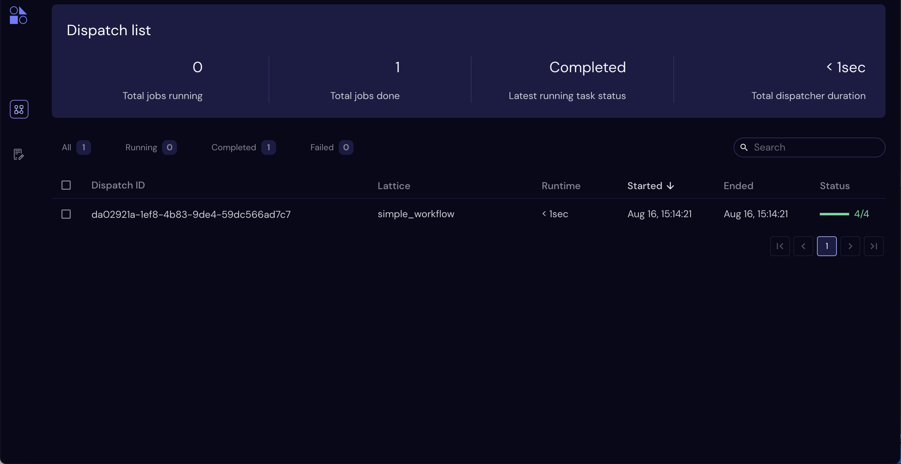
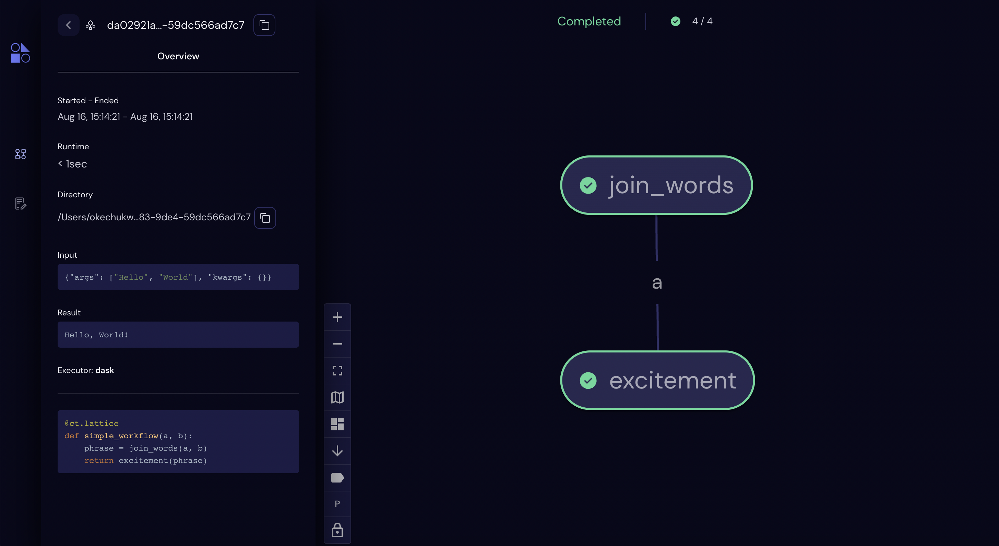

========================
Installation from Source
========================

This page describes how to build and install Covalent from source.

.. admonition:: Before you start

  Ensure you are using a compatible OS and Python version. See the :doc:`Compatibility <./compatibility>` page for supported Python versions and operating systems.

Building and Installing Covalent
################################

.. note::

   If you are upgrading Covalent from the previous stable release, refer to the :doc:`migration guide <./../version_migrations/index>` to preserve your data and avoid upgrade problems.

To download and install Covalent from source, first clone the GitHub repo:

.. code:: bash

   git clone git@github.com:AgnostiqHQ/covalent.git

Then use the ``setup`` script to build and deploy Covalent.

.. note::

   The first time you build Covalent locally, make sure you have the required packages installed:

   .. code:: bash

      cd covalent
      pip install -r requirements.txt

.. code:: bash

   cd covalent

   # Build the dashboard
   python setup.py webapp

   # Install using pip (-e is for developer mode)
   pip install -e .

Building the Documentation
~~~~~~~~~~~~~~~~~~~~~~~~~~

To build the documentation locally, use the :code:`setup.py` script.

.. note::

   The first time you build the docs locally, make sure you have the required packages installed:

   .. code:: bash

      cd covalent/doc
      pip install -r requirements.txt

To build the documentation:

.. code:: bash

   cd covalent
   python setup.py docs

View the local documentation at ``covalent/doc/build/html/index.html``.

Validating the Installation
~~~~~~~~~~~~~~~~~~~~~~~~~~~

Covalent has been properly installed if the following returns without error:

.. code:: bash

   python -c "import covalent"

Starting the Server
###################

Start the Covalent server:

.. code:: console

   $ covalent start
   Covalent server has started at http://localhost:48008

Managing the Server
~~~~~~~~~~~~~~~~~~~

Use the Covalent CLI tool to manage the Covalent server. You can start and stop the server, view its status, and see the server logs.

View available subcommands with the --help option:

.. code:: console

   $ covalent --help
   Usage: covalent [OPTIONS] COMMAND [ARGS]...

   Covalent CLI tool used to manage the servers.

   Options:
   -v, --version  Display version information.
   --help         Show this message and exit.

   Commands:
   logs     Show Covalent server logs.
   purge    Shutdown server and delete the cache and config settings.
   restart  Restart the server.
   start    Start the Covalent server.
   status   Query the status of the Covalent server.
   stop     Stop the Covalent server.

Using the UI to View Workflows and Results
~~~~~~~~~~~~~~~~~~~~~~~~~~~~~~~~~~~~~~~~~~

View the Covalent UI in your web browser at http://localhost:48008. This is where dispatched jobs will appear.

Running a Workflow
##################

Run this simple "Hello World" example to see Covalent in action.

Before starting, ensure that you have installed Covalent, verified the installation, and started the Covalent server.

Open a Jupyter notebook or Python console and create the following workflow:

.. code:: python

   import covalent as ct

   # Construct tasks as "electrons"
   @ct.electron
   def join_words(a, b):
       return ", ".join([a, b])

   @ct.electron
   def excitement(a):
       return f"{a}!"

   # Construct a workflow as "lattice"
   @ct.lattice
   def simple_workflow(a, b):
       phrase = join_words(a, b)
       return excitement(phrase)

   # Dispatch the workflow
   dispatch_id = ct.dispatch(simple_workflow)("Hello", "World")

Navigate to the Covalent UI at `<http://localhost:48008>`_ to see your workflow in the queue:

|

Click on the dispatch ID to view the workflow graph:

|

While the workflow is being processed by the dispatch server, you can terminate the Jupyter kernel or Python console process without losing access to the results. Make sure the Covalent server remains in the "running" state while you have running workflows.

When the workflow has completed, you can start a new session and query the results:

.. code:: python

   import covalent as ct

   # Copy the dispatch ID from the UI
   dispatch_id = "12345678-1234-1234-1234-123456789abc"
   result_string = ct.get_result(dispatch_id).result

When you are done using Covalent to run workflows, stop the server:

.. code:: console

   $ covalent stop
   Covalent server has stopped.
