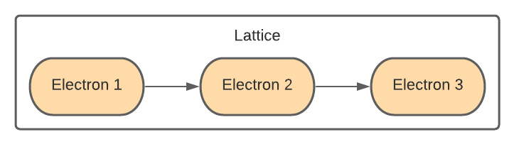
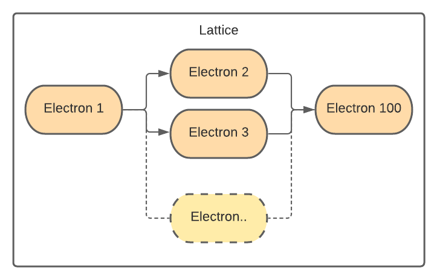
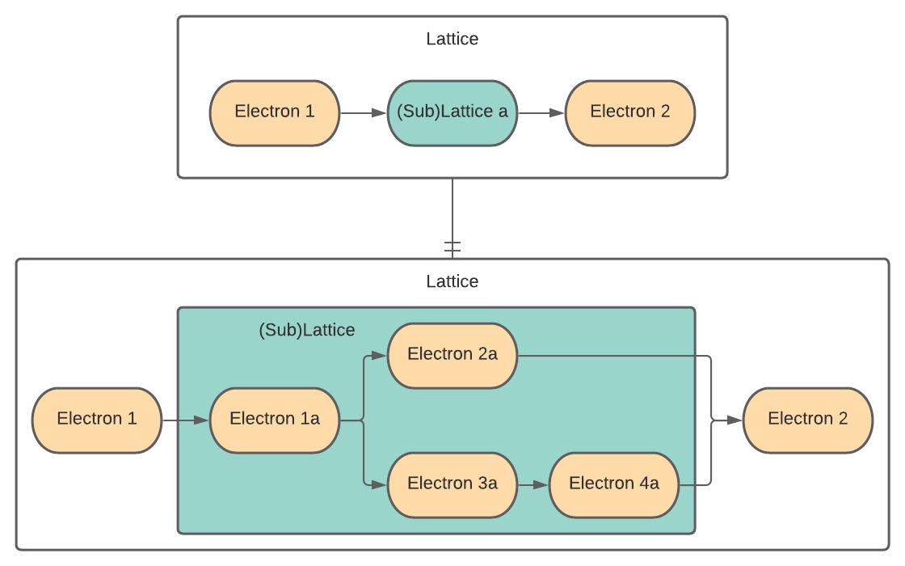

#################
The Covalent SDK
#################

The Covalent SDK exists to enable compute-intensive workloads, such as ML training and testing, to run as server-managed workflows. To accomplish this, the workload is broken down into tasks that are arranged in a workflow. This page explains how this is done.

.. _Electron:

Electron
========

The simplest unit of computational work in Covalent is a task, called an *electron*, created in the Covalent API by using the ``@covalent.electron`` decorator on a function.

In discussing object-oriented code, it's important to distinguish between classes and objects. Here are notational conventions used in this documentation:

Electron (code font, capital "E")
    The :doc:`Covalent API class <../api/electrons>` representing a computational task that can be run by a Covalent executor.

electron (lower-case "e")
    An object that is an instantiation of the :code:`Electron` class.

:code:`@covalent.electron`
    The decorator used to (1) turn a function into an electron; (2) wrap a function in an electron, and (3) instantiate an instance of Electron containing the decorated function (all three descriptions are equivalent).

The :code:`@covalent.electron` makes the function runnable in a Covalent executor. It does not change the function in any other way.

The function decorated with :code:`@covalent.electron` can be any Python function; however, it should be thought of, and operate as, a single task. Best practice is to write an electron with a single, well defined purpose, for example performing a single tranformation of some input or writing or reading a record to a file or database.

For example, here is a simple electron that adds two numbers:

.. code-block:: python
    :linenos:

    import covalent as ct

    @ct.electron
    def add(x, y):
        return x + y

An electron is a building block, from which you compose a :ref:`lattice<lattice>`.

.. _Lattice:

Lattice
=======

A runnable workflow in Covalent is called a *lattice*, created with the :code:`@covalent.lattice` decorator. Similarly to electrons, here the notational conventions:

Lattice (code font, capital "L")
    The :doc:`Covalent API class <../api/lattice>` representing a workflow that can be run by a Covalent dispatcher.

lattice (lower-case "l")
    An obect that is an instantiation of the :code:`Lattice` class.

:code:`@covalent.lattice`
    The decorator used to create a lattice by wrapping a function in the Lattice class. (The synonymous descriptions given for electron hold here as well.)

The function decorated with :code:`@covalent.lattice` must contain one or more electrons. The lattice is a *workflow*, a sequence of operations on one or more datasets instantiated in Python code.

For Covalent to work properly, the lattice must operate on data only by calling electrons. By "work properly," we mean dispatch all tasks to executors. The flexibility and power of Covalent comes from the ability to assign and reassign tasks (electrons) to executors, which has two main advantages, *hardware independence* and *parallelization*.

Hardware indepdendence
    The task's code is decoupled from the details of the hardware it is run on.

Parallelization
    Independent tasks can be run in parallel on the same or different backends. Here, *indepedent* means that for any two tasks, their inputs are unaffected by each others' execution outcomes (that is, their outputs or side effects). The Covalent dispatcher can run two independent electrons in parallel. For example, in the workflow structure shown below, electron 2 and electron 3 are executed in parallel.

.. note:: A function decorated as an electron behaves as a regular function unless called from within a lattice. Only when an electron is invoked from within a lattice is the electron code invoked to run the function in an executor.

.. admonition:: Also note

   When an electron is called from another electron, it is executed as a normal Python function. That is, the calling electron (if run in a lattice) is assigned to an executor, but the inner electron runs as part of the calling electron – it is not farmed out to its own executor.

The example below illustrates this simple but powerful paradigm. The tasks are constructed first using the :code:`@covalent.electron` decorator, then the :code:`@covalent.lattice` decorator is applied on the workflow function that manages the tasks.

.. _ml example:

.. code-block:: python
    :linenos:

    from numpy.random import permutation
    from sklearn import svm, datasets
    import covalent as ct

    @ct.electron
    def load_data():
        iris = datasets.load_iris()
        perm = permutation(iris.target.size)
        iris.data = iris.data[perm]
        iris.target = iris.target[perm]
        return iris.data, iris.target

    @ct.electron
    def train_svm(data, C, gamma):
        X, y = data
        clf = svm.SVC(C=C, gamma=gamma)
        clf.fit(X[90:], y[90:])
        return clf

    @ct.electron
    def score_svm(data, clf):
        X_test, y_test = data
        return clf.score(X_test[:90], y_test[:90])

    @ct.lattice
    def run_experiment(C=1.0, gamma=0.7):
        data = load_data()
        clf = train_svm(data=data, C=C, gamma=gamma)
        score = score_svm(data=data, clf=clf)
        return score

Notice that all the data manipulation in the lattice is done by electrons.

.. _Sublattice:

Sublattice
==========

It is common practice to perform a nested set of experiments. For example, you design an experiment from a set of tasks defined as electrons. You then construct the experiment as a lattice, then dispatch the experiment using some test parameters.

Now assume that you want to run a series of these experiments in parallel across a spectrum of input parameters. Covalent enables exactly this technique through the use of *sublattices*.

A sublattice is a lattice transformed into an electron by applying an electron decorator after applying the lattice decorator.

For example, the lattice :code:`experiment` defined below performs some experiment for a given set of parameters. To carry out a series of experiments for a range of parameters, you just wrap the :code:`experiment` lattice with the :code:`@electron` decorator to construct the :code:`run_experiment` sublattice. (The example below explicitly wraps :code:`experiment` in :code:`electron` rather than using decorator notation. The result is the same.)

When :code:`run_experiment_suite` is dispatched for execution, it runs the experiment with an array of different input parameter sets. Since this arrangement meets the criteria for independence of the sublattices' inputs and outputs, Covalent executes the sublattices in parallel!

.. code-block:: python

    @ct.electron
    def task_1(**params):
        ...

    @ct.electron
    def task_2(**params):
        ...

    @ct.lattice
    def experiment(**params):
        a = task_1(**params)
        final_result = task_2(a)
        return final_result

    run_experiment = ct.electron(experiment) # Construct a sublattice

    @ct.lattice
    def run_experiment_suite(**params):
        res = []
        for param in params:
            res.append(run_experiment(**params))
        return res

Conceptually, as shown in the figure below, executing a sublattice adds the constituent electrons to the :doc:`transport graph <server_concepts>`.

.. note:: Don't confuse :code:`ct.electron(lattice)`, which creates a sublattice, with :code:`ct.lattice(electron)`, which is a workflow consisting of a single task.
