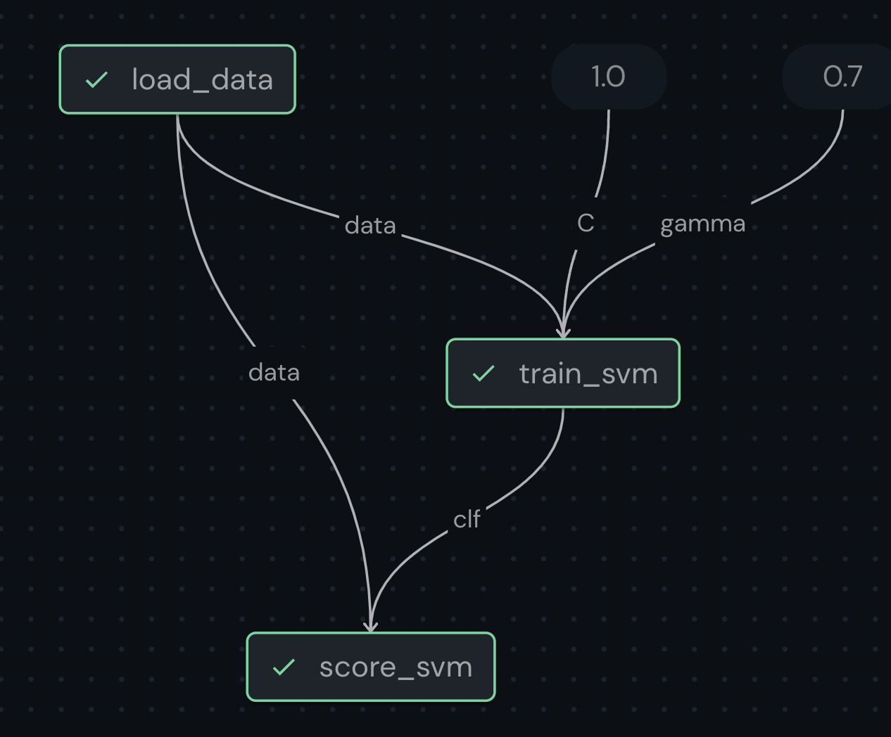
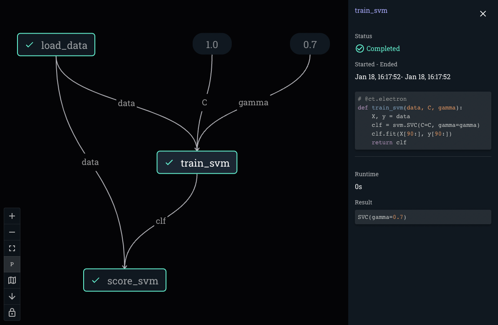

*********
Concepts
*********

===========================================
What is Covalent?
===========================================

Covalent is a Pythonic workflow management tool that can be used to perform computations on advanced classical and quantum computing hardwares. To start, the user defines a workflow, or a set of interdependent tasks, using Covalent's electron and lattice decorators. An electron is a Python function that performs some granular task, while a lattice is a workflow that executes various tasks to accomplish a larger computation. Workflows can be run locally or dispatched to quantum and classical hardwares using custom executors. Running computationally intensive jobs on HPC and quantum hardware can be expensive, so users can construct, visualize, and execute the workflow locally first. Once a workflow is submitted to the dispatcher, the execution progress can be tracked in the Covalent UI. The user interface is useful not just for monitoring the execution progress of individual tasks, but it also shows users the workflow graph. The workflow graph is the visual representation of the tasks and their dependency relations, so users can better understand and communicate their computations at a conceptual level. Lastly, Covalent allows users to easily analyze, reuse, and share results of both individual tasks as well as the workflow as a whole, so that users can iterate faster and collaborate more easily.

Users may find Covalent useful for a variety of reasons:

Covalent...

* minimizes the need to learn new syntax. Once it has been installed, it is as easy as breaking your script into functions and attaching decorators.
* parallelizes mutually independent parts of workflows.
* provides an intuitive user interface to monitor workflows.
* allows users to view, modify and re-submit workflows directly within a Jupyter notebook.
* manages the results of your workflows. Whenever the workflow is modified, Covalent natively stores and saves the run of every experiment in a reproducible format.

In summary, Covalent is an easy-to-use workflow orchestration tool that makes deploying high performance computing jobs seamless. The browser-based user interface and the design of the package makes it extremely easy to track the status of the computations. Covalent has been designed so that it is very easy to modify or build on top of previous computational experiments.

Users interact with Covalent in 5 main ways:

* :ref:`Workflow construction<Workflow construction>`

* :ref:`Workflow execution<Workflow execution>`

* :ref:`Status polling<Workflow status polling>`

* :ref:`Results collection<Workflow result collection>`
* :ref:`Electron Dependencies<Workflow electron dependencies>`

* :ref:`File Transfers<File transfer>`

..
  Under the hood Covalent brings up a set of :doc:`microservices <../api/microservices>` to orchestrate workflows.

.. _Workflow construction:

===========================================
Workflow construction
===========================================

Workflow construction is the process of taking a computational objective and breaking it up into tasks -- simple, atomic Python functions. Tasks are constructed using an :code:`electron` decorator on a Python function. A workflow is made up of several tasks and can be defined by attaching a :code:`lattice` decorator to a Python function comprised of tasks. A workflow can further be used as a task in another larger workflow by converting it into an electron. These structures are referred to as :ref:`sublattices<Sublattice>`.

.. _Electron:

~~~~~~~~~~~~~~~
Electron
~~~~~~~~~~~~~~~

A workflow is comprised of one or more tasks. Tasks are constructed using the :ref:`electron<electrons_api>` decorator, which transforms a Python function into an :code:`Electron` object. These are the building blocks for a lattice, as can be seen in the figure below.

.. image:: ./images/simple_lattice.png
  :width: 400
  :align: center

One reason to convert tasks into electrons is that Covalent can parallelize execution of independent electrons within a lattice. In other words, when the input parameters for two electrons are independent of the execution outcome of the other, the tasks are performed in parallel. For example, in the workflow structure shown below, Electron 2 and Electron 3 are executed in parallel.

.. image:: ./images/parallel_lattice.png
   :width: 400
   :align: center

Below, we see an example of an electron that simply adds two numbers.

.. code-block:: python
    :linenos:

    import covalent as ct

    @ct.electron
    def add(x, y):
        return x + y

Covalent's design ensures that a function decorated as an electron can still be called as a regular Python function. Only when an electron is invoked from within a lattice do the electron properties come into play. In other words, a function decorated as an electron behaves as a regular function unless called from within the context of a lattice.

.. note:: When an electron is invoked by another electron, it is executed as a normal Python function.

.. _Lattice:

~~~~~~~~~~~~~~
Lattice
~~~~~~~~~~~~~~

A workflow can be constructed by applying the :ref:`lattice<lattices_api>` decorator to a Python function composed of electrons. In the example shown below, we first construct tasks using the electron decorator, and then use the lattice decorator on the workflow function which manages the tasks.

.. code-block:: python
    :linenos:

    from numpy.random import permutation
    from sklearn import svm, datasets
    import covalent as ct

    @ct.electron
    def load_data():
        iris = datasets.load_iris()
        perm = permutation(iris.target.size)
        iris.data = iris.data[perm]
        iris.target = iris.target[perm]
        return iris.data, iris.target

    @ct.electron
    def train_svm(data, C, gamma):
        X, y = data
        clf = svm.SVC(C=C, gamma=gamma)
        clf.fit(X[90:], y[90:])
        return clf

    @ct.electron
    def score_svm(data, clf):
        X_test, y_test = data
        return clf.score(X_test[:90], y_test[:90])

    @ct.lattice
    def run_experiment(C=1.0, gamma=0.7):
        data = load_data()
        clf = train_svm(data=data, C=C, gamma=gamma)
        score = score_svm(data=data, clf=clf)
        return score

.. warning:: When constructing a workflow out of tasks, users should avoid object manipulation within the lattice outside of electrons.

Single-Task Workflows
---------------------

An electron can also be executed as a single-task workflow by attaching a lattice decorator on top.

.. image:: ./images/single_electron_lattice.png
   :width: 200
   :height: 125
   :align: center

.. code-block:: python
   :linenos:

   import covalent as ct

   @ct.lattice
   @ct.electron
   def add(x, y):
       return x + y

This type of behavior is useful when testing and debugging individual workflow components in a more controlled manner.

Working with Iterables
----------------------

When composing a workflow, passing a slice of an iterable returned by one electron as an input to another iterable is also supported by Covalent.

.. code-block:: python
    :linenos:

    @ct.lattice
    def workflow(**params):
        res_1 = electron_1(**params)
        res_2 = electron_2(res_1[0]) # Using an iterable data structure slice as an input parameter
        ...

Loops
-----

The following design pattern for deploying multiple experiments using the :code:`for` loop is encouraged (when possible) as shown in the code snippet below.

.. code-block:: python
    :linenos:

    @ct.electron
    def experiment(**params):
        ...

    @ct.lattice
    def run_experiment(**experiment_params):
        res = []
        for params in experiment_params:
            res.append(experiment(**params))
        return res

This ensures that the independent experiments are performed in parallel rather than sequentially.

Waiting for other electrons
----------------------

Sometimes the user might want to wait for a task's execution before executing another task even when the output of one is not the input of another. For those cases a `wait_for()` function is there which is called on the dependent electron and takes as input the depending electrons,

.. code-block:: python
    :linenos:

    @ct.electron
    def task_1a(a):
        return a ** 2

    @ct.electron
    def task_1b(a):
        return a ** 3

    @ct.electron
    def task_1c(a):
        return a ** 4

    @ct.electron
    def task_2(x, y):
        return x * y

    @ct.electron
    def task_3(b):
        return b ** 3

    @ct.lattice
    def workflow():
        res_1a = task_1a(2)
        res_1b = task_1b(2)
        res_1c = task_1c(2)
        res_2 = task_2(res_1a, 3)
        res_3 = task_3(5).wait_for([res_1a, res_1b, res_1c])

        return task_2(res_2, res_3)
        ...

    res = ct.dispatch_sync(workflow)()

This means that even though `task_3`'s input does not depend on anything, it's execution will still wait until all the tasks passed in `wait_for` have completed execution.

Best Practices
--------------

There are a few best practices to highlight when working with lattices.

.. code-block:: python

    import pandas as pd

    @ct.electron
    def task_1():
        return {'a': 1, 'b': 2, 'c': 3}

    @ct.lattice
    def workflow():
        abc_dict = task_1()
        return pd.DataFrame.from_dict(abc_dict)

    res = ct.dispatch_sync(workflow)(a=1)

The code snippet above will not execute properly, since lattices are supposed to be used to construct the workflow and not manipulate the execution results of an electron. When :ref:`dispatch<Workflow dispatch>` is called, a :ref:`transport graph<Transport graph>` is built using the electrons as graph nodes. During construction, these electrons are not executed, but rather simply added to the transport graph; however, any non-electron is executed. In the example above, :code:`pd.DataFrame.from_dict()` (non-electron) is executed during construction while :code:`task_1` (electron) is not executed. This raises an error since the output of :code:`task_1` is not available to be used as an input for :code:`pd.DataFrame.from_dict()`.

The above example can be restructured using an extra electron to transform the dictionary into a dataframe.

.. code-block:: python

    import pandas as pd

    @ct.electron
    def task_1():
        return {'a': 1, 'b': 2, 'c': 3}

    @ct.electron
    def task_2(x_dict):
        return pd.DataFrame.from_dict(x_dict)

    @ct.lattice
    def workflow():
        abc_dict = task_1()
        return task_2(abc_dict)

    res = ct.dispatch_sync(workflow)(a=1)

However, lattices do support some basic parsing of electron outputs:

.. code-block:: python

    class TestClass:
        def __init__(self):
            self.test_value = 1234

    @ct.electron
    def task_1():
        return [3, TestClass(), 7], {"m": [x**2, x, [2, {"l": 5}]]}

    @ct.electron
    def task_2(var):
        return var ** 2

    @ct.lattice
    def workflow():
        a, b = task_1()

        res_a1 = task_2(a[0])
        res_b = task_2(b['m'][0])
        res_a2 = task_2(a[1].test_value)

        # The following are not yet supported:
        # for i in a: -> iterating over the values
        # len(a) -> getting the length
        # a[0] = 1 -> assigning a value

    res = ct.dispatch_sync(workflow)(a=1)

Note that while the lattice construction has some minor restrictions, as indicated through these examples, electrons can be constructed from any Python function.

.. _Sublattice:

~~~~~~~~~~~~~~
Sublattice
~~~~~~~~~~~~~~

A sublattice is a lattice transformed into an electron using an electron decorator after applying the lattice decorator.

Often, a user wants to perform a nested set of experiments. For example, a user designs an experiment from a set of tasks. They define the set of tasks using the electron decorator. Following that, the user constructs the experiment using the lattice decorator. The user then dispatches the experiment using some test parameters. Now, consider that the user wants to run a series of these experiments in parallel across a spectrum of inputs. Covalent is designed to allow exactly that behavior through the use of `sublattices`. For example, the lattice :code:`experiment` defined below performs some experiment for some given parameters. When the user is ready to carry out a series of experiments for a range of parameters, they can simply decorate the :code:`experiment` lattice with the electron decorator to construct the :code:`run_experiment` sublattice. When :code:`run_experiment_suite` is dispatched for execution, Covalent then executes the sublattices in parallel.

.. code-block:: python

    @ct.electron
    def task_1(**params):
        ...

    @ct.electron
    def task_2(**params):
        ...

    @ct.lattice
    def experiment(**params):
        a = task_1(**params)
        final_result = task_2(a)
        return final_result

    run_experiment = ct.electron(experiment) # Construct sublattice

    @ct.lattice
    def run_experiment_suite(**params):
        res = []
        for param in params:
            res.append(run_experiment(**params))
        return res

Conceptually, as shown in the figure below, executing a sublattice adds the constituent electrons to the transport graph.

.. image:: ./images/sublattice.png
   :width: 600
   :height: 400
   :align: center

.. note:: :code:`ct.electron(lattice)`, which creates a sublattice, should not be confused with :code:`ct.lattice(electron)`, which is a single task workflow.

.. _Transport graph:

~~~~~~~~~~~~~~~~
Transport graph
~~~~~~~~~~~~~~~~

After the workflow has been defined, and before it can be executed, one of the first steps performed by the dispatcher server is to construct a dependency graph of the tasks. This `directed acyclic graph` is referred to as the Transport Graph, which is constructed by sequentially inspecting the electrons used within the lattice. As each electron is reached, a corresponding node and its input-output relations are added to the transport graph. The user can visualize the transport graph in the Covalent UI. Furthermore, the graph contains information on :ref:`execution status<Workflow status polling>`, task definition, runtime, input parameters, and more. Below, we see an example of transport graph for a machine learning workflow as it appears in the Covalent UI.

.. _Workflow execution:

===========================================
Workflow execution
===========================================

Once a workflow has been constructed, users can run it either locally or on classical and quantum hardwares using custom :ref:`executor<Executors>` plugins. Since the computational cost of HPC hardwares can be large, we recommend that users run the workflow locally to debug all possible issues, i.e., using the local executor. Once the user is confident with their workflow, it can be :ref:`dispatched<Workflow dispatch>` on the local machine or on cloud backends. After the workflow has been dispatched, a results directory is created where all the computational outputs are stored in a :ref:`result<Result>` object. Access to these result objects are facilitated by the Covalent :ref:`results manager<Result Manager>`.

.. _Workflow dispatch:

~~~~~~~~~~~~~~~~~~~~~~~
Workflow dispatch
~~~~~~~~~~~~~~~~~~~~~~~

Once a workflow has been constructed, it is dispatched to the Covalent dispatcher server. The local dispatcher server is managed using the :ref:`Covalent Command Line Interface<dispatcher_api>` tool (see also: :doc:`how-to guide <../../how_to/execution/covalent_cli>`). Userscan dispatch the job to the local executor or to one of the cloud executors. When a workflow has been successfully dispatched, a dispatch ID is generated. This ensures that the Jupyter notebook or script where the task was dispatched can now be closed. The Covalent UI server receives updates from the dispatcher server: it not only stores the dispatch IDs, but also the corresponding workflow definitions and parameters corresponding to the dispatched jobs. An example of a workflow dispatch is shown in the code snippet below.

.. code-block:: python
    :linenos:

    dispatch_id = ct.dispatch(run_experiment)(C=1.0, gamma=0.7)

Once the workflow has been submitted to the dispatcher, all the relevant workflow information, including execution status and results, are tagged with a unique dispatch ID. In other words, the workflow details and execution results are not tied to the initial workflow definition, but rather an instance of the workflow execution. Covalent is designed in this way so that the user can retrieve and analyze results at a later point in time.

.. _Executors:

~~~~~~~~~~~~~
Executors
~~~~~~~~~~~~~

An executor is responsible for taking a task and executing it in a certain place in a certain way. For example, the local executor invokes the task on the user's local computer. Users can define custom executors to make Covalent compatible with any remote backend system.

The workflow defined in the :ref:`lattice<Lattice>` subsection uses the electron decorator without passing any custom parameters. By default, a Dask executor is chosen. However, Covalent allows users to...

* use different executors for each electron.

* pass in custom executors to the dispatcher.

.. code-block:: python
    :linenos:

    @ct.electron(executor=quantum_executor)
    def task_1(**params):
        ...
        return val

    @ct.electron(executor=gpu_executor)
    def task_2(**params):
        ...
        return val

This feature is very important to Covalent since a user might want to break down their workflow according to compute requirements, where some of the tasks require quantum hardware, while others require CPUs or GPUs. This design choice allows us to send each electron to the appropriate hardware.

See the how-to guide on customizing the local executor :doc:`How to customize the executor <../../how_to/execution/choosing_executors>`. Covalent also allows users to build their own executor plugins by inheriting from the `BaseExecutor` class as shown below.

.. code-block:: python

    from covalent.executor import BaseExecutor

    class CustomExecutor(BaseExecutor):
        ...

Refer the how-to guide on building custom executors :doc:`How to create a custom executor <../../how_to/execution/creating_custom_executors>` for more details.

.. _Workflow status polling:

===========================================
Workflow status polling
===========================================

Once a workflow has been dispatched, users will want to track the progress of the tasks. This can be viewed using the Covalent UI. The user can view the dependencies between the various electrons.

.. _Status:

~~~~~~~~~~~
Status
~~~~~~~~~~~

The progress of the electron execution can be tracked using the Covalent UI.

The user can view the dependencies among the various electrons in addition to the execution status (running, completed, not started, failed, or cancelled). Additional information on how long each task has been running for, or the total execution time is also shown in the Covalent UI.

.. _Workflow result collection:

===========================================
Workflow result collection
===========================================

As soon as a workflow has been successfully submitted, a dispatch ID and a result object are created to store the outcome details. The dispatch ID uniquely identifies the result object. A list of dispatch IDs corresponding to previously submitted workflows can be easily viewed in the Covalent UI. As each task is terminated, either due to an error, cancellation, or successful completion, the :ref:`result<Result>` object is updated by the :ref:`result manager<Result manager>`.

.. _Result manager:

~~~~~~~~~~~~~~~~~~~~~
Result manager
~~~~~~~~~~~~~~~~~~~~~

The Covalent result manager is responsible for storing, updating, and retrieving the workflow result object. The philosophy behind the result manager is to separate the experiment outcomes from the workflow that was initially defined in some Jupyter notebook or Python script. This decoupling ensures that once the workflow has been dispatched, users can easily track the progress in the Covalent UI even without the original source code. This has the added benefit that experiment outcomes are safely stored regardless of any mishaps. The result object can be retrieved in the following way.

.. code-block:: python

    dispatch_id = ct.dispatch(workflow)(**params)
    result = ct.get_result(dispatch_id=dispatch_id, wait=False)

The result manager allows us to retrieve the result object even if the computations have not completed by setting the :code:`wait` parameter to :code:`False` as shown above.

.. _Result:

~~~~~~~~~~~~~
Result
~~~~~~~~~~~~~

The :ref:`result<results_api>` object contains all relevant details related to workflow execution outcomes. It further includes information to make each experiment entirely reproducible. In other words, the result object also stores information about the exact workflow instance, task and input parameter choices, as well as the final computational outputs. Some of the information stored in the result object includes...

* computation start and end time (see an :doc:`example<../../how_to/status/query_lattice_execution_time>`).
* computation status (see examples for :doc:`electrons<../../how_to/status/query_electron_execution_status>` and :doc:`lattices<../../how_to/status/query_lattice_execution_status>`).
* print statements inside electrons.
* metadata associated with each electron and with the lattice.

Below, we see an example of how to access the :code:`status` attribute of the result object to perform some analysis with the results once the workflow has been successfully executed.

.. code-block:: python

    # Check if result has been successfully computed
    if result.status:

        # Carry out analysis with results
        ...

We can, just as conveniently, access the details of the computational output of each task (:doc:`how-to guide <../../how_to/collection/query_multiple_lattice_execution_results>`) and the whole workflow (:doc:`how-to guide <../../how_to/collection/query_lattice_execution_result>`).

.. _File transfer:

=====================
File Transfer
=====================

Covalent supports transferring files from and to remote or local filesystems. These file transfer operations can be performed by specifying a list of :code:`FileTransfer` instances (along with a corresponding File Transfer Strategy) in an electron's decorator as a list using the :code:`files` keyword argument. File Transfer operations are queued to execute prior or post electron execution in the electron’s backend execution environment.

~~~~~~
Files
~~~~~~
Files are a objects which represent files corresponding to a supplied filepath.

:code:`File` objects can support various formats of filepaths such as :code:`/my_absolute_path` but also supports URIs for specifying particular protocols such as :code:`scheme://my_file_location`.
Examples of valid URIs that can be provided to a File object are below:

- :code:`/home/ubuntu/my_file`
- :code:`file:///home/ubuntu/my_file`
- :code:`https://example.com/file`

A file can be instantiated as show below::

    import covalent as ct
    file = ct.fs.File('/home/ubuntu/my_file')

.. note::

   (Advanced) File objects can also support additional arguments such as the :code:`is_remote` flag which should only be used when using the :code:`FileTransfer` class directly to specify a file that resides on a remote host (for usage with Rsync via SSH).

~~~~~~
Folders
~~~~~~
A :code:`Folder` is an object which represents a folder corresponding to a supplied filepath. Folders inherit from the File class so they support the same filepath formats as above.

A folder can be instantiated as show below::

    import covalent as ct
    folder = ct.fs.Folder('/home/ubuntu/my_dir')

~~~~~~
FileTransfer
~~~~~~
A :code:`FileTransfer` object is a declarative manner of specifying File Transfer operations which should be queued prior or post electron execution.
In general FileTransfer objects take a from (source) and to (destination) filepaths (or File objects) along with a File Transfer Strategy to perform download, upload, or copy operations over a corresponding protocol.

A File Transfer object can be created with the following to describe a local file transfer using Rsync::

    import covalent as ct
    ft = ct.fs.FileTransfer('/home/ubuntu/src_file','/home/ubuntu/dest_file')

By default the File Transfer will occur prior to electron execution, however one can specify that this should be performed post execution using the Order enum as such::

    import covalent as ct
    ft = ct.fs.FileTransfer('/home/ubuntu/src_file','/home/ubuntu/dest_file', order=ct.fs.Order.AFTER)

Under the hood covalent will create File objects corresponding to each filepath, but one can explicitly use File objects in a FileTransfer object::

    import covalent as ct
    source_file = ct.fs.File('/home/ubuntu/src_file')
    dest_file = ct.fs.File('/home/ubuntu/dest_file')
    ft = ct.fs.FileTransfer(source_file, dest_file, order=ct.fs.Order.BEFORE)

Furhermore Folders can also be used in file transfer operations::

    import covalent as ct
    src_dir = ct.fs.Folder('/home/ubuntu/src_dir')
    dest_dir = ct.fs.Folder('/home/ubuntu/dest_dir')
    ft = ct.fs.FileTransfer(src_dir, dest_dir)

By default only folder contents are transfered to the destination folder however one can specify to also include the folder in the transfer with :code:`Folder('filepath', include_folder=True)`

To use File Transfers in a covalent workflow a list of :code:`FileTransfer` instances must be specified in an electron's decorator using the :code:`files` keyword argument::

    import covalent as ct
    @ct.electron(
        files=[ct.fs.FileTransfer('/home/ubuntu/src_file', '/home/ubuntu/dest_file')]
    )
    def my_task():
        # we can read the destination filepath as the above file transfer is performed prior to electron execution
        with open('/home/ubuntu/dest_file', 'r') as f:
            return f.read()

    @ct.lattice()
    def file_transfer_workflow():
        return my_task()

    # Dispatch the workflow
    dispatch_id = ct.dispatch(file_transfer_workflow)()

~~~~~~
Strategies
~~~~~~

File Transfer Strategies define how files should be copied, downloaded, or uploaded during a file transfer operation. If a strategy is not explicitly provided in a FileTransfer object a corresponding strategy is resolved by covalent based on the provided File schemes.

A strategy can be specified in a :code:`FileTransfer` by specifying the :code:`strategy` keyword argument.

Rsync
---------------------

.. warning:: Rsync must be installed on an electron’s backend execution environment. On Debian based distros (ex. Ubuntu ) with :code:`apt-get install rsync` , rpm-based based distros (ex. CentOS, Fedora) with :code:`yum install rsync`, or MacOS with :code:`brew install rsync`

This is the default strategy when transferring files within a local filesystem.

If both the from & to filepaths are of the file scheme (i.e using filepaths of the form :code:`/home/ubuntu/...`, or :code:`file:///home/ubuntu/...`) Rsync is automatically chosen as the default file transfer strategy.

Therefore the following are equivalent::

    import covalent as ct

    ct.fs.FileTransfer('/home/ubuntu/src', '/home/ubuntu/dest')
    ct.fs.FileTransfer('/home/ubuntu/src', '/home/ubuntu/dest', strategy=ct.fs_strategies.Rsync())

Rsync (SSH)
---------------------

.. warning:: Rsync must be installed on an electron’s backend execution environment. On Debian based distros (ex. Ubuntu ) with :code:`apt-get install rsync` , rpm-based based distros (ex. CentOS, Fedora) with :code:`yum install rsync`, or MacOS with :code:`brew install rsync`

If one of the files are marked as remote the Rsync strategy will be used but will require additional information such as username and host to connect to via SSH (optionally a private key path to use).

The following will describe an Rsync file transfer operation over SSH to download a remote file and place in the specified local filepath::

    import covalent as ct

    strategy = ct.fs_strategies.Rsync(user='admin', host='44.202.86.215', private_key_path='...')
    from_remote_file = File('/home/admin/my_file', is_remote=True)
    to_local_file = File('/home/ubuntu/my_file')
    ct.fs.FileTransfer(from_remote_file, to_local_file, strategy=strategy)

S3
~~~~~~~~~~~~
.. warning:: AWS Python SDK must be installed on an electron’s backend execution environment. It can be installed using :code:`pip install boto3`

If one of the files is a S3 bucket location (s3://repository-name/file-path) S3 strategy will be used. For accessing the S3 bucket necessary credentials (aws_access_key_id, aws_secret_access_key, aws_session_token, region_name) can be passed to it. In case they are not provided default values described in the environment will be used.

The following will perform an S3 file transfer operation to download a remote file and place in the specified local filepath::

    import covalent as ct

    strategy = ct.fs_strategies.S3(aws_access_key_id = '...', aws_secret_access_key = '...', aws_session_token = '...', region_name = '...')

    ct.fs.FileTransfer('s3://covalent-tmp/temp.txt','/home/ubuntu/temp.txt',strategy = strategy)

~~~~~~
TransferFromRemote
~~~~~~

A shorthand manner of specifying file transfers from a remote source (with a default order of BEFORE) is the following::

    import covalent as ct

    strategy = ct.fs_strategies.Rsync(user='admin', host='44.202.86.215', private_key_path='...')
    ct.fs.TransferFrom('/home/admin/my_file', '/home/ubuntu/my_file', strategy=strategy)

Which is equivalent to::

    import covalent as ct

    strategy = ct.fs_strategies.Rsync(user='admin', host='44.202.86.215', private_key_path='...')
    from_remote_file = File('/home/admin/my_file', is_remote=True)
    to_local_file = File('/home/ubuntu/my_file')
    ct.fs.FileTransfer(from_remote_file, to_local_file, strategy=strategy, order=ct.fs.Order.BEFORE)

.. note::

   The order of the :code:`TransferFromRemote` operation can be specified in the same manner as :code:`FileTransfer` using the :code:`order` keyword argument with the corresponding :code:`Order` enum.

~~~~~~
TransferToRemote
~~~~~~

A shorthand manner of specifying file transfers to a remote destination (with a default order of AFTER) is the following::

    import covalent as ct

    strategy = ct.fs_strategies.Rsync(user='admin', host='44.202.86.215', private_key_path='...')
    ct.fs.TransferTo('/home/admin/my_file', '/home/ubuntu/my_file', strategy=strategy)

Which is equivalent to::

    import covalent as ct

    strategy = ct.fs_strategies.Rsync(user='admin', host='44.202.86.215', private_key_path='...')
    from_local_file = File('/home/ubuntu/my_file')
    to_remote_file = File('/home/admin/my_file', is_remote=True)
    ct.fs.FileTransfer(from_local_file, to_remote_file, strategy=strategy, order=ct.fs.Order.AFTER)

.. note::

   The order of the :code:`TransferToRemote` operation can be specified in the same manner as :code:`FileTransfer` using the :code:`order` keyword argument with the corresponding :code:`Order` enum.
.. _Workflow electron dependencies:

=====================
Electron Dependencies
=====================
The installation of an electron's dependencies is managed within the electron's execution environment. In essence, one can specify different types of dependencies in an electron which will be installed or executed in the electron's backend execution environment.

~~~~~~
Deps
~~~~~~
:code:`Deps` is an ABC class for managing any kind of electron dependency. Other kinds of dependencies inherit attributes of the :code:`Deps` class and override its  :code:`__init__()` and :code:`apply()` methods.

:code:`:__init__()`: The :code:`__init__()` method is the constructor that takes in variables
including :code:`apply_fn` which is the callable function to be applied in the backend environment and a set of :code:`args` and :code:`kwargs`.
When a :code:`Deps` object is initialized, the :code:`apply_fn`, :code:`args`, and :code:`kwargs` are serialized into transportable objects.

:code:`:apply()`: The :code:`:apply()` function returns a :code:`Tuple` containing serialized copies of :code:`apply_fn`, :code:`args` and :code:`kwargs`.

The following kinds of dependencies are supported at the electron level:

* DepsPip - used in managing pip dependencies in an electron.
* DepsBash - used in managing bash dependencies in an electron.
* DepsCall - used in managing functions that are called before or after executing an electron.

~~~~~~~
DepsPip
~~~~~~~
:code:`DepsPip` is the class that is responsible for managing the list of required PyPI packages which have to be installed in the backend environment prior to executing the electron.

:code:`__init__()`: The :code:`__init__()` constructor of :code:`DepsPip` takes a list of required PyPI packages and/or a path to the file that contains the list of required PyPI packages. It overrides :code:`Deps`'s :code:`__init_()` by
using :code:`apply_pip_deps` which is a callable that installs the required PyPI packages.

Below is an example of using :code:`DepsPip` to specify a list of PyPI packages in an electron::

    import covalent as ct
    from covalent import DepsPip

    @ct.electron(
        deps_pip=DepsPip(packages=["numpy==0.23", "qiskit"]),
    )
    def task():
    ...

Alternatively, one can specify the path to a :code:`requirements.txt` file that contains the list of required packages.
Assuming the path to the file is :code:`/usr/foo/requirements.txt`::

    @ct.electron(
        deps_pip=DepsPip(reqs_path="/usr/foo/requirements.txt")
    )

~~~~~~~~
DepsBash
~~~~~~~~

:code:`DepsBash` is the class that is responsible for managing the execution of bash commands that are required by an electron.

:code:`__init_()`: The :code:`__init__()` constructor of :code:`DepsBash` accepts a list of bash commands as its argument.
It overrides :code:`Deps`'s :code:`__init__()` by accepting :code:`apply_bash_commands` which is the callable that executes the commands and :code:`apply_args`
which references the specified list of commands.

:code:`apply_bash_commands`: This takes the list of commands and executes them as subprocesses in the same environment as the electron.

Below is an example of using :code:`DepsBash` to specify a list of bash commands in an electron::

    import covalent as ct
    from covalent import DepsBash

    @ct.electron(
        deps_bash=DepsBash(["echo $PATH", "ssh foo@bar.com"]),
    )
    def task():
    ...

~~~~~~~~
DepsCall
~~~~~~~~

:code:`DepsCall` is the class that is responsible for managing Python functions and other electron dependencies that need to be invoked in the same backend environment as the electron.
It also functions as a parent class for :code:`DepsBash`, :code:`DepsPip`, and :code:`Deps` and can apply those dependencies before or after the electron's execution.

:code:`__init__()`: :code:`DepsCall` :code:`__init__()` constructor takes in :code:`func` which is a callable
that is invoked in the electron's environment. It also takes a list of :code:`args` and :code:`kwargs`
which are passed as arguments when overriding the parent :code:`Deps` class.

Below is an example of using :code:`DepsCall` to declare functions that are called before and after an electron is executed::

    import covalent as ct
    from covalent import DepsCall

    def execute_before_electron():
    ...

    def shutdown_after_electron():
    ...

    @ct.electron(
        call_before=DepsCall(execute_before_electron, args=[1, 2])
        call_after=DepsCall(shutdown_after_electron),
    )
    def task():
    ...

Another example shows hows to pass :code:`DepsBash` objects to :code:`call_before` and :code:`call_after`::

    from covalent import DepsBash

    @ct.electron(
    call_before=DepsBash("cp file.txt target_directory/"),
    call_after=DepsBash("cp target_directory/file.txt  ."),
    )
    def task():
    ...

*Note*: It's also possible to implicitly declare multiple kinds of dependencies in an electron::

    import covalent as ct
    from covalent import DepsPip, DepsBash, DepsCall

    def execute_before_electron(a, b):
    ...

    def shutdown_after_electron():
    ...

    @ct.electron(
        deps_pip=DepsPip(packages=["numpy==0.23", "qiskit"]),
        deps_bash=DepsBash(commands=["echo $PATH", "ssh foo@bar.com"]),
        call_before=DepsCall(execute_before_electron, args=(1, 2)),
        call_after=DepsCall(shutdown_after_electron),
    )

Alternatively, one can explicitly specify each kind of dependency::

    @ct.electron(
        deps_pip=["numpy==0.23", "qiskit"]
        deps_bash=["echo $PATH", "ssh foo@bar.com"]
        call_before=[execute_before_electron, (1, 2)],
        call_after=[shutdown_after_electron],
    )
    def task():
    ...

Lastly, one can directly apply other types of :code:`Deps` in the electron's environment by passing them as variables to :code:`call_before` and :code:`call_after`::

    import covalent as ct
    from covalent import DepsPip, DepsBash, DepsCall

    deps_pip=DepsPip(packages=["numpy==0.23", "qiskit"]),
    deps_bash=DepsBash(commands=["echo $PATH", "ssh foo@bar.com"])

    @ct.electron(
        call_before=[deps_pip, deps_bash],
        call_after=[shutdown_after_electron],
    )
    def task():
    ...
