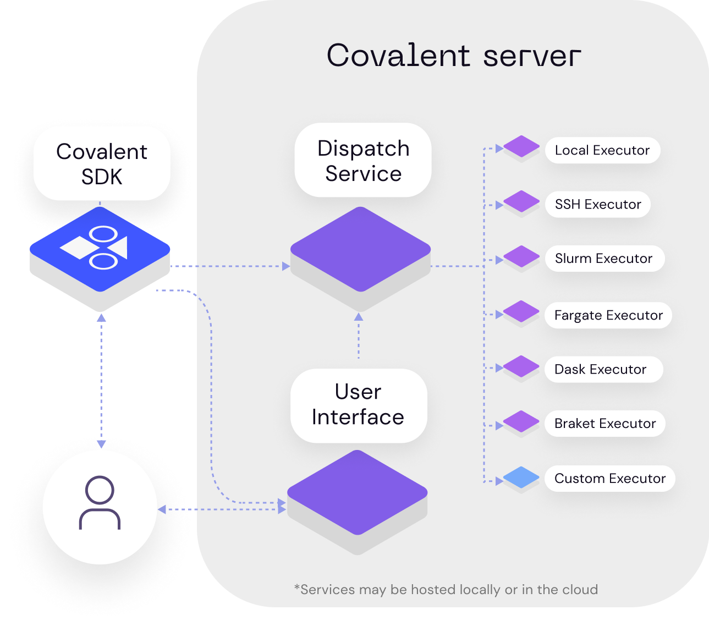

************************************
:octicon:`mortar-board;1em;` Concepts
************************************

.. _What is Covalent:

What is Covalent?
=================

Covalent is a Python-based workflow management platform designed for use with high-performance and quantum computing hardware.

.. _Covalent Components:

Covalent Components
===================

Covalent consists of three component systems:

* A Python module containing an API (or SKD) that you use to build manageable workflows out of new or existing Python functions.
* A set of services that run locally or on a server to dispatch and execute workflow tasks.
* A browser-based UI from which to manage workflows and view results.

These components are briefly described below. A more detailed look at each component is presented in the following pages.

To install Covalent and run a sample workflow, see the :doc:`Quick Start <../getting_started/quick_start/index>` or :doc:`First Experiment <../getting_started/first_experiment/index>` Guide.

The Covalent API
----------------

The Covalent API is a Python module containing a small collection of classes that implement server-based workflow management. The key elements are two decorators that wrap functions to create managed *tasks* and *workflows*.

The task decorator is called an *electron*. The electron decorator simply turns the function into a dispatchable task.

The workflow decorator is called a *lattice*. The lattice decorator turns a function composed of electrons into a manageable workflow.

Covalent Services
-----------------

The Covalent server is a lightweight service that runs on your local machine or on a server. A dispatcher analyzes workflows (lattices) and hands its component functions (electrons) off to executors. Each executor is an adaptor to a backend hardware resource. Covalent has a growing list of turn-key executors for common compute backends. If no executor exists yet for your compute platform, Covalent supports writing your own.

The Covalent GUI
----------------

The Covalent user interface runs as a web server on the machine where the Covalent server is running. The GUI dashboard shows a list of dispatched workflows. From there, you can drill down to workflow details or a graphical view of the workflow. You can also view logs, settings, and result sets.

.. toctree::
   :maxdepth: 1

   API Concepts <./api_concepts/index>
   Server Concepts <./server_concepts/index>
   User Interface Concepts <./ui_concepts/concepts>
