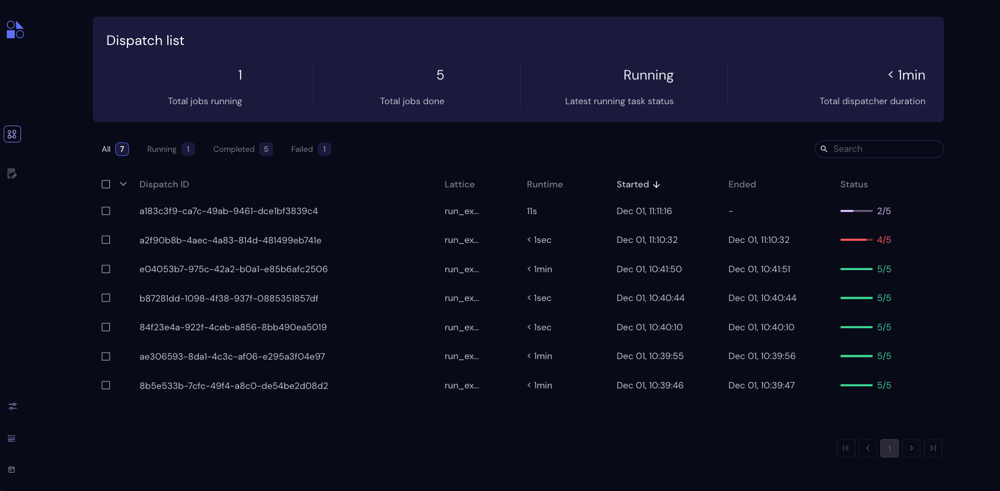

.. _The Covalent GUI:

################
The Covalent GUI
################

The Covalent graphical user interface (GUI) is a browser-based dashboard displayed by the dispatch service. The GUI dashboard shows a list of dispatched workflows. From there, you can drill down to workflow details or a graphical view of the workflow. You can also view logs, settings, and result sets.

The Covalent GUI is a convenient way to monitor and visualize dispatched workflows. Its functionality is documented in :doc:`The User Interface<../webapp_ui/index>`. This page discusses some of the GUI's features as they relate to the concepts in :doc:`The Covalent SDK <api_concepts>` and :doc:`Covalent Services <server_concepts>`.

.. _Dispatches:

Dispatches
==========

The UI dashboard displays a list of all dispatches that have been created by the server, whether they've completed or not.

Note that the second workflow in the screen above failed (*Status* shows 4 of 5 tasks successful completed), and that the first workflow is still in progress with 11 seconds of runtime and two tasks completed.

.. note:: The node count includes parameters, which are always counted as successful. A more useful metric might be to subtract the two values to determine how many tasks failed.

Transport Graph
===============

You can click on a dispatch ID to view the :ref:`transport graph <Transport Graph>`. The nodes in the graph shows the executor, name, and ID number of each task. The graph's edges are labeled with the data dependencies betwen nodes. Below is a transport graph for the :ref:`machine-learning workflow<ml example>` example.

.. image:: ./images/transport_graph.png
    :align: center
    :scale: 45 %

.. _Workflow Status Polling:

Workflow Status Polling
=======================

Once a workflow has been dispatched, users will want to track the progress of the tasks. This can be viewed using the Covalent UI. The user can view the dependencies between the various electrons.

.. _Status:

Status
======

The status of each electron execution can be tracked using the Covalent UI.

.. image:: ./images/status_check.png
    :align: center
    :scale: 40 %

The user can view the dependencies among the various electrons in addition to the execution status (running, completed, not started, failed, or cancelled). Additional information on how long each task has been running for, or the total execution time is also shown in the Covalent UI.
