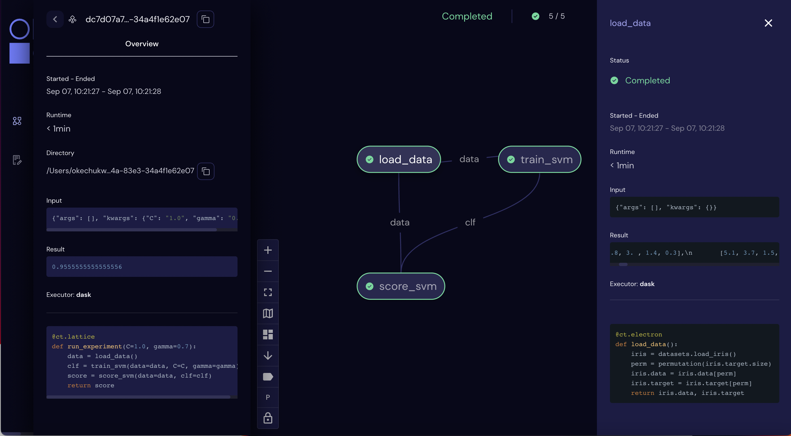

.. _Workflow:

===========================================
Workflow
===========================================

Covalent is a workflow orchestration tool and users can interact with Covalent in four main ways:

* :doc:`Workflow construction<components>`

* :ref:`Workflow execution<Workflow execution>`

* :ref:`Status polling<Workflow status polling>`

* :ref:`Results collection<Workflow result collection>`

.. _Workflow execution:

===========================================
Workflow execution
===========================================

Once a workflow has been constructed, users can run it either locally or on classical and quantum hardwares using custom :ref:`executor<Executors>` plugins. Since the computational cost of HPC hardwares can be large, we recommend that users run the workflow locally to debug all possible issues, i.e., using the local executor. Once the user is confident with their workflow, it can be :ref:`dispatched<Workflow dispatch>` on the local machine or on cloud backends. After the workflow has been dispatched, a results directory is created where all the computational outputs are stored in a :ref:`result<Result>` object. Access to these result objects are facilitated by the Covalent :ref:`results manager<Result Manager>`.

.. _Workflow dispatch:

~~~~~~~~~~~~~~~~~~~~~~~
Workflow dispatch
~~~~~~~~~~~~~~~~~~~~~~~

Once a workflow has been constructed, it is dispatched to the Covalent dispatcher server. The local dispatcher server is managed using the :ref:`Covalent Command Line Interface<dispatcher_api>` tool (see also: :doc:`how-to guide <../../how_to/execution/covalent_cli>`). Userscan dispatch the job to the local executor or to one of the cloud executors. When a workflow has been successfully dispatched, a dispatch ID is generated. This ensures that the Jupyter notebook or script where the task was dispatched can now be closed. The Covalent UI server receives updates from the dispatcher server: it not only stores the dispatch IDs, but also the corresponding workflow definitions and parameters corresponding to the dispatched jobs. An example of a workflow dispatch is shown in the code snippet below.

.. code-block:: python
    :linenos:

    dispatch_id = ct.dispatch(run_experiment)(C=1.0, gamma=0.7)

Once the workflow has been submitted to the dispatcher, all the relevant workflow information, including execution status and results, are tagged with a unique dispatch ID. In other words, the workflow details and execution results are not tied to the initial workflow definition, but rather an instance of the workflow execution. Covalent is designed in this way so that the user can retrieve and analyze results at a later point in time.

.. _Executors:

~~~~~~~~~~~~~
Executors
~~~~~~~~~~~~~

An executor is responsible for taking a task and executing it in a certain place in a certain way. For example, the local executor invokes the task on the user's local computer. Users can define custom executors to make Covalent compatible with any remote backend system.

The workflow defined in the :ref:`lattice<Lattice>` subsection uses the electron decorator without passing any custom parameters. By default, a Dask executor is chosen. However, Covalent allows users to...

* use different executors for each electron.

* pass in custom executors to the dispatcher.

.. code-block:: python
    :linenos:

    @ct.electron(executor=quantum_executor)
    def task_1(**params):
        ...
        return val

    @ct.electron(executor=gpu_executor)
    def task_2(**params):
        ...
        return val

This feature is very important to Covalent since a user might want to break down their workflow according to compute requirements, where some of the tasks require quantum hardware, while others require CPUs or GPUs. This design choice allows us to send each electron to the appropriate hardware.

See the how-to guide on customizing the local executor :doc:`How to customize the executor <../../how_to/execution/choosing_executors>`. Covalent also allows users to build their own executor plugins by inheriting from the `BaseExecutor` class as shown below.

.. code-block:: python

    from covalent.executor import BaseExecutor

    class CustomExecutor(BaseExecutor):
        ...

Refer the how-to guide on building custom executors :doc:`How to create a custom executor <../../how_to/execution/creating_custom_executors>` for more details.

.. _Workflow status polling:

===========================================
Workflow status polling
===========================================

Once a workflow has been dispatched, users will want to track the progress of the tasks. This can be viewed using the Covalent UI. The user can view the dependencies between the various electrons.

.. _Status:

~~~~~~~~~~~
Status
~~~~~~~~~~~

The progress of the electron execution can be tracked using the Covalent UI.

The user can view the dependencies among the various electrons in addition to the execution status (running, completed, not started, failed, or cancelled). Additional information on how long each task has been running for, or the total execution time is also shown in the Covalent UI.

.. _Workflow result collection:

===========================================
Workflow result collection
===========================================

As soon as a workflow has been successfully submitted, a dispatch ID and a result object are created to store the outcome details. The dispatch ID uniquely identifies the result object. A list of dispatch IDs corresponding to previously submitted workflows can be easily viewed in the Covalent UI. As each task is terminated, either due to an error, cancellation, or successful completion, the :ref:`result<Result>` object is updated by the :ref:`result manager<Result manager>`.

.. _Result manager:

~~~~~~~~~~~~~~~~~~~~~
Result manager
~~~~~~~~~~~~~~~~~~~~~

The Covalent result manager is responsible for storing, updating, and retrieving the workflow result object. The philosophy behind the result manager is to separate the experiment outcomes from the workflow that was initially defined in some Jupyter notebook or Python script. This decoupling ensures that once the workflow has been dispatched, users can easily track the progress in the Covalent UI even without the original source code. This has the added benefit that experiment outcomes are safely stored regardless of any mishaps. The result object can be retrieved in the following way.

.. code-block:: python

    dispatch_id = ct.dispatch(workflow)(**params)
    result = ct.get_result(dispatch_id=dispatch_id, wait=False)

The result manager allows us to retrieve the result object even if the computations have not completed by setting the :code:`wait` parameter to :code:`False` as shown above.

.. _Result:

~~~~~~~~~~~~~
Result
~~~~~~~~~~~~~

The :ref:`result<results_api>` object contains all relevant details related to workflow execution outcomes. It further includes information to make each experiment entirely reproducible. In other words, the result object also stores information about the exact workflow instance, task and input parameter choices, as well as the final computational outputs. Some of the information stored in the result object includes...

* computation start and end time (see an :doc:`example<../../how_to/status/query_lattice_execution_time>`).
* computation status (see examples for :doc:`electrons<../../how_to/status/query_electron_execution_status>` and :doc:`lattices<../../how_to/status/query_lattice_execution_status>`).
* print statements inside electrons.
* metadata associated with each electron and with the lattice.

Below, we see an example of how to access the :code:`status` attribute of the result object to perform some analysis with the results once the workflow has been successfully executed.

.. code-block:: python

    # Check if result has been successfully computed
    if result.status:

        # Carry out analysis with results
        ...

We can, just as conveniently, access the details of the computational output of each task (:doc:`how-to guide <../../how_to/collection/query_multiple_lattice_execution_results>`) and the whole workflow (:doc:`how-to guide <../../how_to/collection/query_lattice_execution_result>`).
