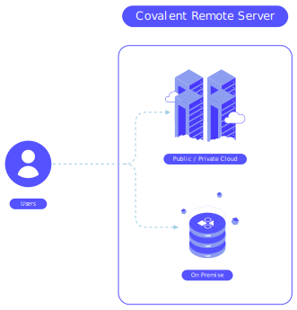

#################
Server Deployment
#################

Covalent supports both local and remote installation to suit different use cases. For quick prototyping and testing, running Covalent locally is sufficient.

For dispatching large compute-intensive workflows that require lots of CPU cores and memory, deploying Covalent as a :term:`remote` server (cloud or on-premise) uses resources more efficiently. You can develop workflows locally, then dispatch them to the remote Covalent server for execution.

Click an option below for instructions on deploying to that platform.

.. note:: Whether you deploy on-prem or on a web service, there are some issues to be aware of that don't apply when you run Covalent locally. :doc:`This information<../developer/patterns/deployment>` will help you avoid some common remote deployment pitfalls.

.. grid:: 1

  .. grid-item-card:: On-Premise Deployment
    :text-align: center

  .. grid-item-card::
    :text-align: left

    Install the Covalent server on an on-prem server or virtual machine to create a centralized deployment.

  .. grid-item-card::

    .. grid:: 1 2 2 2

      .. grid-item-card:: Docker
        :link: deploy_with_docker
        :link-type: doc
        :img-top: images/docker_deploy.jpg

        Pull the pre-built container image from our public registries and run it in Docker.

      .. grid-item-card:: systemd
        :link: deploy_with_systemd
        :link-type: doc
        :img-top: images/systemd_deploy.jpg

        Use ``systemd`` on a Linux host to manage a self-hosted Covalent server.

.. grid:: 1

  .. grid-item-card:: Cloud Deployment
    :text-align: center

  .. grid-item-card::
    :text-align: left

    Deploy on any major cloud platform to scale your deployments based on compute and memory needs.

  .. grid-item-card::

    .. grid:: 1 2 2 2

      .. grid-item-card:: AWS
        :link: deploy_with_aws
        :link-type: doc
        :img-top: images/aws_deploy.jpg

        Deploy Covalent in an AWS account with any ``x86``-based EC2 instance.
