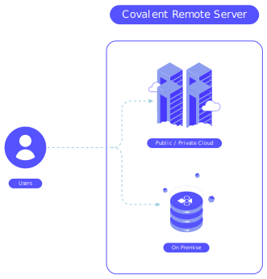

*************************
Covalent Deployment Guide
*************************

Covalent supports both local and remote installations to suit different uses cases and compute requirements. For quick prototyping and testing running ``Covalent`` locally
might be sufficient but for dispatching large compute intensive workflows which may require lots of CPU cores and memory, deploying ``Covalent`` as a **remote** server (cloud/on-prem) would be a better alternative. This way
users can still develop their workflows locally and dispatch them to the remote Covalent server for execution.

=========================
Deployment with Docker
=========================

Apart from installing ``Covalent`` locally within a Python virtual environment, users can also run Covalent as a docker container using the public images. The latest docker image for ``Covalent`` can be obtained as

.. code:: bash

    docker pull public.ecr.aws/covalent/covalent:latest

.. note::

    To obtain the stable image, the ``stable`` tag can be used instead of ``latest``

Covalent can then be started by running the container as follows

.. code:: bash

    docker container run -d --name covalent -p 48008:48008 public.ecr.aws/covalent/covalent:latest

This will start the container in detached mode and map port ``48008`` back out to host. To view the UI, users can then go to `http://localhost:48008 <http://localhost:48008>`_. Users can still configure Covalent that's running inside the container via environment variables.
The following table lists out all the supported environment variables that users can specify to customize Covalent's execution environment at start up.

.. list-table:: Covalent configuration environment variables
   :widths: 20 80
   :header-rows: 1

   * - Environment Variable
     - Description
   * - COVALENT_ROOT
     - Root directory for the ``covalent`` process
   * - COVALENT_CONFIG_DIR
     - Directory that ``covalent`` will search for its configuration file, ``covalent.conf``
   * - COVALENT_PLUGINS_DIR
     - Path where ``covalent`` will look to load any executor plugins installed
   * - COVALENT_DATABASE
     - Path to ``covalent``'s backend SQLite3 database
   * - COVALENT_LOGDIR
     - Path to ``covalent``'s log file
   * - COVALENT_CACHE_DIR
     - Directory to be used by ``covalent`` for storing temporary objects during runtime
   * - COVALENT_DATA_DIR
     - Path to ``covalent``'s database directory
   * - COVALENT_RESULTS_DIR
     - Directory on the filesystem to store the intermediate result objects
   * - COVALENT_SVC_PORT
     - TCP port on which ``covalent`` will start running
   * - COVALENT_SERVER_IFACE_ANY
     - Boolean value to allow ``covalent`` to listen on all network interfaces on the host
   * - COVALENT_NUM_WORKERS
     - Number of Dask workers to start as part of Covalent's default cluster
   * - COVALENT_MEM_PER_WORKER
     - Memory limit for each dask worker
   * - COVALENT_THREADS_PER_WORKER
     - Number of threads to start each worker with

As an example users can start Covalent with 2 workers on port 8000 as follows

.. code:: bash

   docker container run --name covalent -p 8000:8000 -e COVALENT_NUM_WORKERS=2 -e COVALENT_SVC_PORT=8000 public.ecr.aws/covalent/covalent:latest

==============================
On-prem deployment
==============================

The ``Covalent`` server can be installed and deployed on on-prem servers or virtual machines quite easily in order to centralize the deployment. This would enable users to host their Covalent servers on on-prem machines they may have access to or run them inside virtual machines. If the remote machines have `Docker <https://www.docker.com/>`_ support enabled then the deployment is trivally simple and amounts to simply pulling and running the Covalent container from our public registries. The deployment can be customized by following the steps outlined in :ref:`Deployment with Docker <Deployment with Docker>` section.

-----------------------
Deployment with Systemd
-----------------------

The Covalent server can also be installed and managed as a `systemd <https://systemd.io/>`_ service if desired. This can be a preferred approach if one would like to manage and administer the server via `systemd <https://systemd.io/>`_. There are several ways Covalent can be installed on a system and managed via systemd. For instance, users can directly install Covalent at the system level, install all the required plugins, create a ``covalent.service`` unit file and enable the service.

.. warning::

   Installing Covalent at the system level is **NOT** recommended as its Python package dependencies can potentially conflict with system packages. Moreover, the system Python version may not be compatible with Covalent. Refer to our compatibility matrix to see all the support Python versions

The recommended approach for running Covalent under systemd is to create a Python virtual environment with Covalent installed and then run the systemd service. This approach ensures that the system level Python settings are not altered and any potential Python package dependency conflicts are averted. In this guide, for convenience we assume ``Python3.8`` is available on the system and all the commands are carried out as the **root** user. We first being by creating the Python virtual environment in which Covalent will be subsequently installed

.. code:: bash

   python3 -m virtualenv /opt/virtualenvs/covalent

.. note::

   On Debian/Ubuntu based systems the **virtualenv** Python module can be installed at the system level via pip as follows ``python3 -m pip install virtualenv``

We can now install ``Covalent`` in this virtual environment as follows

.. code:: bash

   /opt/virtualenvs/covalent/bin/python -m pip install covalent

.. note::

   If users are looking to use the AWS executor plugins with their Covalent deployment the ``covalent-aws-plugins`` must be installed via ``/opt/virtualenvs/covalent/bin/python -m pip install 'covalent-aws-plugins[all]'``

This will ensure that the latest release of ``Covalent`` along with all its dependencies are properly installed in the virtual environment. We can now create a ``systemd`` unit file for Covalent and enable it to be managed by ``systemd``.
Systemd provides a convenient inferface to configure environment variables that will be exposed to the covalent server via the ``Environment`` and ``EnvironmentFile`` directives. We will leverage these interfaces to configure Covalent's startup and runtime behaviour. Users can use the following sample ``covalent.service`` systemd unit file and customize it for their needs when hosting Covalent themselves. On most linux systems, this service file can be installed under ``/usr/lib/systemd/system``. Users are encouraged to review the systemd documentation `here <https://www.freedesktop.org/software/systemd/man/systemd.html>`_.

.. code:: bash

   [Unit]
   Description=Covalent Dispatcher server
   After=network.target

   [Service]
   Type=forking
   Environment=VIRTUAL_ENV=/opt/virtualenvs/covalent
   Environment=PATH=/opt/virtualenvs/covalent/bin:$PATH
   Environment=HOME=/var/lib/covalent
   Environment=COVALENT_SERVER_IFACE_ANY=1
   EnvironmentFile=/etc/covalent/covalent.env
   ExecStartPre=-/opt/virtualenvs/covalent/bin/covalent stop
   ExecStart=/opt/virtualenvs/covalent/bin/covalent start
   ExecStop=/opt/virtualenvs/covalent/bin/covalent stop
   TimeoutStopSec=10

   [Install]
   WantedBy=multi-user.target

To ensure that when systemd invokes the ``Covalent`` server, its from within the virtual environment created earlier, we need to the set ``VIRTUAL_ENV`` environment variable to its proper value

.. code:: bash

   VIRTUAL_ENV=/opt/virtualenvs/covalent

Setting this variable to the location of the virtual environment is sufficient to ensure that the proper Python interpreter is used by Covalent at runtime. In the ``[Service]`` directive we set the ``EnvironmentFile`` location to ``/etc/covalent/covalent.env``. Users can optionally create this file and populate it with Covalent specific environment variables such as COVALENT_CACHE_DIR, COVALENT_DATABASE, COVALENT_SVC_PORT ... in order customize Covalent's runtime environment.

Once all the settings have been configured, Covalent can be started as follows

.. code:: bash

   systemctl daemon-reload
   systemclt start covalent.service

.. note::

   The status of the service can be inspected by ``systemctl status covalent``. The systemd ``daemon-reload`` command must be executed each time a unit file has been modified to notify systemd about the changes

The ``covalent.service`` can also be enabled to start on boot via systemd as follows

.. code:: bash

   systemctl enable covalent.service

Once the service is running properly, users can connect to the Covalent's UI from their browser by via their remote machines hostname and the port they configured Covalent to run on via the ``COVALENT_SVC_PORT`` environment variable. By default, Covalent start on port ``48008``. The server can be stopped using systemd as follows

.. code:: bash

   systemctl stop covalent.service

.. warning::

   Running Covalent as the root user is **NOT** recommended as it can have several security implications for the remote server. If possible, users must configure a ``service`` account on the system with just the right amount of privileges to ensure proper Covalent functionality. The Covalent UI has an in-built terminal for convenience and it present a login shell as the Covalent user i.e. if the Covalent server is running as root, then users will have access to a root shell on the server. This can potentially have major security implications, thus proper UNIX security polices and best practices must be followed when self-hosting Covalent on remote servers

====================
Deployment on AWS
====================

Users can deploy Covalent in their own AWS accounts with any ``x86`` based EC2 instance of their choice. Deploying on AWS cloud will allow users to vertically/horizontally scale up their deployments depending on their compute needs.

Similar to the docker image, with each stable release, a ready to use Amazon Machine Image (AMI) is also released that is fully configured to start a Covalent server on instance boot. Users can query AWS Marketplace for the AMI ID directly from the console or via the ``aws cli`` command line tool.

.. code:: bash

   aws ec2 describe-images --owners Agnostiq --filter "Name=tag:Version,Values=0.202.0"

The above CLI example illustrates one can query details about the AMI released for version ``covalent==0.202.0``. Once the AMI id is retrieved, users can launch on EC2 instance in their account as follows

.. code:: bash

   aws ec2 run-instances --image-id <ami-id> --instance-type <instance-type> --subnet-id <subnet-id> -security-group-ids <security-group-id> --key-name <ec2-key-pair-name>

For more complicated deployments infrastructure as code tools such as `AWS CloudFormation <https://aws.amazon.com/cloudformation/>`_ or `Terraform <https://www.terraform.io/>`_ can be used.

===============
Best Practices
===============

Self-hosting Covalent on remote machines is an easy way to run compute intensive workflows on machines other than a user's local workstation. Although the experience of creating and dispatching workflows is largely the same, there a few subtleties to consider.

---------------------------------
Client/Server Side configuration
---------------------------------

When Covalent is deployed on remote machines Covalent parses all its configuration values from the configuration file it was deployed with i.e. **server side config**. The client side/local configuration file can be used by the client to set the dispatcher address and port information so that workflows can be dispatched to the remote server.

.. note::

   It is important to realize that when Covalent is hosted remotely there is no need for the Covalent server to be running on the user's local machine. Setting the server address and port in the user's local i.e. **client side** configuration file is enough for dispatching workflows

On the client side, when Covalent is imported it renders a `config` file based on its default values. Users can edit the ``dispatcher`` section of the client side configuration with the new values for the ``address`` and ``port``. These values default to ``localhost`` and ``48008`` on client side.

.. code:: bash

   [dispatcher]
   address = <remote covalent address/hostname>
   port = <remote covalent port>
   ...

The dispatcher ``address`` and ``port`` can also via the ``get_config`` method before dispatching any workflows

.. code:: python

   import covalent as ct

   ct.set_config({"dispatcher.address": "<dispatcher address>"})
   ct.set_config({"dispatcher.port": "<dispatcher port>"})

   ...

   dispatch_id = ct.dispatch(my_workflow)(*args, **kwargs)

Lastly, the dispatcher address can also be specified directly in the `ct.dispatch` and `ct.get_result` methods

.. code:: python

   import covalent as ct

   ...

   dispatch_id = ct.dispatch(workflow, dispatcher_addr="<addr>:<port>")(*args, **kwargs)
   result = ct.get_result(dispatch_id, dispatcher_addr="<addr>:<port>")

------------------
Executors
------------------

When Covalent is deployed remotely, it is important to understand how ``executors`` are handled by the server. For instance, in Covalent there are multiple ways users can specify an ``executor`` for an electron in their workflows and each of the cases has certain implications on how the executor information is parsed and handled by the remote server

#. Using the executor short name

.. code:: python

   import covalent as ct

   @ct.electron(executor="awsbatch")
   def task(*args, **kwargs):
    ...
    return result

In this case, the server receives only the short name of the executor that ought to be used for executing the electron, thus the server will construct an instance of the specified executor using the configuration values specified in its config file i.e. **server side** during workflow execution just prior the the task being sent to the backend for execution. This is a very convenient way to choose executors in a workflow then the compute resources are being managed entirely by the remote server.

.. warning::

  Users however should be cautious of any changes being made to the **server side** configurations from the UI or directly over a SSH connection to the remote server.

#. Passing an instance of the executor class with fully specified input arguments

.. code:: python

   import covalent as ct

   awslambda = ct.executor.AWSLambdaExecutor(function_name="my-lambda-function", s3_bucket_name="my-s3-bucket-name")

   @ct.electron(executor=awslambda)
   def task(*args, **kwargs):
    ...
    return result

When a fully specified instance of an executor is passed to the remote server then the client passed instance is pickled and transported to the remote server, which then uses that to execute the task on the user specified backend. In this case there is not ambiguity between the client and the server as to which values of the executor ought to be parsed from the **server side** configuration file since all the values are specified by the client at workflow dispatch time.

.. warning::

   When providing executor information this way, users must ensure that the remote Covalent server has access to the executor backend. For instance, if the user is looking to use the ``AWSBatchExecutor`` in their workflows, then the remote Covalent server must have the proper IAM permissions and policies configured so that it can execute that task on the user's behalf using the AWS Batch service.

#. Passing an instance of an executor with partially specified input arguments

.. code:: python

   import covalent as ct

   awsbatch = ct.executor.AWSBatchExecutor(vcpus=2)

   @ct.electron(executor=awsbatch)
   def task(*args, **kwargs):
    ...
    return result

In this case, all the parameter values that are omitted from the executor's constructor are inferred from the **client side** configuration/environment during workflow construction time. This occurs offline and the dispatcher/remote server is not interacted with until the workflow is submitted for execution.

------------------
Environment Sanity
------------------

Covalent by default starts a local Dask cluster that it uses to execute tasks when executor metadata. This cluster by default runs in the same environment as Covalent and shares all the Python packages. In this case, users must be cautious of using any ``DepsPip`` call in their workflows as the user requested ``pip`` packages will be installed in the same environment as Covalent. This can potentially lead to unwarranted package conflicts and de-stabilize the Covalent server.

As a best practice, it is **recommended** that users start a separate Dask cluster that runs either on an entirely different machine or in a separate virtual environment on the same machine. This way users can ensure that Covalent's virtual environment will remain unmodified even if the workflows use frequent calls to ``DepsPip``.

.. note::

   When running a separate Dask cluster, users must make Covalent aware of the cluster's scheduler address and port by modifying the **server side** configuration file so that Covalent can submit tasks to it as they appear in the workflow

----------------------------
LocalExecutor & I/O
----------------------------

For performance and stability reasons, users must avoid using the ``LocalExecutor`` as much as possible and only use it for debugging purposes. Secondly, users must aim to avoid excessively large inputs and outputs for their electrons as they can consume a lot of system memory.
