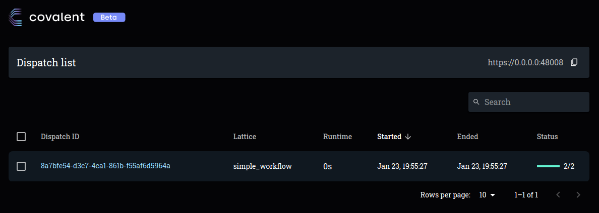
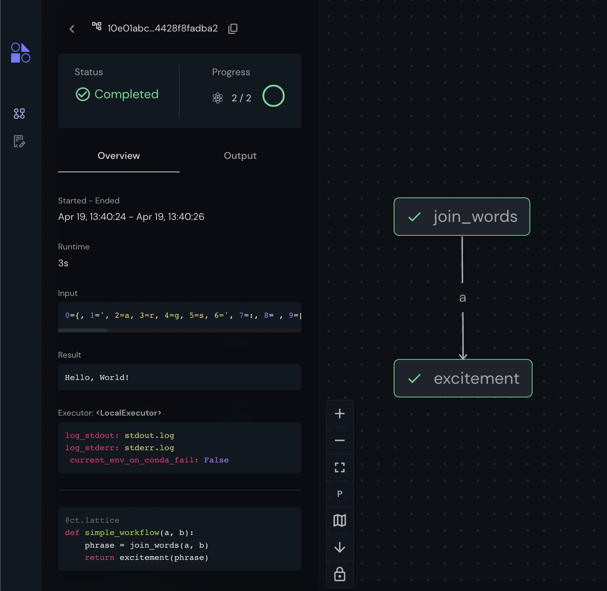

===============
Getting Started
===============

Covalent is developed using Python 3.8 on Linux and macOS.  See the :doc:`Compatibility <./compatibility>` page for further details on Python versions and operating systems which support Covalent. To set up Python on your computer, refer to the official `Python for Beginners <https://www.python.org/about/gettingstarted/>`_ page.

Installation
############

Installation Methods
~~~~~~~~~~~~~~~~~~~~

Pip Install
-----------

The easiest way to install Covalent is using the PyPI package manager:

.. code:: bash

   pip install covalent

.. note::

   If you have used Covalent previously, make sure to uninstall the Covalent Dask plugin by running :code:`pip uninstall covalent-dask-plugin`. That plugin has been folded into Covalent and will no longer be maintained separately.

Conda Install
-------------

Users can also install Covalent as a package in a Conda environment:

.. code:: bash

   conda install -c agnostiq covalent

.. note::

   Installation via Conda is currently only supported for Linux. Sometimes Conda can have trouble resolving packages. Use the flag :code:`--override-channels` to speed things up.

Install From Source
--------------------

Covalent can also be downloaded and installed from source:

.. code:: bash

   git clone git@github.com:AgnostiqHQ/covalent.git
   cd covalent

   # Build dashboard
   python setup.py webapp

   # Install using pip (-e for developer mode), or...
   pip install -e .

   # Build and install using Conda (10-15 mins)
   conda build .
   conda install -c local covalent

The documentation can also easily be built locally:

.. code:: bash

   python setup.py docs

Validate the Installation
~~~~~~~~~~~~~~~~~~~~~~~~~

You can validate Covalent has been properly installed if the following returns without error:

.. code:: bash

   python -c "import covalent"

Start the Server
#################

Use the Covalent CLI tool to manage the Covalent server. The following commands will help you get started.

.. code:: console

   $ covalent --help
   Usage: covalent [OPTIONS] COMMAND [ARGS]...

   Covalent CLI tool used to manage the servers.

   Options:
   -v, --version  Display version information.
   --help         Show this message and exit.

   Commands:
   logs     Show Covalent server logs.
   purge    Shutdown server and delete the cache and config settings.
   restart  Restart the server.
   start    Start the Covalent server.
   status   Query the status of the Covalent server.
   stop     Stop the Covalent server.

Start the Covalent server:

.. code:: console

   $ covalent start
   Covalent server has started at http://localhost:48008

Optionally, confirm the server is running:

.. code:: console

   $ covalent status
   Covalent server is running at http://localhost:48008.

Now, navigate to the Covalent UI by entering the address into your web browser.  This is where dispatched jobs will appear.

Hello, Covalent!
################

Let's look at a simple example to get started with Covalent. Before starting, ensure you have installed Covalent, verified the installation, and started the Covalent server. Next, open a Jupyter notebook or Python console and create a simple workflow:

.. code:: python

   import covalent as ct

   # Construct tasks as "electrons"
   @ct.electron
   def join_words(a, b):
       return ", ".join([a, b])

   @ct.electron
   def excitement(a):
       return f"{a}!"

   # Construct a workflow of tasks
   @ct.lattice
   def simple_workflow(a, b):
       phrase = join_words(a, b)
       return excitement(phrase)

   # Dispatch the workflow
   dispatch_id = ct.dispatch(simple_workflow)("Hello", "World")

Navigate to the Covalent UI at `<http://localhost:48008>`_ to see your workflow in the queue:

|

Click on the dispatch ID to view the workflow graph:

|

While the workflow is being processed by the dispatch server, you are free to terminate the Jupyter kernel or Python console process without losing access to the results. Make sure the Covalent server remains in the "running" state while you have running workflows.

When the workflow has completed, you can start a new session and query the results:

.. code:: python

   import covalent as ct

   dispatch_id = "8a7bfe54-d3c7-4ca1-861b-f55af6d5964a"
   result_string = ct.get_result(dispatch_id).result

When you are done using Covalent, stop the server:

.. code:: console

   $ covalent stop
   Covalent server has stopped.

Even if you forget to query or save your workflow results, Covalent saves them after each task's execution. The full results, including metadata, are stored on disk in the format shown below:

.. code:: text

    📂 my_project/
    ├─ 📙 my_experiment.ipynb
    ├─ 📂 results/
    │  ├─ 📂 8a7bfe54-d3c7-4ca1-861b-f55af6d5964a/
    │  │  ├─ 📄 result.pkl
    │  │  ├─ 🗒️ dispatch_script.py
    │  │  ├─ 🧾 result_info.yaml

Read more about how Covalent works on the Covalent :doc:`concepts <../concepts/concepts>` page.
