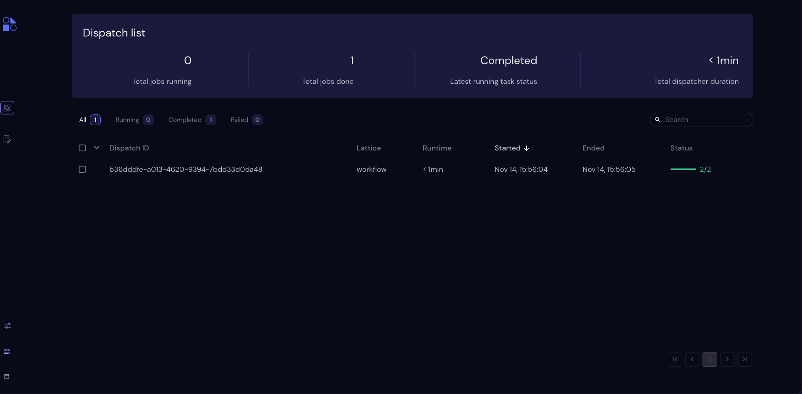
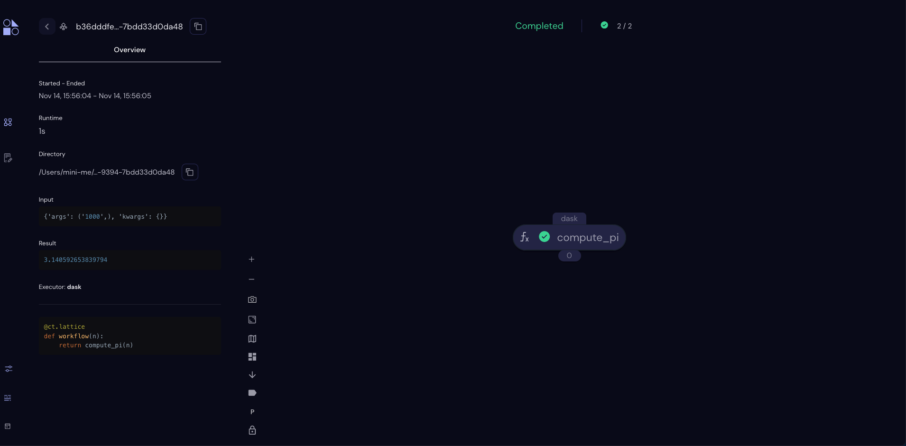

=================
:octicon:`stopwatch;1em;` Quick Start
=================

To quickly install Covalent and run a short demo, follow the four steps below.

.. admonition:: Before you start

   Ensure you are using a compatible OS and Python version. See the :doc:`Compatibility <./compatibility>` page for supported Python versions and operating systems.

1. Use Pip to install the Covalent server and libraries locally.

  Type the following in a terminal window:

.. code:: bash

    $ pip install covalent

2. Start the Covalent server.

  In the terminal window, type:

.. code:: console

    $ covalent start
    Covalent server has started at http://localhost:48008

3. Run a workflow.

Open a Jupyter notebook or Python console and run the following Python code:

.. code:: python

  # Compute π (pi) to arbitrary precision using the Leibiz series.
  # Precision depends on the number of terms (TERM_COUNT in the code).
  import covalent as ct  # The Covalent API

  @ct.electron  # No executor specified, so defaults to Dask on localhost
  def compute_pi(n):
      # Leibniz formula for π
      return 4 * sum(1.0/(2*i + 1)*(-1)**i for i in range(n))

  @ct.lattice
  def workflow(n):
      return compute_pi(n)

  dispatch_id = ct.dispatch(workflow)(100000)
  result = ct.get_result(dispatch_id=dispatch_id, wait=True)
  print(result.result)

4. View the workflow progress.

  Navigate to the Covalent UI at `<http://localhost:48008>`_ to see your workflow in the queue:

  Click on the dispatch ID to view the workflow graph:

What to Do Next
###############

Read :doc:`Concepts <../../concepts/concepts>` gain a deeper understanding of how Covalent works.

See the :doc:`Tutorials <../../tutorials/tutorials>` to see how to apply Covalent to real-world machine learning problems in a variety of subject domains.

See the :doc:`API Reference <../../api/index>` for usage information on ``electron``, ``lattice``, and ready-to-use executors.

See :doc:`AWS Plugins <../../api/executors/awsplugins>` to see how you can specify an executor to run this example on an AWS node using only two more lines of code.