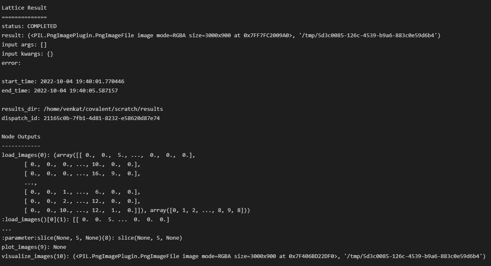
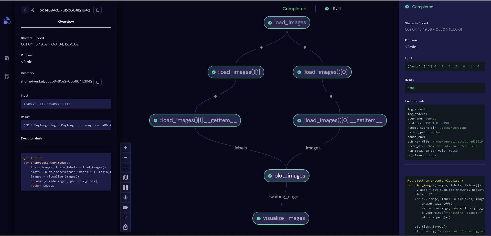
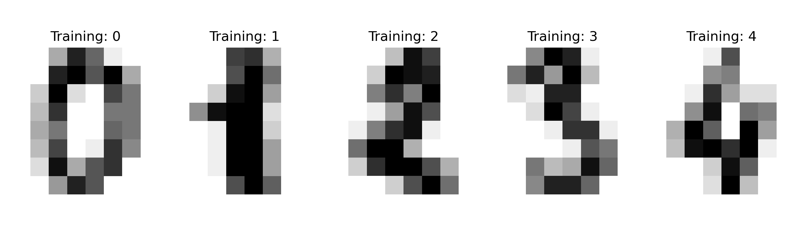
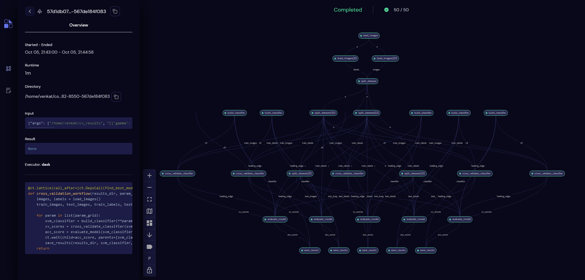
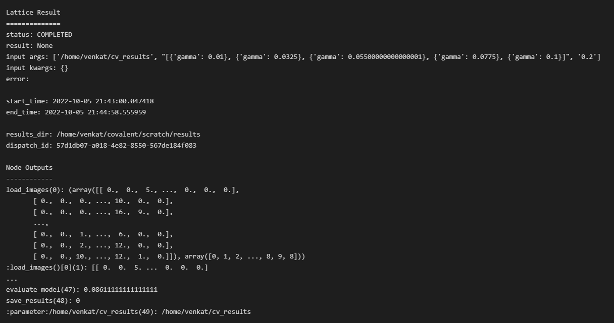

Classification with Support Vector Machines
=============================================

In this example we highlight some advanced features in Covalent that facilitate developing workflows involving multiple remote executors. Covalent is quite
feature rich and allows users to customize execution of their workflows at a very granular level. Users can specify custom hooks that can execute before or after an electron is run by Covalent,
files can be uploaded and downloaded from remote machines, AWS S3 buckets before the tasks consuming them even begin execution. Users can also specify custom synchronization points in their workflows in order
to enforce dependencies between electrons. This feature is quite useful when users would want to force a dependency between independent electrons before proceeding to subsequent steps.

In this example, we use the classic MNIST dataset and build a SVM (Support Vector Machine) classifier using ``scikit-learn`` tools. We will decompose the entire machine learning pipeline
into several stages and use Covalent to execute the corresponding workflows.

Generally speaking, ML workflows can be largely decomposed into the 3 stages

1) Data pre-processing
2) Model training/Cross Validation
3) Inference

All of these stages are unique on their own and depending on the problem at hand each one of them can be quite computationally expensive. Training very large ML models require vast amounts of data all of which needs pre-processing.

With Covalent, we can tackle each of these stages as separate workflows and dispatch computationally intensive parts of each to remote backends using suitable executors.

Workflow Outline
~~~~~~~~~~~~~~~~~~~~~

Data pre-processing
~~~~~~~~~~~~~~~~~~~~~

In the first stage, we load the MNIST hand written dataset from ``scikit-learn`` itself and arrange it in a shape suitable for training. To gain visual insight into the dataset, we add a step
in our workflow to plot a few training samples from the dataset and display the images. Seemingly these steps are quite simple but can be computationally intensive under certain circumstances.
Imagine the use case where the dataset to be plotted is really large and needs a machine with ample amount hardware resources to render the figures. This could very well be a node in a workflow,
that can be offloaded to a remote machine for execution through Covalent.

We break our pre-processing workflow into 3 distinct steps

1) Load the raw images from ``scikit-learn`` datasets
2) Plot a few sample images using ``matplotlib`` and save the resulting figure as PNG using a remote executor (``SSHExecutor``)
3) Download the resulting figures to the local machine for visualization and post-processing

The first step is trivial and is expressed by the following electron. We flatten the ``8 x 8`` pixel images to a vector of length ``64``. This makes it easier when fitting the classifier to the dataset

.. code:: python

    import covalent as ct
    from sklearn import datasets

    @ct.electron
    def load_dataset():
        """
        Return the MNIST handwritten images and labels
        """
        data = datasets.load_digits()
        nsamples = len(data.images)
        return data.images.reshape((nsamples, -1)), data.target

For the second stage of the pre-processing workflow we are going to use the ``SSHExecutor`` to offload the task of generating the images to a remote virtual machine. The source code for this ``plot_images`` stage
is the following

.. code:: python

    import matplotlib.pyplot as plt
    import os
    from covalent.executor import SSHExecutor

    localssh = SSHExecutor(username=<username>, hostname=<hostname>, ssh_key_file=<path to ssh key>)

    @ct.electron(executor=localssh)
    def plot_images(images, labels, basedir = os.environ['HOME']):
        _, axes = plt.subplots(nrows=1, ncols=len(images), figsize=(10, 3))

        for ax, image, label in zip(axes, images, labels):
            ax.set_axis_off()
            ax.imshow(image.reshape(8, 8), cmap=plt.cm.gray_r, interpolation="nearest")
            ax.set_title(f"Training: {label}")

        plt.tight_layout()
        plt.savefig(f"{os.path.join(basedir, "training_images.png")}", format="png", dpi=300)
        return

We first create an instance of the ``SSHExecutor`` with the corresponding arguments and pass that as an input the the ``electron`` decorator. This signifies to covalent that
the execution of the ``plot_images`` electron needs to be on the remote machine running at ``<hostname>``. During runtime, the executor will authenticate with that remote machine
with the user supplied credentials. The inputs to this ``plot_images`` electron are the training images along with their labels to be plotted and an optional ``basedir`` argument that defaults to the HOME directory
on the remote machine. This electron does not return anything but generates a PNG figure named ``training_images.png`` saved at ``basedir``.

Electron Dependencies
=======================

Pip Dependencies
~~~~~~~~~~~~~~~~~~~~

During runtime, when Covalent will encounter this, it will pickle the ``plot_images`` function using ``cloudpickle`` and transport it to the remote machine for execution. The pickled object will be un-pickled on the remote machine
and executed due to which all the python packages being referenced in the ``electron`` need to be installed and be visible in the ``PYTHONPATH`` of the remote Python interpreter.
There are multiple ways this can be accomplished namely

1) The user curates the remote execution environment before dispatching the workflows
2) If on the cloud, the VM can be customized by creating specialized AMIs using tools such as Terraform, Packer and equivalents.
3) Use Covalent's ``electron dependencies`` features

Here we highlight an important feature in Covalent that allows users to install python packages required by an electron before execution. :doc:`Electron dependencies <../../../../concepts/concepts>` are a key feature in Covalent
that makes it really convenient for users to install the required Python packages for an electron before its execution. The platform on which the packages get installed are determined by the
executor of the electron. If the electron is configured to execute on a remote machine, the dependencies will be injected into the remote machines environment. There are several electron dependencies
supported by Covalent, in this section we will focus on the :doc:`DepsPip <../../../../concepts/concepts>` dependency.

Inspecting the ``plot_images`` electron it is apparent that ``matplotlib`` is required to be present on the remote machine for the plots to be properly generated. We can instruct Covalent to install a very specific version of ``matplotlib`` at the electron level as follows

.. code:: python

    @ct.electron(
        executor=localssh,
        deps_pip = ct.DepsPip(packages=["matplotlib==3.5.1"])
    )
    def plot_images(images, labels, basedir = os.environ['HOME']):
        _, axes = plt.subplots(nrows=1, ncols=len(images), figsize=(10, 3))

        for ax, image, label in zip(axes, images, labels):
            ax.set_axis_off()
            ax.imshow(image.reshape(8, 8), cmap=plt.cm.gray_r, interpolation="nearest")
            ax.set_title(f"Training: {label}")

        plt.tight_layout()
        plt.savefig(f"{os.path.join(basedir, "training_images.png")}", format="png", dpi=300)
        return

By simply augmenting the ``electron`` decorator with the ``deps_pip`` dependency, Covalent will now install ``matplotlib`` version ``3.5.1`` before executing the ``plot_images`` electron on the remote machine.

.. note::
    As electrons are packaged and transported as types defined within Covalent, ``covalent`` itself is a dependency that needs to be installed and made available on remote machines.
    For consistency it is recommended that the same version of covalent is used across all remote environments to avoid any version conflicts

File Transfers
~~~~~~~~~~~~~~~~

:doc:`File transfer <../../../../concepts/concepts>` is another important feature in Covalent that aims to facilitate file I/O between environments during runtime. In the context of our workflow,
we want to transfer the PNG figure generated on the remote machine via the ``plot_images`` electron onto our local machine before visualization. Covalent supports a variety of file transfer ``strategies`` to facilitate
the movement of large files between environments. In our case, we will leverage the ``Rsync`` file transfer strategy to download the PNG figures from the remote machine as part of the visualization step of the workflow. Further details about
file transfers and different strategies can be found :doc:`here <../../../../concepts/concepts>`

The source code for the visualization electron is as follows

.. code:: python

    rsync = ct.fs_strategies.Rsync(user=<username>, host=<hostname>, private_key_path=<ssh key file>)
    @ct.electron(
        files=[ct.fs.TransferFromRemote(f"{os.path.join(os.environ['HOME'], 'training_images.png')}", strategy=rsync)]
    )
    def visualize_images(files=[]):
        _, local_path_to_file = files[0]
        return Image.open(f"{local_path_to_file}"), str(local_path_to_file)

As seen from above, we create a ``rsync`` file transfer strategy object and pass it the connection credentials such as the username, remote host address and path to the private SSH key.
The electron decorator is then augmented with a list of file transfer objects (in this case ``ct.fs.TransferFromRemote``) indicating the files that need to be moved from the remote machine to
the local platform before ``visualize_images`` executes. With this simple addition, Covalent will copy the figures generated on the remote machine to the user's local environment
and make it available for further processing in the ``visualize_images`` electron.

It can be seen that there is a ``files=[]`` placeholder argument being passed into ``visualize_images``. This is a convenient handle Covalent exposes for users to easily interact
with the files being transferred in and out. It can noted that we have not specified where on the local filesystem Covalent ought to download the file. To this end, we use
the ``files`` argument in ``visualize_images`` to get the temporary path to the download file.

This is then used to open the PNG file and return it as a Python object.

Pre-processing workflow
=========================

We now stich all the above specified electrons into a workflow that can be dispatched to Covalent for execution.

.. code:: python

    import os
    import covalent as ct
    import matplotlib.pyplot as plt
    from PIL import Image
    from sklearn import datasets
    from covalent.executor import SSHExecutor

    @ct.electron
    def load_dataset():
        """
        Return the MNIST handwritten images and labels
        """
        data = datasets.load_digits()
        nsamples = len(data.images)
        return data.images.reshape((nsamples, -1)), data.target

    # Create the SSHExecutor
    localssh = SSHExecutor(username=<username>,
                    hostname=<hostname>,
                    ssh_key_file=<path to ssh key>)

    @ct.electron(
        executor=localssh,
        deps_pip = ct.DepsPip(packages=["matplotlib==3.5.1"])
    )
    def plot_images(images, labels, basedir = os.environ['HOME']):
        _, axes = plt.subplots(nrows=1, ncols=len(images), figsize=(10, 3))

        for ax, image, label in zip(axes, images, labels):
            ax.set_axis_off()
            ax.imshow(image.reshape(8, 8), cmap=plt.cm.gray_r, interpolation="nearest")
            ax.set_title(f"Training: {label}")

        plt.tight_layout()
        plt.savefig(f"{os.path.join(basedir, "training_images.png")}", format="png", dpi=300)
        return

    # Download the file for visualization
    rsync = ct.fs_strategies.Rsync(user=<username>, host=<hostname>, private_key_path=<ssh key file>)
    @ct.electron(
        files=[
            ct.fs.TransferFromRemote(
                f"{os.path.join(os.environ['HOME'],
                'training_images.png')}",
                strategy=rsync
            )
        ]
    )
    def visualize_images(files=[]):
        _, local_path_to_file = files[0]
        return Image.open(f"{local_path_to_file}"), str(local_path_to_file)

    @ct.lattice
    def preprocessing_workflow():
        train_images, train_labels = load_dataset()
        plots = plot_images(train_images[:5], train_labels[:5])
        images = visualize_images()
        ct.wait(child=images, parents=[plots])
        return images

Synchronization between nodes
~~~~~~~~~~~~~~~~~~~~~~~~~~~~~~

Before proceeding further, we pause here to mention a few key aspects about the current workflow. It can be noted that the ``plot_images`` electron basically returns ``None``
and there are no inputs to the ``visualize_images`` electron. However, the PNG images will only be generated after the ``plot_images`` step completes successfully and until then
the ``visualize_images`` step should be barred from executing. All lattices are converted into DAGs before execution by Covalent and nodes in the graph that have not dependent edges between them
are deemed to execute concurrently by Covalent.

In this case however, this would lead to ``visualize_images`` to fail if the PNG figure is not ready to be downloaded. This is an implicit race condition in this workflow that needs to be addressed.
In Covalent, users can enforce dependencies between nodes by using the ``wait`` command. As seen in the ``preprocessing_workflow`` we are enforcing a ``parent-child`` dependency between
the ``plot_images`` and ``visualize_images`` electrons via the ``ct.wait`` command.

Behind the scenes, Covalent will create an ``edge`` connecting the two and synchronizing the execution thus eliminating the potential race condition.

The workflow can now be dispatched to Covalent and its graph can be viewed at `<http://localhost:48008>`_

.. code:: python

    dispatch_id = ct.dispatch(preprocessing_workflow)()
    result = ct.get_result(dispatch_id, wait=True)
    print(result)

Workflow Graph

The output of the ``visualize_images`` electron is the following

Model Training & Cross validation
=================================

So far we looked at the `pre-processing` workflow and covered several niche features in Covalent such as file transfers, electron dependencies, synchronization primitives, remote executors etc.
In the earlier section, we saw how users can dispatch parts of their workflows to remote machines they may have access to. The machines can be bare-metal servers, virtual machines (on-prem/cloud) that users
would have access to.

In this section, we look to demonstrate users can dispatch their Covalent workflows to AWS cloud services (especially AWS Batch) for execution. Covalent supports execution of tasks
on a variety of AWS cloud services through its suite of :doc:`AWS cloud executor plugins<../../../../plugins>`. Users can choose the right compute service for their computational needs and use them elastically as the needs arise.

Following is the list of AWS cloud executors that are currently supported in Covalent

* AWS EC2
* AWS Batch
* AWS ECS
* AWS Lambda
* AWS Braket

Each one of them can be installed independently through PYPI, but users can use the following shortcut to install all the AWS cloud plugins

.. code:: bash

    pip install covalent-aws-plugins

In this exercise we will be using the AWS Batch executor to offload the training our model to AWS. The Covalent AWS Batch plugin can from PYPI as follows

.. code:: bash

    pip install covalent-awsbatch-plugin==0.16.1rc0

AWS Batch Executor
~~~~~~~~~~~~~~~~~~~~

The `Batch executor <https://github.com/AgnostiqHQ/covalent-awsbatch-plugin>`_ plugin assumes that all the necessary AWS infrastructure has already been provisioned prior to running the workflow. Details pertaining to configuring a
a AWS batch job queue, job definitions, compute environments and IAM roles can be found `here <https://docs.aws.amazon.com/batch/latest/userguide/Batch_GetStarted.html>`_

As AWS Batch supports executing jobs as containers, the AWS Batch executor utilizes that feature to execute electrons. From a high level the execution steps from start to finish
of an electron scheduled to be executed on AWS Batch are as follows

1) Pickle the electron task to be executed along with all its dependencies (``DepsPip, DepsCall`` etc)
2) Upload the pickled file to the user provided S3 bucket
4) Submit a AWS Batch job to execute the electron task using Covalent's public AWS Batch base container
5) Upload the electron's result object to the user provided S3 bucket
6) Download the result object locally for post processing

Similar to the way we configured the ``SSHExecutor``, user can import the ``AWSBatchExecutor`` from Covalent and use that in their workflows. Users can configure this executor in several different ways as outlined in `here <https://github.com/AgnostiqHQ/covalent-awsbatch-plugin>`_.
In this example, we will configure an instance of the executor and use that to offload execution of certain electrons to the Batch compute environment. Following are the required arguments users need to provided in order to
properly configure the AWS Batch executor

* ``s3_bucket_name``: Name of the AWS S3 bucket to be used during execution to cache function/result objects
* ``batch_job_definition_name``:  Name of the user configured AWS Batch job definition
* ``batch_queue``: Name of the AWS Batch job queue to which the job ought to be submitted
* ``batch_execution_role_name``: Execution role name that grants Batch compute backend services (ECS/Fargate) to take API calls on the user's behalf
* ``batch_job_role_name``: IAM role name configured by the user for the Batch job. This role should have sufficient privileges for the jobs to read and write the S3
* ``batch_job_log_group_name``: Name of the AWS cloudwatch log group for storing all logs generated during batch job execution
* ``vcpu``: Number of virtual CPU cores to be used to execute the task
* ``memory``: Memory in GB to allocate for the task
* ``time_limit``: Time limit for the job in seconds

.. note::
    The executor uses ``vcpu=2``, ``memory=3.75`` and ``time_limit=300`` as default values for all jobs. These can
    be overridden by the user as per their compute requirements and AWS Batch configuration

With the required information, users can then instantiate their Batch executor as follows and use it to offload electrons from their workflows

.. code:: python

    from covalent.executor import AWSBatchExecutor

    awsbatch = AWSBatchExecutor(
                        s3_bucket_name='<s3 bucket name>',
                        batch_job_definition_name='<job definition name>',
                        batch_queue='<batch job queue>',
                        batch_execution_role_name='<batch execution role name>',
                        batch_job_role_name='<batch IAM job role name>',
                        batch_job_log_group_name='<batch job log group name>',
                        vcpu=2,
                        memory=3.75,
                        time_limit=60
    )

Cross validation
~~~~~~~~~~~~~~~~~

When building good machine learning models it is important that the models do not overfit the training dataset. Overfitting causes the model's to generalize poorly and
result in poor accuracy on test sets. To circumvent such issues, k-fold cross validation is typically carried out using the training samples a) to prevent overfitting and b) to find the optimal
model hyper-parameters. There are great tools already available in the ``scikit-learn`` package that greatly simplify this process. In this section we will use these techniques to optimize
our SVM classifier while using Covalent to orchestrate the entire workflow.

We build our cross validation workflow in stages as done earlier in the pre-processing stage. The steps in our workflow consists of the following

1) Load the dataset
2) Build a grid of parameters over which to tune the classifier
3) Build an SVM classifier from a specific set of input parameters
4) Perform k-fold cross validation of the classifier on the training dataset
5) Calculate CV scores
6) Evaluate the model's performance on the training/test set and record results
6) Save results to disk for each model

To begin, we import all the required python libraries for our workflow

.. code:: python

    import os
    import uuid
    import covalent as ct
    import numpy as np
    from sklearn import datasets, metrics
    from covalent.executor import AWSBatchExecutor
    from sklearn.model_selection import train_test_split, cross_val_score, ParameterGrid
    from sklearn.svm import SVC
    from joblib import dump

We reuse the ``load_images`` electron that we created earlier during the pre-processing stages i.e.

.. code:: python

    @ct.electron
    def load_dataset():
        """
        Return the MNIST handwritten images and labels
        """
        data = datasets.load_digits()
        nsamples = len(data.images)
        return data.images.reshape((nsamples, -1)), data.target

We introduce the following two new electrons to build the SVM classifier and split the datasets into training and test sets

.. code:: python

    @ct.electron
    def build_classifier(gamma: float):
        return SVC(gamma = gamma)

    @ct.electron
    def split_dataset(images, labels, fraction: float=0.2):
        return train_test_split(images, labels, test_size=fraction, random_state=42)

We now create the cross validation electron that would be by far the most compute intensive operation of our workflow. To this end we offload this electron to AWS using our Batch executor created earlier (``awsbatch``).
We also point out that since the executor will be executed using the AWS Batch service as a container, we need to ensure that all Python packages that this electron needs are installed and available to it during runtime. To accomplish this,
we use the ``DepsPip`` electron dependency to install ``scikit-learn`` in the tasks runtime environment on AWS Batch. With these additions, the ``cross_validation`` electron is the following

.. code:: python

    @ct.electron(executor=awsbatch, deps_pip=ct.DepsPip(packages=['scikit-learn']))
    def cross_validate_classifier(clf, train_images, train_labels, kfold=3):
        """
        Cross validate using the estimators default scorer
        """
        cv_scores = cross_val_score(clf, train_images, train_labels, cv=kfold)
        return cv_scores

Here ``clf`` is the SVC classifier used in the cross validation and ``kfold`` is the number of cross validation folds we would run at a given time (defaults to 3). Once the cross validation is finished, we fit the model again on the entire training set
and predict using the so far, untouched test set and compute an accuracy score. We summarize these steps in the following ``evaluate_model`` electron

.. code:: python

    @ct.electron
    def evaluate_model(clf, train_images, train_labels, test_images, test_labels):
        clf.fit(train_images, train_labels)
        predictions = clf.predict(test_images)
        return metrics.accuracy_score(predictions, test_labels)

Finally, we save all the results into separate files on disk via the ``save_results`` electron. In this electron, we save the actually classifier, the scores obtained from cross validation
and the accuracy score of the model returned via ``evaluate_model``. We define a variable ``RESULTS_DIR`` for convenience that points to the location where the user wishes to save the results
of their workflow.

.. code:: python

    RESULTS_DIR = os.path.join(os.environ['HOME'], "cv_results")

    @ct.electron(
        call_before=[ct.DepsCall(setup_results_dir, args=[RESULTS_DIR])]
    )
    def save_results(results_dir, classifier, cv_scores, accuracy_score):
       # Generate a random name for the object and results
        random_name = uuid.uuid4()
        dump({"clf": classifier, "cv_score": np.mean(cv_scores), "accuracy": acc_score}, os.path.join(results_dir, f"{random_name}_results.pkl"))
        return

Call Before/After Hooks
~~~~~~~~~~~~~~~~~~~~~~~~~

Covalent allows users to define custom hooks that they can use to run arbitrary Python functions before and after an electron executes. These call dependencies are another type of :doc:`electron dependencies <../../../../concepts/concepts>`
referred to in Covalent as ``DepsCall``. Users can pass in a list of Python functions to the electron decorator they wish Covalent to execute on their behalf before/after an
electron is executed.

In our case, we use the ``call_before`` hook to check that the directory referenced by ``RESULTS_DIR`` exists, if not we create it before the ``save_results`` electron executes.
This way we are able to ensure that all the results from the ``cross_validation`` step are saved properly to disk for later post processing.

Cross Validation Workflow
~~~~~~~~~~~~~~~~~~~~~~~~~~

We now create our lattice composing of all the above electrons as follows

.. code:: python

    @ct.lattice(call_after=[ct.DepsCall(find_best_model, args=[RESULTS_DIR])])
    def cross_validation_workflow(results_dir, param_grid, split_fraction: float = 0.2):
        images, labels = load_images()
        train_images, test_images, train_labels, test_labels = split_dataset(images, labels, fraction=split_fraction)

        for param in list(param_grid):
            svm_classifier = build_classifier(**param)
            cv_scores = cross_validate_classifier(svm_classifier, train_images, train_labels, kfold=3)
            acc_score = evaluate_model(svm_classifier, train_images, train_labels, test_images, test_labels)
            ct.wait(child=acc_score, parents=[svm_classifier, cv_scores])
            save_results(results_dir, svm_classifier, cv_scores, acc_score)
    return

In our ``cross_validation_workflow`` we first load the images from ``scikit-learn`` and split the entire dataset into ``training`` and ``test`` sets. As inputs to our workflow,
we pass in the following

* ``results_dir``: Location on the local filesystem where the model results are to be saved
* ``param_grid``: The grid of model parameter values to use during cross validation
* ``split_fraction``: Fraction of the entire dataset to be used for testing the model, defaults to ``0.2``

Following the splitting of the datasets, we loop over all the parameter values passed in via the ``param_grid`` variable. For each parameter then we do the following steps sequentially

* Build a SVM classifier object
* Use just the training set to perform 3 fold cross validation of the model
* Evaluate the model on the test set after fitting it to the entire training dataset
* Store the results on disk as pickle files using a randomly generated name

We use the ``ct.wait`` feature again to enforce that the ``save_results`` electrons do not proceed before the results from ``cross_validate_classifier`` and ``evaluate_model``
are available. This ensure consistency in our workflow and prevents any race conditions.

.. note::

    It can be noted that running the cross validation electron for different parameter values are independent of each other. Covalent is able to recognize such patterns in workflows
    and it automatically unrolls the for loop iterations and renders them as independent nodes in the workflow graph. Each of these nodes then execute concurrently as separate AWS Batch jobs.
    This scales quite nicely with workflow size as independent loop iterations are separate invocations of the underlying electron.

We now dispatch the workflow to Covalent as follows after generating a grid of 5 SVM classifier parameter values

.. code:: python

    from sklearn.model_selection import ParameterGrid
    import numpy as np

    parameters = list(ParameterGrid({'gamma': np.linspace(0.01, 0.1, 5)}))

    dispatch_id = ct.dispatch(cross_validation_workflow)(RESULTS_DIR, parameters, 0.2)
    result = ct.get_result(dispatch_id, wait=True)
    print(result)

The workflow graph can be inspected in the UI

The result object of the workflow is the following

Model selection
================
