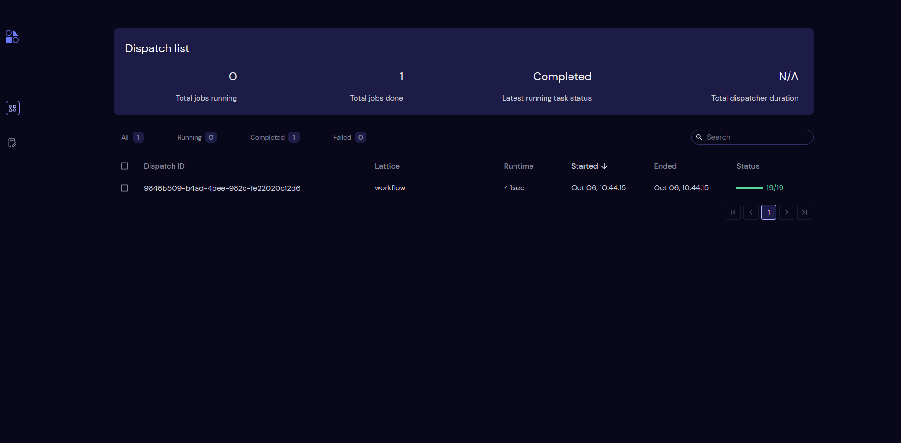
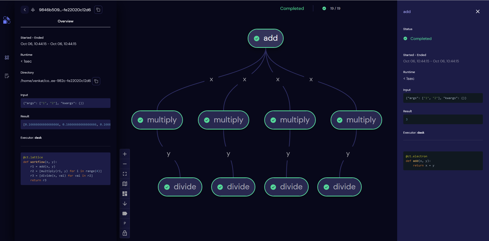

======
Hello, Covalent!
======

Covalent is a workflow orchestration tool written purely in Python to facilitate heterogenous and distributed computing. With Covalent users can quickly take their
existing code, ``covalentify`` it and dispatch it for execution on variety of hardware backends (on-prem or cloud) by simply annotating their code using ``decorators``.

Generally speaking, workflows are simply a collection of interdependent tasks. Tasks are the building blocks of workflows and are referred to as :doc:`electrons <../../../../concepts/concepts>` in Covalent.
A collection of electrons constitutes a :doc:`lattice <../../../../concepts/concepts>` that ultimately represents the entire computation a user intends to run in Covalent.

.. note::

   A very strong feature of Covalent is that it makes it extremely easy for users to dispatch parts of their workflow to different backends (on-prem HPC clusters, cloud services, quantum devices) through the means
   of :doc:`executors <../../../../plugins>`. Users can dictate their intent to Covalent as to where it should execute their tasks by passing in these executors.

In pythonic terms, :doc:`electrons <../../../../concepts/concepts>` are nothing more than simple python functions and the :doc:`lattice <../../../../concepts/concepts>` is simply a function
that stitches all of those electrons together. After a user submits their workflow to Covalent, the lattice is converted into a workflow graph which Covalent renders in its :doc:`UI <../../../../webapp_ui/index>`, a demo which can be seen
`here <http://demo.covalent.xyz>`_

Let's look at a simple example to get started with Covalent. Before starting, users must ensure that Covalent is installed and the Covalent server is running as outlined :doc:`here <../../../installation/index>`.
The following code snippet can be executed either from a jupyter notebook or Python console directly.

.. code:: python

   import covalent as ct

   # Construct tasks as "electrons"
   # Normal python functions can be converted into electrons by
   # simply adding the ``electron`` decorator
   @ct.electron
   def add(x, y):
      return x + y

   @ct.electron
   def multiply(x, y):
      return x*y

   @ct.electron
   def divide(x, y):
      return x/y

   # Construct the lattice/workflow by simply ``stitching`` all the electrons
   # defined earlier
   @ct.lattice
   def workflow(x, y):
      r1 = add(x, y)
      r2 = [multiply(r1, y) for _ in range(4)]
      r3 = [divide(x, value) for value in r2]
      return r3

   # Dispatch the workflow
   dispatch_id = ct.dispatch(workflow)(1, 2)

Covalent has a web based user interface that by default starts at `<http://localhost:48008>`_  after the server started. In the UI users can take a look at their workflow queue
and several metadata fields associated with each such as current status, dispatch ID, workflow runtime etc.

|

Workflow level details can be viewed by clicking on the dispatch ID. In this example, our workflow graph looks as follows

The UI is very interactive and users can inspect electron level metadata by simply clicking on the nodes. Users can experience it for themselves by visiting our demo page `here <http://demo.covalent.xyz>`_

.. note::

   All workflow tasks that have no dependent edges are executed in parallel/concurrently by Covalent. Moreover, if users provide :doc:`executor <../../../../plugins>` information for certain
   electrons, Covalent will execute those specific electrons using the defined executors. This way users can dispatch potentially hundreds if not thousands of electrons to remote backends
   simply by appending executor metadata to specific electrons. Concrete examples of how this can be done in Covalent can be found in the :doc:`intermediate <../../intermediate/matrix_eigenvalues/index>`
   and :doc:`advanced <../../advanced/svm_classification/index>` workflow guides.

While the workflow is being processed by Covalent, users are free to terminate the Jupyter kernel or Python console process without losing access to the results as long as they retain their workflow's dispatch ID.

.. note::

   Make sure the Covalent server remains in the "running" state while you have running workflows. The status of the Covalent server can be queried from the command line

   .. code:: bash

         covalent status

When the workflow has completed, you can start a new session and query the results by simply keeping track of the dispatch ID generated by Covalent when the workflow was submitted

.. code:: python

   import covalent as ct

   dispatch_id = "<dispatch_id>"
   # Get the result
   result = ct.get_result(dispatch_id).result

When users are done using Covalent, the server can be stopped as follows:

.. code:: console

   $ covalent stop
   Covalent server has stopped.

Covalent saves the results of every workflow on disk after each task's executes so users can query it at any point in time using its dispatch ID.

Read more about how Covalent works on the Covalent :doc:`concepts <../../../../concepts/concepts>` page.
