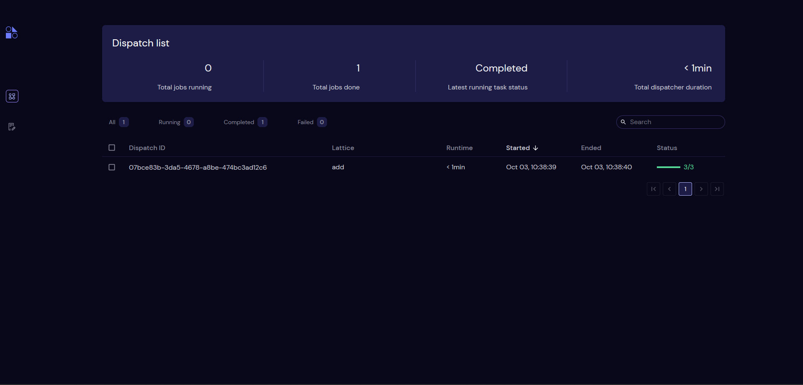

====
Single node workflows
====

In Covalent, users can create workflows consisting of just a single node quite easily via the ``electron`` and ``lattice`` decorators.
Before starting, ensure that ``covalent`` is properly installed in your environment and that the server is running.

.. note::
    Status of the covalent server can be quickly checked from the command line running ``covalent status``

In Covalent, single node workflows are ``lattices`` that are composed entirely of a single ``electron``. Consider the following
example

.. code:: python

    import covalent as ct

    @ct.electron
    def add(x, y):
        return x + y

    @ct.lattice
    def add_workflow(x, y):
        return add(x, y)

    dispatch_id = ct.dispatch(add_workflow)(1, 2)
    result = ct.get_result(dispatch_id, wait=True)
    assert result.result == 3

The ``add_workflow`` in the above example contains only the ``add`` electron thus making the entire workflow single node.
In Covalent we can reduce the code complexity even further by attaching the ``lattice`` decorator to the
``add`` electron itself resulting in the following simplification

.. code:: python

    import covalent as ct

    @ct.lattice
    @ct.electron
    def add(x, y):
        return x + y

    dispatch_id = ct.dispatch(add)(1, 2)
    result = ct.get_result(dispatch_id, wait=True)
    assert result.result == 3

After the dispatch, users can navigate to their Covalent UI running at `<http://localhost:48008>`_ to see visualize the workflow. Following is a sample of the dispatch queue

|

Details pertaining the the workflow can be visualized by clicking on the dispatch ID.

|

From the above, we can see that an ``electron`` itself can be made into a ``lattice`` by decorator composition reducing
unecessary code duplication and leaner workflows.
