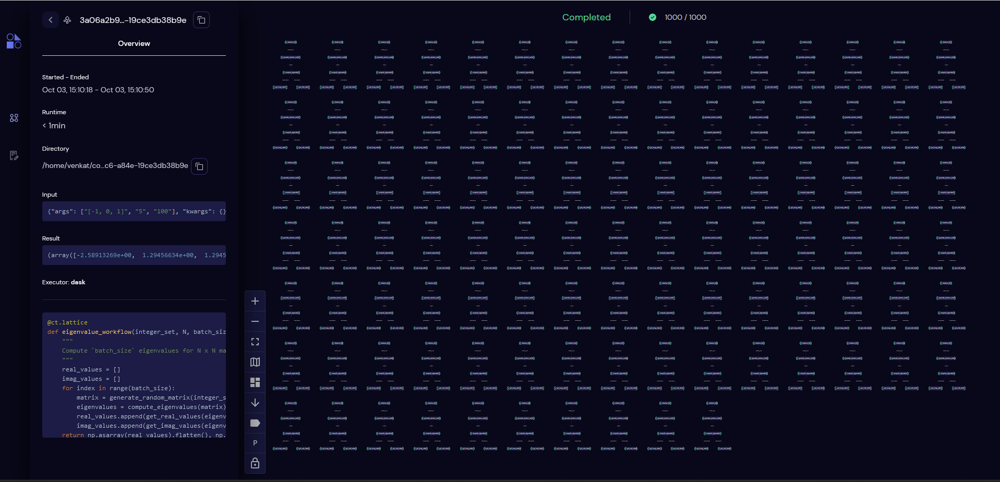
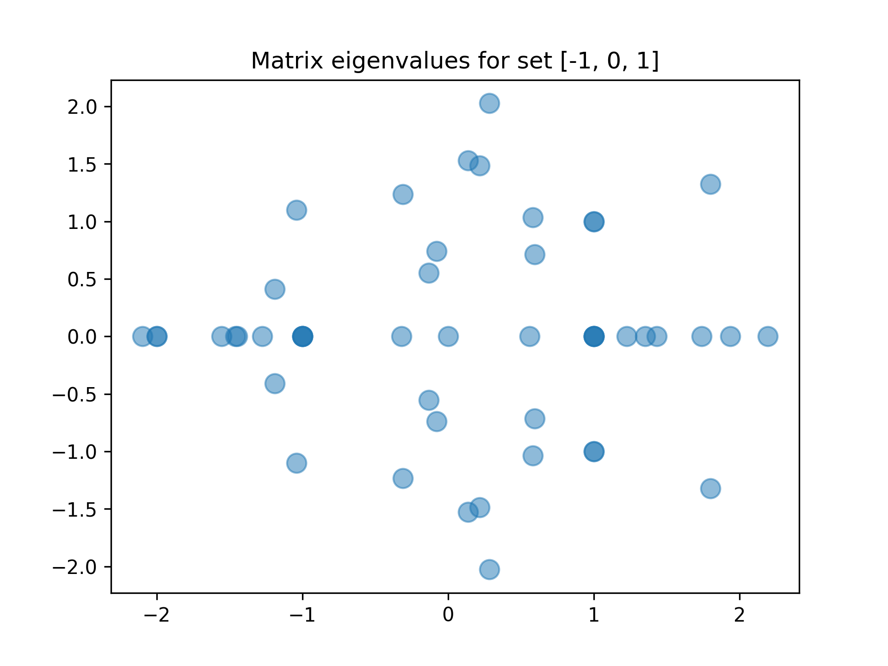
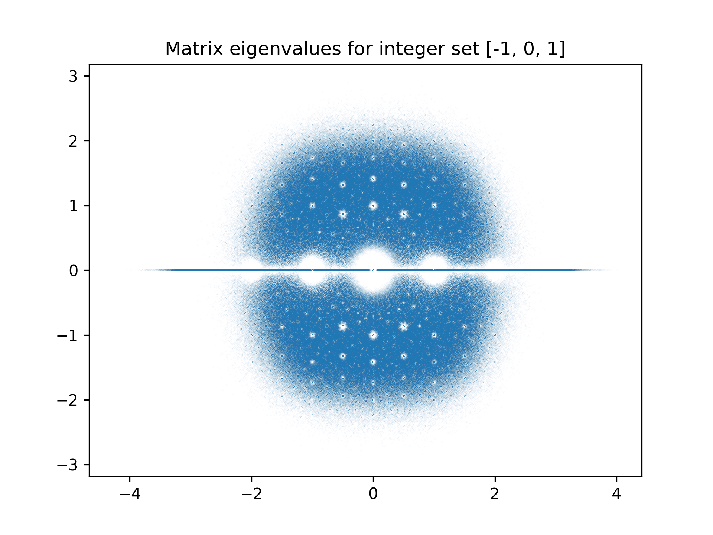

====
Matrix Eigenvalues
====

In this example we will investigate a workflow for repeatedly computing eigenvalues of N x N matrices and plotting the results through Covalent. The matrices we construct will
be from a set of integers of bounded height i.e. finite sized/valued. Further details about such matrices and their properties can be found at the :ref:`BHIME project <http://www.bohemianmatrices.com/>`.

Computing matrix eigenvalues is a CPU/memory intensive task especially when computing a lot of them repeatedly. Such tasks are well suited to be offloaded to other machines that
have the necessary hardware resources (CPU/Memory) for such tasks. In Covalent, remote execution of tasks are supported via ``executors`` that allow users to dictate the runtime environment
for each of the tasks in their workflows. In this example, we will use the ``SSHExecutor`` to offload the computationally heavy tasks to a remote machine and aggregate the results locally for post-processing.

At a high level, the steps involved in this workflow are quite straight forward and can be summarized as follows

* Given a set of bounded integers, generate a N x N matrix by randomly sampling the set
* Compute the eigenvalues of the N x N matrix resulting in at most N eigenvalues
* Separate the real and imaginary parts of the N eigenvalues
* Store the results
* Repeat K times
* Plot the final results

We begin building our workflow by creating electrons for all the tasks listed in the list above.

.. code:: python

    import covalent as ct
    import numpy as np
    import matplotlib.pyplot as plt

    @ct.electron
    def generate_random_matrix(integer_set, nrows, ncols):
        """
        Return a nrow x ncols matrix by repeatedly sampling the set of integers provided `nrows*ncols` times
        """
        return np.random.choice(integer_set, nrows*ncols).reshape(nrows, ncols)

    @ct.electron
    def compute_eigenvalues(matrix):
        """
        Compute the eigenvalues of the provided matrix
        """
        evals, _ = np.linalg.eig(matrix)
        return evals

    
    @ct.electron
    def get_real_values(eigenvalues):
        """
        Extract the real part from the eigenvalues
        """
        return [np.real(eigval) for eigval in eigenvalues]

    @ct.electron
    def get_imag_values(eigenvalues):
        """
        Extract the imaginary part from the eigenvalues
        """
        return [np.imag(eigval) for eigval in eigenvalues]

Compute workflow
~~~~~~~~~~~~~~~~~

We stich all the above electrons in a ``lattice`` as follows

.. code:: python

    @ct.lattice
    def eigenvalue_workflow(integer_set, N, batch_size):
        """
        Compute `batch_size` eigenvalues for N x N matrices randomly generated by sampling the `integer_set`
        """
        real_values = []
        imag_values = []
        for index in range(batch_size):
            matrix = generate_random_matrix(integer_set, N, N)
            eigenvalues = compute_eigenvalues(matrix)
            real_part = get_real_values(eigenvalues)
            imag_part = get_imag_values(eigenvalues)
            real_values.append(real_part)
            imag_values.append(imag_part)

        return np.asarray(real_values).flatten(), np.asarray(imag_values).flatten()

The ``eigenvalue_workflow`` can be dispatched to the ``Covalent`` server as follows

.. code:: python

    dispatch_id = ct.dispatch(eigenvalue_workflow)([-1, 0, 1], 100)
    result = ct.get_result(dispatch_id, wait=True)

With the above dispatch, the workflow will compute ``100`` random matrices with at most 5 eigenvalues each, thus resulting in a plot with approximately ``500`` eigenvalues. The workflow
graph can be inspected from in the UI at `<http://localhost:48008>`_.

Workflow Graph
~~~~~~~~~~~~~~~

From the construction of our workflow, it might be apparent that different iterations of the eigenvalue computation are independent of each other,
and can proceed in parallel. Covalent is able to infer the dependencies between different tasks in a workflow
and will be default execute electrons with no dependencies in parallel. This decoupling between tasks can be clearly seen
in the workflow graph from the UI.

From the above figure it also apparent that ``Covalent`` can easily scale up to lots of electrons and and process them at scale
quite easily.

Post-processing/Visualization
~~~~~~~~~~~~~~~~~~~~~~~~~~~~~

To visualize the results of our computation, we can plot all the result of our workflow. To this end we can create a
single node workflow ``generate_figure`` and dispatch that to Covalent with the results of the ``eigenvalue_workflow`` as follows

.. code:: python

    @ct.lattice
    @ct.electron
    def generate_figure(real_values, imag_values, integer_set):
        fig, ax = plt.subplots()
        plt.plot(real_values, imag_values, 'o', ms=1)
        plt.title(f"Matrix eigenvalues for set {integer_set}", fontsize=12)
        return ax
        
    dispatch_id = ct.dispatch(generate_figure)(real_values, imag_values, integer_set)
    result = ct.get_result(dispatch_id, wait=True)

Creating a separate workflow for plotting the result, allows one to decouple computation from post-processing.
This way several dispatches of the ``eigenvalue_workflow`` can be sent to Covalent and the results of all of those can be
aggregated into one and sent for plotting via the ``generate_figure`` lattice.

The ``generate_figure`` lattice can be dispatched to Covalent in a similar fashion and the plot can be obtained as follows

.. code:: python

    dispatch_id = ct.dispatch(generate_figure)(real_values, imag_values, [-1, 0, 1])
    result = ct.get_result(dispatch_id, wait=True)
    print(result.result)

In the above, ``real_values`` and ``imag_values`` are the outputs of the ``eigenvalue_workflow``. Dispatching the above results in the following
plot

Remote executors
~~~~~~~~~~~~~~~~~

So far we have been working with running/executing all workflow tasks locally a.k.a on the same machine where the
Covalent server is also running. For small workflows and rapid prototyping this is sufficient, but when workflows get really large or
have computationally intensive tasks such as computing matrix eigenvalues, it is preferable to offload the computation to a remote machine
which would have the required hardware resources (CPU/Memory) to handle those tasks.

Through the use of ``executors``, users can dictate the runtime environment of their tasks/workflows in Covalent. In this example,
we will leverage Covalent's ``SSHExecutor`` to offload the entire ``eigenvalue_workflow`` to a remote machine.

All Covalent ``executors`` are provided as separate plugins that user's can at will download and configure to best match the needs.
The ``SSHExecutor`` can be installed through ``pip`` as follows

.. code:: bash
    
    pip install covalent-ssh-plugin

The executor can be imported from Covalent as any normal Python module and can be used in a workflow to customize
its runtime environment. The ``SSHExecutor`` at the very minimum needs the following set of arguments to function properly

* ``username``: Name of the user account on the remote machine
* ``hostname``: Hostname or IP address of the remote machine
* ``ssh_key_file``: Path to the private SSH key on local disk to be used to authenticate as the ``user`` on the remote machine

With these three arguments, the ``SSHExecutor`` can be configured as follows

.. code:: python

    from covalent.executor import SSHExecutor

    sshexec = SSHExecutor(username=<username>,
        hostname=<hostname>, ssh_key_file=<path to ssh private key>)

Now that the executor has been configured, users can declare their intent of executing certain tasks on the remote machine to Covalent
via augmenting the electron/lattice decorators by passing in the ``executor`` as an argument.

In our context, since we want to offload the entire computation stack to the remote machine, we can simply augment the ``lattice`` decorator by providing
a reference to an instance of our ``SSHExecutor`` created above. This is illustrated in the following code sample

.. code:: python

    @ct.lattice(executor=sshexec)
    def eigenvalue_workflow(integer_set, N, batch_size):
        ...

This simple, one line change is sufficient to offload the computation of the entire workflow to the remote machine running at ``<hostname>``. Now with this small change,
users can dispatch the workflow with potentially millions of eigenvalue computations and aggregate just the results locally for post-processing.

When millions of such eigenvalues are computed, the resulting figure is the following

Full source
~~~~~~~~~~~~~

For convenience, following is the entire source code needed to quickly get started with this workflow

.. code:: python

    import covalent as ct
    import numpy as np
    import matplotlib.pyplot as plt
    from covalent.executor import SSHExecutor

    sshexec = SSHExecutor(username=<username>,
        hostname=<hostname>, ssh_key_file=<path to ssh private key>)

    @ct.electron
    def generate_random_matrix(integer_set, nrows, ncols):
        """
        Return a nrow x ncols matrix by repeatedly sampling the set of integers provided `nrows*ncols` times
        """
        return np.random.choice(integer_set, nrows*ncols).reshape(nrows, ncols)

    @ct.electron
    def compute_eigenvalues(matrix):
        """
        Compute the eigenvalues of the provided matrix
        """
        evals, _ = np.linalg.eig(matrix)
        return evals

    
    @ct.electron
    def get_real_values(eigenvalues):
        """
        Extract the real part from the eigenvalues
        """
        return [np.real(eigval) for eigval in eigenvalues]

    @ct.electron
    def get_imag_values(eigenvalues):
        """
        Extract the imaginary part from the eigenvalues
        """
        return [np.imag(eigval) for eigval in eigenvalues]

    @ct.lattice(executor=sshexec)
    def eigenvalue_workflow(integer_set, N, batch_size):
        """
        Compute `batch_size` eigenvalues for N x N matrices randomly generated by sampling the `integer_set`
        """
        real_values = []
        imag_values = []
        for index in range(batch_size):
            matrix = generate_random_matrix(integer_set, N, N)
            eigenvalues = compute_eigenvalues(matrix)
            real_part = get_real_values(eigenvalues)
            imag_part = get_imag_values(eigenvalues)
            real_values.append(real_part)
            imag_values.append(imag_part)

        return np.asarray(real_values).flatten(), np.asarray(imag_values).flatten()

    @ct.lattice
    @ct.electron
    def generate_figure(real_values, imag_values, integer_set):
        """
        Plot the real/imaginary parts of the eigenvalues on the complex plane
        """
        fig, ax = plt.subplots()
        plt.plot(real_values, imag_values, 'o', ms=1)
        plt.title(f"Matrix eigenvalues for set {integer_set}", fontsize=12)
        return ax

    dispatch_id = ct.dispatch(eigenvalue_workflow)([-1, 0, 1], 5, 1000000)
    result = ct.get_result(dispatch_id, wait=True)

    real_values, imag_values = result.result

    ## Pre-processing
    dispatch_id = ct.dispatch(generate_figure)(real_values, imag_values, [-1, 0, 1])
    result = ct.get_result(dispatch_id, wait=True)

    print(result.result)
