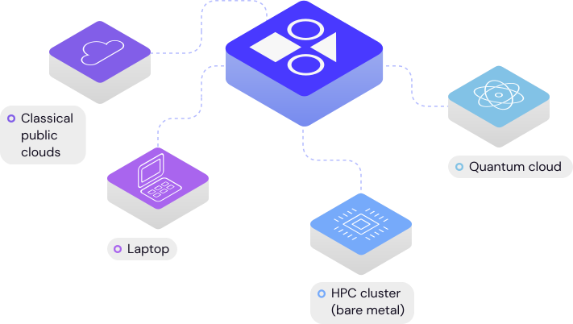

.. covalent

.. raw:: html

   

======================
COVALENT DOCUMENTATION
======================

.. raw:: html

   

   
   
   
   
   

|

|

Covalent is a Pythonic distributed workflow tool used to prototype and run high performance classical and quantum software. Covalent can be used to...

- rapidly iterate prototypes and exploratory research models
- construct complex workflows consisting of tasks written in a variety of languages
- automate, manage, and share reproducible experiments
- build data pipelines across distributed infrastructure
- visualize data and task dependencies in an interactive user interface
- run software in heterogeneous compute environments, including in hybrid-cloud and hybrid-quantum configurations
- understand where time and money is spent across a project

.. |

.. .. raw:: html

   

   <iframe
   style="position: absolute; top: 0; left: 50%; width: 100%; height: 100%; max-width: 600px; max-height: 400px; transform:translateX(-50%); -webkit-transform:translateX(-50%); -moz-transform: translateX(-50%);"
   src="https://www.youtube.com/embed/tZ92zRbnuAA"
   frameborder="0"
   allowfullscreen="">
   </iframe>
   

Next Steps
##########

Check out the :doc:`Getting Started <./getting_started/index>` page to learn how to immediately start using Covalent. After you're set up, come back and dig deeper in the Concepts and Tutorials. Once you're comfortable with the basics, use the How-To Guides and the API Reference to start building your own applications.

.. panels::

   :column: col-lg-12 p-2
   .. link-button:: getting_started/index
    :type: ref
    :text: Getting Started
    :classes: btn-outline-primary btn-block

   ----------------

   Concepts
   ^^^^^^^^^^^^^^^^^^^^^^
   What is a workflow? How does Covalent work? This section covers the "big picture", including design principles and motivations for using Covalent.

   +++

   .. link-button:: concepts/concepts
      :type: ref
      :text: Go To Concepts
      :classes: btn-outline-primary btn-block stretched-link

   ------------------------------------------------

   Tutorials
   ^^^^^^^^^^^^^^^^^^^^^^
   Learn how Covalent is being used in real-world research applications. The tutorials range in difficulty and span a variety of subjects.

   +++

   .. link-button:: tutorials/tutorials
       :type: ref
       :text: Go To Tutorials
       :classes: btn-outline-primary btn-block stretched-link

   ------------------------------------------------

   How-To Guides
   ^^^^^^^^^^^^^^^^^^^^^^
   Quick references and examples for users who know what they're looking for.

   +++

   .. link-button:: how_to/index
       :type: ref
       :text: Go To How-To Guides
       :classes: btn-outline-primary btn-block stretched-link

   ------------------------------------------------

   API Reference
   ^^^^^^^^^^^^^^^^^^^^^^
   Learn more about the syntax of Covalent's classes, functions, and modules.

   +++

   .. link-button:: api/api
      :type: ref
      :text: Go To API Reference
      :classes: btn-outline-primary btn-block stretched-link

   Deployment
   ^^^^^^^^^^^^^^^^^^^^^^
   Learn about self-hosting a Covalent server and deployment best practices

   +++

   .. link-button:: deployment/index
      :type: ref
      :text: Go to Deployment reference
      :classes: btn-outline-primary btn-block stretched-link

Recent Changes
##############

The latest release of Covalent includes two new feature sets and three major enhancements. True to its modular nature, Covalent now allows users to define custom pre- and post-hooks to electrons to facilitate various use cases from setting up remote environments (using `DepsPip`) to running custom functions. We also now support data/file transfers between remote electrons in a very modular way, including `Rsync`, `HTTP`, and `S3` protocols. As part of the enhancements, Covalent now internally uses an SQL database instead of storing results in a serialized format, which has resulted in impressive speedups and stability across the platform.  We have further made the Covalent server leaner by not requiring it to have any dependencies of electrons installed.  Covalent now only requires that your electron’s software dependencies exist on the client (the machine submitting the workflows) and backend (hardware running the tasks).

Summary of major features/enhancements

- Pre- and post-hooks to setup the software environment and to run other custom functions
- Data transfer/management between electrons
- Robust database for storing and managing results
- User interface enhancements

Join the Community
##################

Covalent is a quickly growing and vibrant community of enthusiasts, researchers, scientists, and engineers. Start contributing now by navigating to Covalent's `GitHub <https://github.com/AgnostiqHQ/covalent>`_ homepage or learn more about how Covalent can be used in your business on Covalent's `product <https://agnostiq.ai/covalent>`_ page. You are also welcome to engage with other users in the GitHub `discussions <https://github.com/AgnostiqHQ/covalent/discussions>`_ page.

.. toctree::
   :maxdepth: 3
   :hidden:

   Getting Started <getting_started/index>
   Concepts <concepts/concepts>
   Tutorials <tutorials/tutorials>
   How-To Guides <how_to/index>
   User Interface <webapp_ui/index>
   🔌 Plugins <plugins>
   Credentials <credentials>
   API Documentation <api/index>
   Deployment <deployment/index>

.. toctree::
   :maxdepth: 1
   :caption: Developers:
   :hidden:

   Project Homepage <https://github.com/AgnostiqHQ/covalent>
   Contribution Guidelines <https://github.com/AgnostiqHQ/covalent/blob/develop/CONTRIBUTING.md>
   Code of Conduct <https://github.com/AgnostiqHQ/covalent/blob/develop/CODE_OF_CONDUCT.md>
