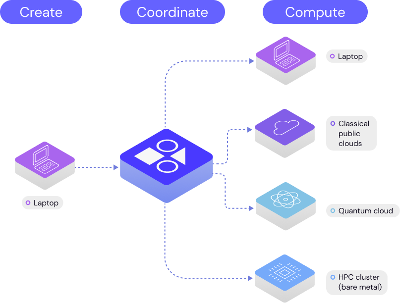

.. covalent

.. raw:: html

   

======================
COVALENT DOCUMENTATION
======================

.. raw:: html

   

   
   
   
   
   

Welcome to Covalent
###################

|

Covalent is a Pythonic workflow tool for computational scientists, AI/ML software engineers, and anyone who needs to run experiments on limited or expensive computing resources including quantum computers, HPC clusters, GPU arrays, and cloud services.

Covalent enables a researcher to run computation tasks on an advanced hardware platform – such as a quantum computer or serverless HPC cluster – using a single line of code.

For a description of what challenges Covalent was designed to solve, see :doc:`Why Covalent? <./about/why_covalent>`. For a more in-depth discussion, see `What is Covalent? <https://www.covalent.xyz/what-is-covalent/>`_.

To learn more about Covalent in the context of modern high-performance computing, read `Covalent in the Era of Cloud-HPC <https://www.covalent.xyz/navigating-the-modern-hpc-landscape/>`_.

Get Started
~~~~~~~~~~~

.. panels::

    .. link-button:: getting_started/quick_start/index
        :type: ref
        :text: Quick Start
        :classes: btn-outline-primary btn-block stretched-link

    ^^^

    Install Covalent, start a local server, and run an example workflow in 10 minutes.

    ------------------------------------------------

    .. link-button:: getting_started/first_experiment/index
        :type: ref
        :text: First Experiment
        :classes: btn-outline-primary btn-block stretched-link

    ^^^

    Install Covalent and see how easy it is to execute the same task on different backends. Also describes how to build Covalent from source – start here if you want to contribute to the Covalent OS project.

Learn More
~~~~~~~~~~

.. panels::

    .. link-button:: concepts/concepts
        :type: ref
        :text: Concepts
        :classes: btn-outline-primary btn-block stretched-link

    ^^^

    How does Covalent work? An architectural overview.

    ------------------------------------------------

    .. link-button:: api/api
        :type: ref
        :text: API Reference
        :classes: btn-outline-primary btn-block stretched-link

    ^^^

    Covalent's classes, functions, and modules. Parameters and attributes of Workflows, Tasks, and Executors.

Build Workflows
~~~~~~~~~~~~~~~

.. panels::

    .. link-button:: how_to/index
        :type: ref
        :text: How-To Guides
        :classes: btn-outline-primary btn-block stretched-link

    ^^^

    Build your own workflows with this cookbook-style collection of instructions for every stage of a project, from coding to execution to results.

    ------------------------------------------------

    .. link-button:: tutorials/tutorials
        :type: ref
        :text: Tutorials
        :classes: btn-outline-primary btn-block stretched-link

    ^^^

    Learn how to apply Covalent in real-world research applications. The tutorials range in complexity from beginner to advanced and span a variety of topic areas.

Recent Changes
##############

The latest release of Covalent includes two new feature sets and three major enhancements. True to its modular nature, Covalent now allows users to define custom pre- and post-hooks to electrons to facilitate various use cases from setting up remote environments (using `DepsPip`) to running custom functions. We also now support data/file transfers between remote electrons in a very modular way, including `Rsync`, `HTTP`, and `S3` protocols. As part of the enhancements, Covalent now internally uses an SQL database instead of storing results in a serialized format, which has resulted in impressive speedups and stability across the platform.  We have further made the Covalent server leaner by not requiring it to have any dependencies of electrons installed.  Covalent now only requires that your electron’s software dependencies exist on the client (the machine submitting the workflows) and backend (hardware running the tasks).

Summary of major features/enhancements

- Pre- and post-hooks to setup the software environment and to run other custom functions
- Data transfer/management between electrons
- Robust database for storing and managing results
- User interface enhancements

Join the Community
##################

Covalent is a quickly growing and vibrant community of enthusiasts, researchers, scientists, and engineers. Start contributing now by navigating to Covalent's `GitHub <https://github.com/AgnostiqHQ/covalent>`_ homepage or learn more about how Covalent can be used in your business on Covalent's `product <https://agnostiq.ai/covalent>`_ page. You can also engage with other users in the GitHub `discussions <https://github.com/AgnostiqHQ/covalent/discussions>`_ page.

.. toctree::
   :maxdepth: 1
   :hidden:

   Why Covalent? <about/why_covalent>

.. toctree::
   :maxdepth: 2
   :caption:  Get Started
   :hidden:

   getting_started/quick_start/index
   First Experiment <getting_started/first_experiment/index>

.. toctree::
   :maxdepth: 3
   :caption:  User Documentation
   :hidden:

   Concepts <concepts/concepts>
   Tutorials <tutorials/tutorials>
   How-To Guide <how_to/index>
   User Interface <webapp_ui/index>
   API Reference <api/index>
   Server Deployment <deployment/index>
   Credentials <credentials>
   Glossary <glossary/index>
   Troubleshooting <troubleshooting>

.. toctree::
   :maxdepth: 3
   :caption:  Features
   :hidden:

   Executor plugins <plugins>
   Triggers <features/triggers>
   Cancellation <features/cancel>

.. toctree::
   :maxdepth: 1
   :caption: For Contributors
   :hidden:

   Project Homepage <https://github.com/AgnostiqHQ/covalent>
   ../getting_started/build_from_source
   Contribution Guidelines <https://github.com/AgnostiqHQ/covalent/blob/develop/CONTRIBUTING.md>
   Code of Conduct <https://github.com/AgnostiqHQ/covalent/blob/develop/CODE_OF_CONDUCT.md>
