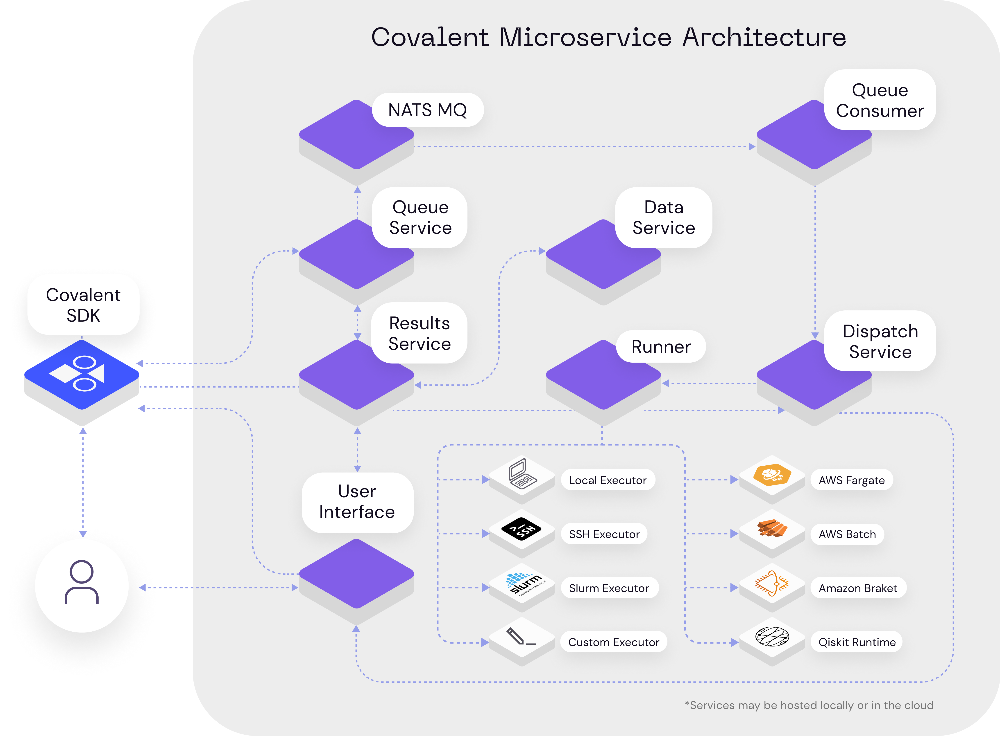
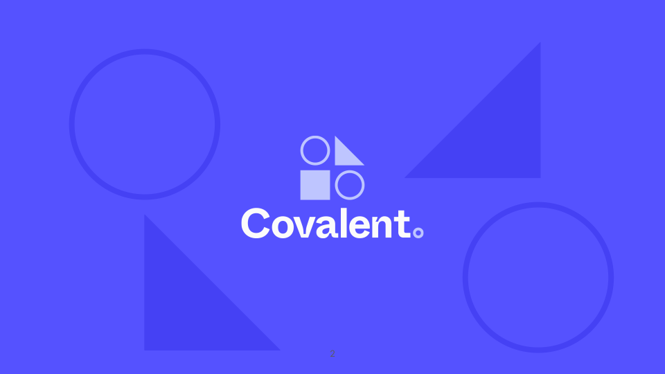

******************************
Release Version |release|
******************************

The latest release of Covalent is now out and available for every amazing sole out there to use ! It comes with huge improvements and changes in the way Covalent is designed right from being even more modular to handling large scale tasks.

Covalent is even more modular
*******************************

**Covalent Microsrvices** Covalent dispatcher used to be the central hub for all covalent tasks to be sent to for being queued and executed on various hardware. With the current release, the biggest change comes from splitting this monolithic central hub into 6 different servers

(Brief 2-3 lines for each entity here and add links to the APIs)

- Data
- Queuer
- Dispatcher
- Runner
- Results
- NATS Message Queue

Each of them is has its own responsibility and works purely via APIs. Thus, in theory one can host any of these servers in any machine they want. More importantly, with the previous monolithic architecture, when using `LocalExecuter`, Covalent would execute the `electrons` in the machine where covalent was running, now instead covalent's LocalExecution is executed specifically by the Runner service, which can be hosted in any machine, even high compute cloud machines !

Dask dependency removed
**************************

Previously, queuing of various tasks and asyinc execution was offloaded to `dask`. Although `dask` is really good at what it does, we moved away from it for various reasons, few important ones being :

- **Dependency cut-down** - We wanted to have the most minimal dependency when it comes to get covalent up and running. We are working on reducing the dependency even further for future releases
- **Control-ability** - Being a tool to interface with high performance advanced hardware, we wanted to have the full control over how exactly we allocate resources, even in the local case.
- **Scalability** - Although Dask is very scalable when it comes to executing independent calculations, Covalent natively deals with not just single calculations, but at workflow level. We found dask to not scale and inefficient to allocate resources when running multiple experiments alongside
- **Modularity** - When creating resources with dask, one is often required to create clusters services which in theory is monolithic. To move separate the heavy execution component and other objects like data transfer, queue etc, we wanted to breakdown Dask's responsibilities and create our own service for each individual components that can be run on separate machines.

As a result, we now have better control over resource allocation, scalable workflows.

Going beyond python
********************

**New language support** Being true to our goal of democratizing advanced hardware, we understand that users might have native codes/scripts written in languages other than python that needs to be maintained/sent off to be computed. With this in mind, we extend the notion of :code:`electrons` to :code:`leptons`, a flavour of particle that is more general and can accept tasks from various languages. Currently, we have extended support for C/C++ and bash with :code:`julia` coming soon. :code:`Leptons` are meant as an easy addition to translate your existing non-pythonic tasks into covalent workflow. Thereby covalent does not only let you **mix advanced hardware** in your experiments, but also **intertwine programing languages!**.

.. code-block:: python

    task = ct.Lepton(language="C",
                     library_name="libtest.so",
                     function_name="test_entry",
                     argtypes=[ (c_int32, ct.Lepton.INPUT),
                                (POINTER(c_int32), ct.Lepton.INPUT_OUTPUT),
                                (POINTER(c_int32), ct.Lepton.OUTPUT)]
                    )

.. Note:: Leptons are meant to translate existing scripts from other languages easily into covalent workflows. When it comes to language support, we are working on two main fronts

    1. to provide native support for scripting languages like Julia, R and
    2. To provide functional access via python to languages like Bash where one can directly run terminal commands from python without needing to write a bash script.

New Executers
*************

As a basic principle of Covalent, we want things to be as modular as it can be. This made us design executers - modular blocks of plugins which dictates and controls the choice of hardware resource your task is being run on. Being an open-source focused team, we made it extremely easy for users to construct custom executers based on the template we have released. Using the same, we are releasing two new executers - :code:`SSHExecuter`, :code:`SLURMExecuter`.

- :code:`SSHExecuter` - Ever wondered if you can do a join hybrid experiment between a RasberryPi and Quantum computer ? After a quick :code:`pip install covalent-ssh-plugin`, one gets the ability to interfaces Covalent with any machines accessible via SSH. This plugin can be used to distribute tasks to one or more compute backends which are not controlled by a cluster management system, such as computers on a LAN, or even a collection of small-form-factor Linux-based devices such as Raspberry Pis, NVIDIA Jetsons, or Xeon Phi co-processors.
It is as simple as adding

.. code-block:: python

    executor = ct.executor.SSHExecutor(
                                        username="user",
                                        hostname="host2.hostname.org",
                                        remote_dir="/tmp/covalent",
                                        ssh_key_file="/home/user/.ssh/host2/id_rsa",)

    @ct.electron(executor=executor)
    def my_custom_task(x, y):
        return x + y

- :code:`SLURMExecuter` - One of the most used Open Source High performance cluster job management system - SLURM, is supported by covalent now ! This executor plugin interfaces Covalent with HPC systems managed by `Slurm <https://slurm.schedmd.com/documentation.html>`_. In order for workflows to be deployable, users must have SSH access to the Slurm login node, writable storage space on the remote filesystem, and permissions to submit jobs to Slurm.

.. code-block:: python

    executor = ct.executor.SlurmExecutor(remote_workdir="/scratch/user/experiment1",
                                        conda_env="covalent",
                                        options={"partition": "compute","cpus-per-task": 8})

    @ct.electron(executor=executor)
    def my_custom_task(x, y):
        return x + y

Covalent theme/UI gets a makeover
***************************************

To go along with these massive new backend changes and to be inclusive of hardware beyond quantum, we have reworked Covalent colors and logo to reflect the true diverse nature of the problems we are solving. Previously a logo meant to indicate the connections made with "C", is now a logo made up of seemingly different shapes to indicate the variety of hardware/software/resource paradigms working in unison to create beautiful results. Being more futuristic with neon colors, we have transitioned to a more pastel colors to indicate the immediate need for such a tool. Hope you all enjoy it as much as we do !
