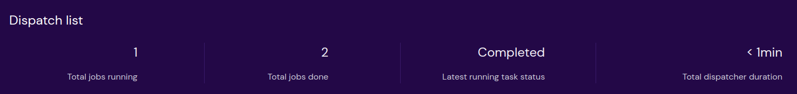

==============================
Dispatch summary
==============================

**Total jobs running**

Shows how many dispatches are being running.

**Total jobs done**

Shows how many dispatches have been completed.

**Latest running task status**

Shows the status of the dispatch which was the last to completed or running or fail among all the dispatches.

**Total dispatcher duration**

Shows total time taken to run all the dispatches. It goes from minutes,hours,days with reference to total runtime of all dispatches
