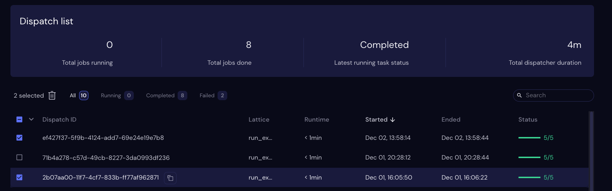

======================
Deleting Dispatches
======================

Select checkboxes on the left of dispatch lines to delete those dispatches.

.. note:: Deleting a dispatch removes the dispatch and its results only from the UI. The dispatch is still in the database. This behavior could change in a future version of Covalent.

When one or more lines are selected, the |delete| icon appears above the dispatch list. Click the icon to delete the selected records from the UI.

Alternatively, click the dropdown arrow to the left of the Dispatch ID heading. If all lines are currently visible ("Running", "Completed", and "Failed" filters unselected) then the dropdown menu contains the following Delete options:

All visible
    Selects all lines on the current page. Click |delete| to delete these records.
All
    Brings up the Delete Items dialog. Click the Delete button to delete all records.
Completed
    Brings up the Delete Items dialog. Click the Delete button to delete all successfully completed dispatches.
Failed
    Brings up the Delete Items dialog. Click the Delete button to delete all failed dispatches.

Filter and Delete
-----------------

If one of the :doc:`filters` is selected, then the dropdown contains only two options:

All visible
    Selects all lines on the page, as above.
*Filter status*
    Brings up the Delete Items dialog. Click the Delete button to delete all dispatches with the currently selected Status. For example if the Completed filter is selected, clicking Delete deletes all Completed dispatches.

Search and Delete
-----------------

If the list is currently filtered by a :doc:`search` term, the Delete Options dropdown menu only applies to lines that match the search criteria *and* the selected status. For example, if a search term limits the list to four items and only one of those items has a Failed status, then choosing Failed from the Delete Options dropdown deletes only that line.

.. image:: ../../images/dispatchlist_delete.gif
   :align: center

.. |delete| image:: ../../images/delete_icon.png
    :width: 20px
