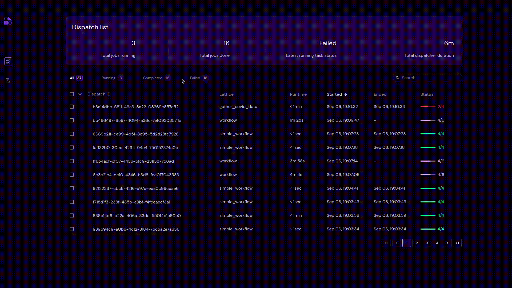
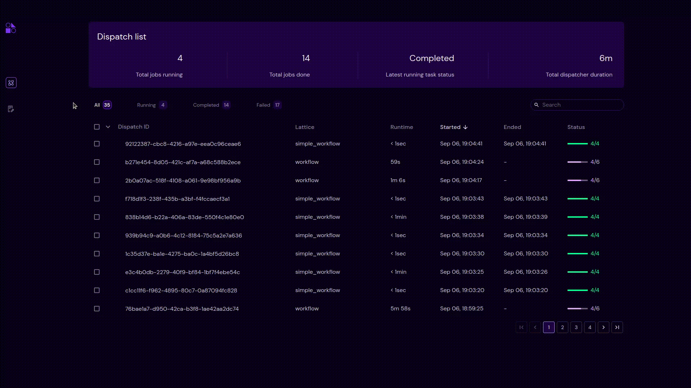

======================
Workflow Dispatch Deletion
======================

.. image:: ../images/delete.gif
   :align: center

- Users can select dispatches and delete them permanently from the UI. This action is not reversible.
- Users can select single, multiple or all dispatches from the current page using the checkbox or the "All visible" option from the dropdown. The selected items may be deleted as a batch.
- Deletion is performed by clicking on the |delete| icon after selecting the dispatch.

Delete Dropdown options
************************

- When the users enable the "All" filter, then the dropdown will have 5 options. They are as follows: All visible, All, Completed, Running and Failed.
    - "All visible" will select all the dispatches from the currently visible page.
    - "All" will prompt a pop-up to delete all the dispatches over the dispatch list.
    - "Completed" will prompt a pop-up to delete all the dispatches with the "Completed" status.
    - "Running" will prompt a pop-up to delete all the dispatches with the "Running" status.
    - "Failed" will prompt a pop-up to delete all the dispatches with the "Failed" status.
    - In the above example, By selecting the "All" option from the dropdown, users are able to delete all the dispatches. By selecting the "Failed" option from the dropdown, users are able to delete all the dispatches with "Failed" status. Similarly for the "Completed" and "Running" statuses.

Filter and Delete
***********************

- When the users enable any filter from the available statuses, then the dropdown will only have 2 options. They are as follows: All visible and that particular status filter.
    - In the above example, users enable the "Running" filter and hence in the dropdown there are two options such as "All visible" and "Running".
    - By clicking the "Running" option from the dropdown, users are able to delete all the dispatches with the "Running" status.
    - Similarly, for the "Completed" and "Failed" statuses.

Search and Delete
***********************
.. image:: ../images/search_delete.gif
   :align: center
- When the users search for something, then the 5 dropdown options only apply to the search results. That is, the dispatches which are not under the scope of this search results will not be affected.
    - In the above example, Users search for workflow and get 15 search results. Now...
    - "All visible" or checkbox will select all the dispatches from the currently visible page.
    - "All" will prompt a pop-up to delete all the dispatches from this search results only. That is all 15 dispatches.
    - "Completed" will prompt a pop-up to delete all the dispatches from this search results with the "Completed" status. Similarly, for the "Running" and "Failed" statuses.
