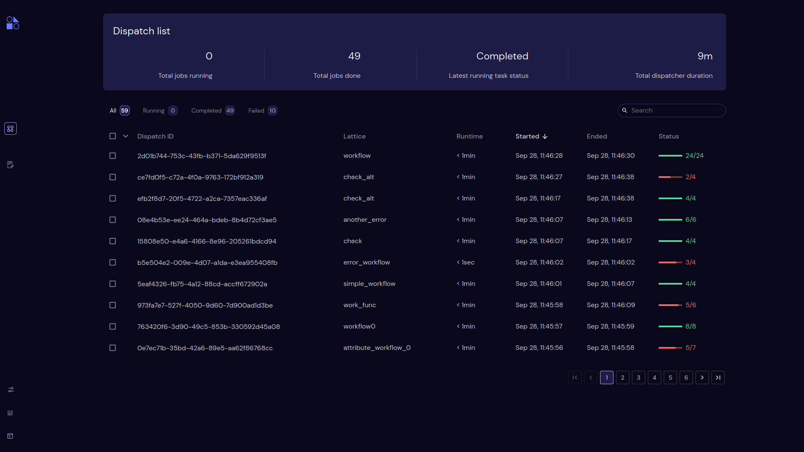

===================================================
List of all dispatches with appropriate metadata
===================================================

**Dispatch ID**

Displays the unique dispatch id as a dispatch is dispatched.

**Lattice**

Displays name of parrent lattice.

**Runtime**

Shows live run time of a dispatch. It goes from minutes,hours,days.

**Started**

Shows the local 24 hours machine time of a dispatch when gets started.

**Ended**

Shows the local 24 hours machine time of a dispatch as soon as it gets ended. It shows a hypen untill a dispatch ends and updates when a dispatch ends. End time of a dispatch is based on when a dispatch gets completed or failed or cancelled.

**Status**

Shows the status of a dispatch. Current statuses are Running, Failed, Completed.
