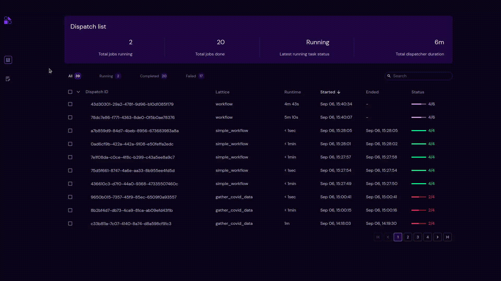

========
Filter
========

- Filter enables users to filter dispatches with respect to a specific status.
- Users can filter according to available statuses, such as "Completed", "Running" and "Failed".
- By default, users can see all the dispatches as "All" filter is enabled.
- Users can click the status name in the overview bar to enable that specific status filter.
- In the above example, users are able to see all the dispatches by default. And by clicking the "Running" status, users are able to see the dispatches with "Running" status. Similarly, for "Completed" and "Failed" statuses.
