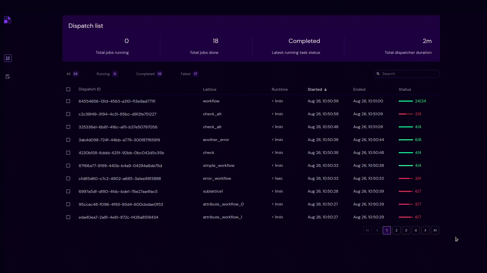

===================
Pagination
===================
Pagination divides dispatches into discrete pages of maximum 10 records per page.

.. |next| image:: ../images/navigate_next.png
    :width: 20px

.. |previous| image:: ../images/navigate_back.png
    :width: 20px

.. |skip first| image:: ../images/skip_first.png
    :width: 20px

.. |skip last| image:: ../images/skip_last.png
    :width: 20px

- User can navigate to next page by clicking |next| and similarly can navigate back by clicking |previous| buttons.
- User can also click |skip last| to jump to last and |skip first| to jump to first page from current page.
- User can also navigate into a particular page by clicking on the page number directly.
