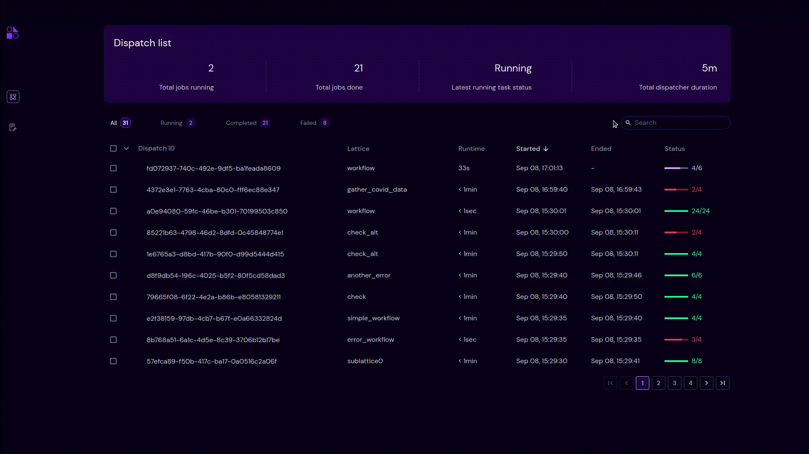

========
Search
========

.. |clear| image:: ../images/clear_search.png
    :width: 20px

- Search enables user to search through the page to get a specific dispatch.
- Search filters dispatch id and workflow name and triggered automatically if three or more characters are entered.
- By clicking the |clear| icon in the search, user can clear the search box.
