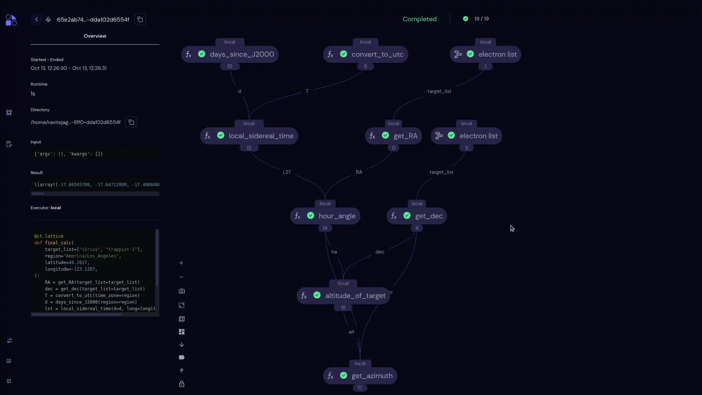
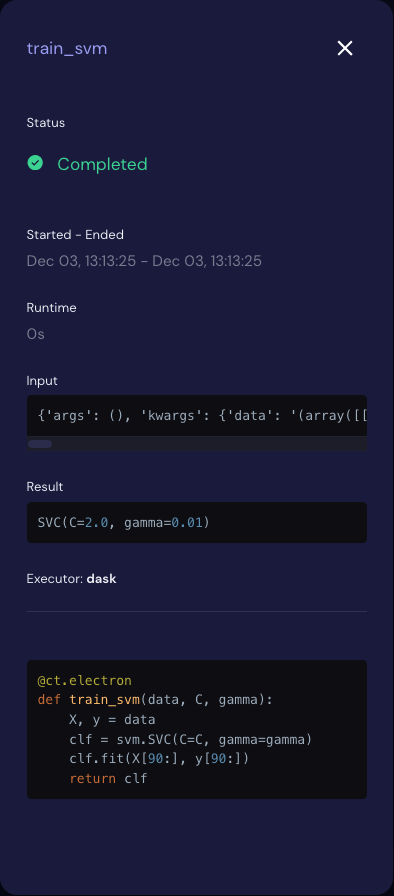

===================
Electron Sidebar
===================

The Electron sidebar shows information about a selected task node. Click an electron node in the transport graph to display the sidebar.

This sidebar contains the following attributes:

Status
    The status for the selected node/electron.

Started - Ended
    The local time when the electron dispatch started and ended.

Runtime
    The live runtime for the selected node.

Input
   The input parameters passed to the selected node. Click the parameter string to :ref:`copy a serialized representation <pickle_copy>` of the input.

Result
    The :code:`Result` returned by the electron function. Click the result string to :ref:`copy a serialized representation <pickle_copy>` of the result.

Executor
    The executor's type and its relevant information for the selected node.

Function String
    The :code:`electron`-decorated Python function.
