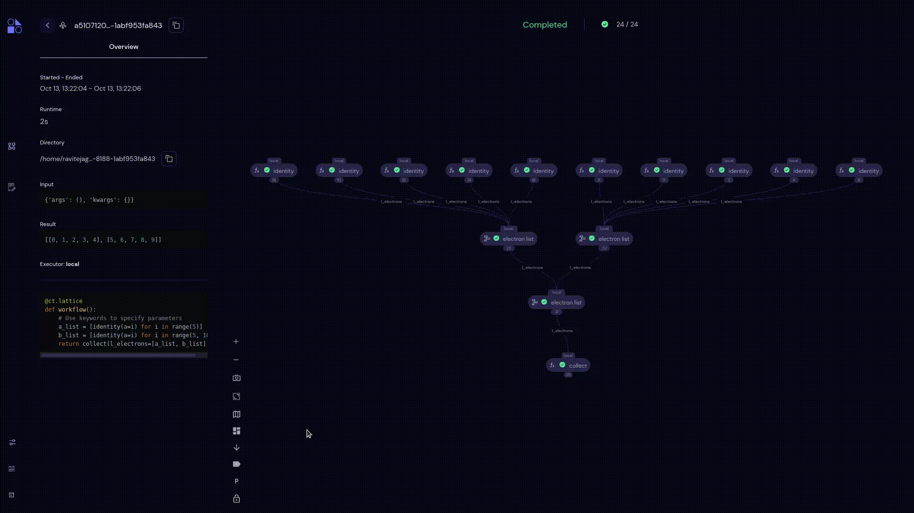

===================
Layouts
===================

The **Layout** feature lets users change the layout of the current transport graph. The Graph comes with different layout options, such as:

- Layered
- Tree
- Force
- Rectangular
- Box
- Old Layout

Users can change the layout of the transport graph by clicking on the |layout| icon.

**Note: By default, Layered layout is applied when users open the transport graph.**
