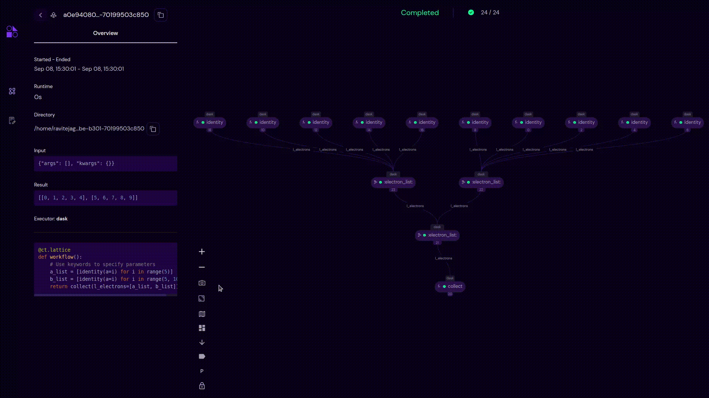
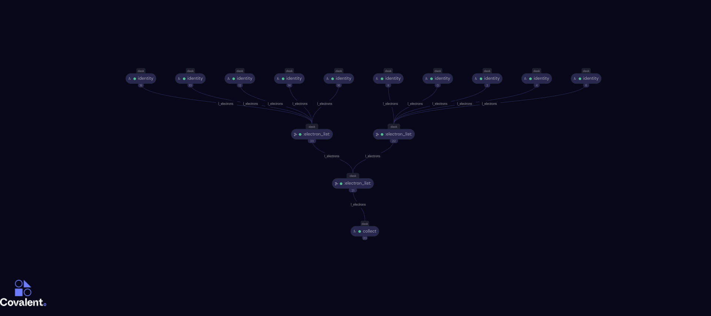

===================
Screenshot
===================

- The **Screenshot** option lets users capture the current state of the transport graph and download it as **jpg** to user's system.
- Users can click |screenshot| icon to use the screenshot feature.

Downloaded Image
--------------------

