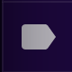
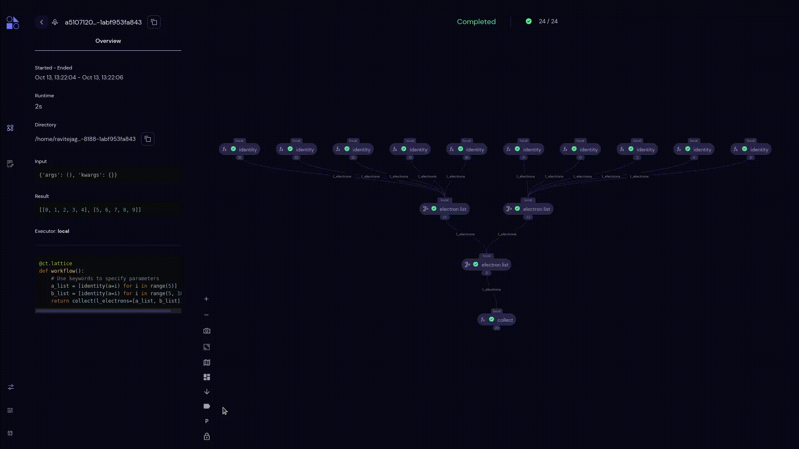

===================
Toggle Options
===================

Minimap
~~~~~~~~~~~~~~~~~~

- The **Minimap** toggle option (|map| icon) lets users view the entire graph as a miniature model.
- This miniature model shows where the screen is focused in the entire graph. This is helpful when hundreds of nodes are present.

Orientation
~~~~~~~~~~~~~~~~~~

- The **Orientation** toggle options (|up|, |down|, |left|, |right| icons) lets users change the direction of the current transport graph.
- By default, the orientation for any transport graph is from top to bottom.

Labels
~~~~~~~~~~~~~~~~~~

- **Show/Hide Labels** toggle option (|label| icon) lets users show or hide labels for each node.
- By default, each node will be shown with a label.

Parameters
~~~~~~~~~~~~~~~~~~

- The **Toggle Parameters** toggle option (|parameter| icon) lets users show parameters for the transport graph.
- When this option is selected, all the available parameters are shown as temporary node(s).
- By default, Parameters will be hidden.

Lock Nodes
~~~~~~~~~~~~~~~~~~

- The **Toggle draggable nodes** toggle option (|lock| icon) **when unlocked**, lets users drag and move nodes inside a transport graph.
- By clicking again, users can lock the position of the transport graph as they set.
- By default, dragging nodes will not be allowed.
