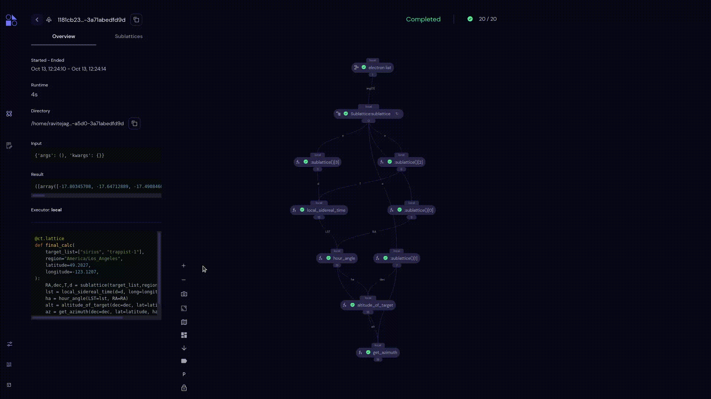
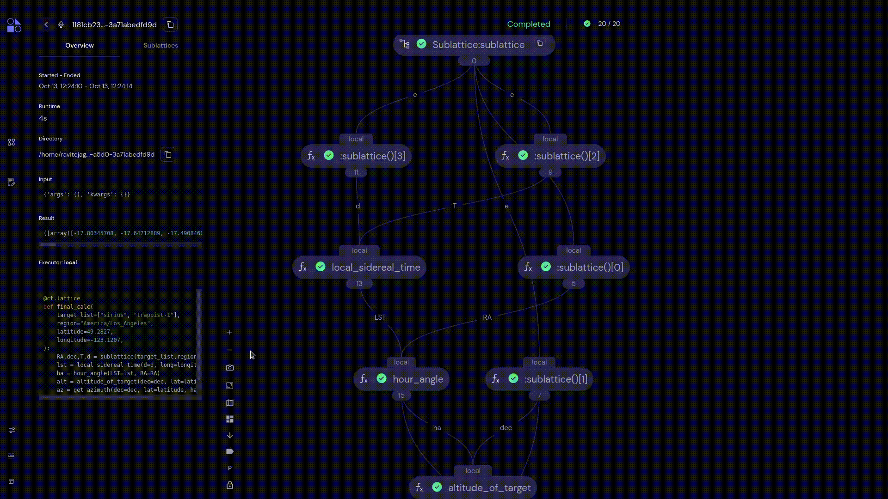

===================
Zoom
===================

The zoom functionalities of the transport graph lets the users perform the following actions:

Zoom In
~~~~~~~~~~~~~~~~~~

- Users can zoom in to transport graph by clicking |zoom in| icon.
- Users can also zoom in by scrolling down when pointing the cursor on the graph view.

Zoom Out
~~~~~~~~~~~~~~~~~~

- Users can zoom out to transport graph by clicking |zoom out| icon.
- Users can also zoom out by scrolling up when pointing the cursor on the graph view.

Fit To Screen
~~~~~~~~~~~~~~~~~~

.. image:: ./images/fit.gif
   :align: center
   :width: 5000px

- The **Fit To Screen** option will reset the current view to 100%.
- Users can make use of this option by clicking  |fit to screen| icon.
