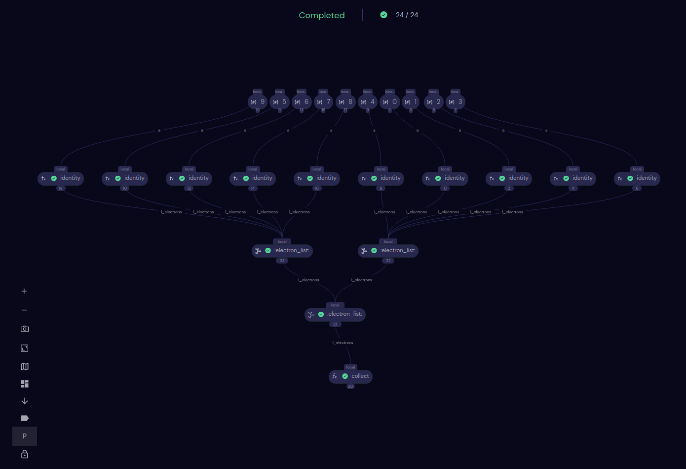
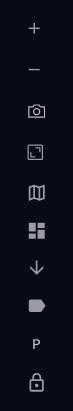
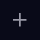
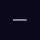
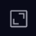
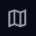
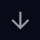
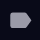
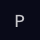
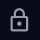

###############
Transport Graph
###############

The Transport Graph displays the :ref:`directed acyclic graph <Transport Graph>` representing the dispatch.

Controls
########

On the left edge of the Transport Graph window is a vertical control bar consisting of several icons, shown here to the left. Use these controls to adjust the view of the transport graph.

.. note:: Adjustments made to the transport graph are lost if you leave the page, for example by going back to the Dashboard screen.

Zoom: |plus| and |minus|
    Zoom in and out on the transport graph. To pan, click and drag over the transport graph.
Screenshot |camera|
    Take a screenshot of the Transport Graph window. Only the transport graph, without the control bar, is captured. The image, a JPG file named after the dispatch ID, is saved in your browser's default location.
Fit to Screen |fit|
    Automatically scale the entire transport graph to fit in the available window space.
Layout |layout|
    Choose a layout for the graph nodes. Clicking |layout| opens a menu with the following options: Layered, Tree, Force, Rectangular, Box, Old Layout.
Change Orientation |orient|
    Cycle through four orientations: top-to-bottom (default); right-to-left; bottom-to-top; and left-to-right. The orientation affects the graph differently depending on the layout.
Labels |label|
    Toggle labels on the node on or off. Labels include the executor, the task name, and the node ID.
Parameters |param|
    Toggle parameter nodes. Parameter nodes show input parameters to the task nodes. With parameter nodes off (default), the graph displays only electron nodes.

    Clicking a parameter node also highlights the dependencies (graph edges) that contain the selected parameter.
    
Lock Nodes |lock|
    Toggle locking of draggable nodes. Toggle to "unlock" to enable dragging nodes to improve readability of the graph. Toggle to "lock" (default) to keep from accidentally dragging nodes.

