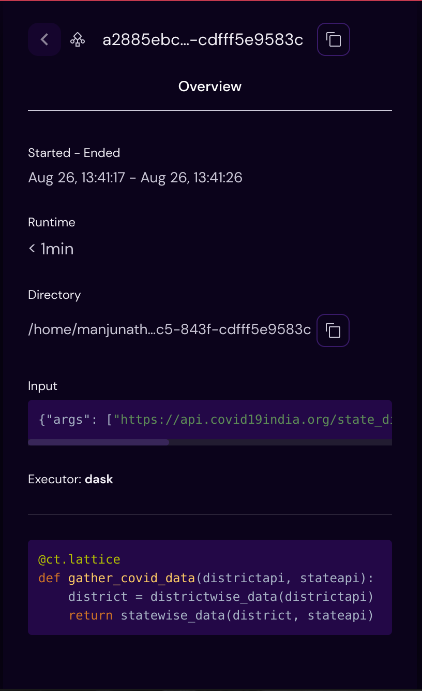

===================
Lattice Sidebar
===================

The Lattice sidebar gives an overview of attributes and details for a particular workflow dispatch. This contains as follows:

- **Started - Ended**

      Shows the local time when a dispatch started and when a dispatch ended.

- **Runtime**

      Shows the live run time for the dispatch.

- **Directory**

      Shows the folder path where all the result objects are stored for the lattice.

- **Input**

      Shows the input parameters for the lattice function.

- **Result**

      Shows the result object related to workflow execution outcomes.

- **Executor**

      Shows the executor's type and its relevant information for lattice function.

- **Function String**

      Shows the detailed string representation of a lattice function ( python format ).
