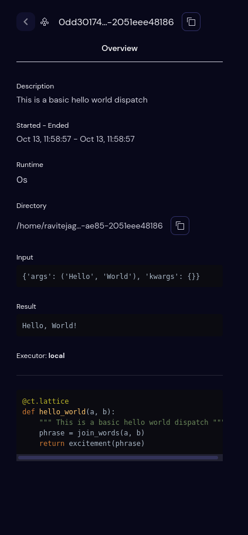

===================
Lattice Sidebar
===================

- The Lattice sidebar gives an overview of attributes and details for a particular workflow dispatch. Users can copy the dispatch id of the workflow dispatch from the copy icon at the top.

Overview
############
The overview details are as follows:

- **Description**

  Shows the description of the lattice if provided. If the user doesn't add any description in the python code, then the user can't see this section.

- **Started - Ended**

  Shows the local time when a dispatch started and when a dispatch ended.

- **Runtime**

  Shows the live run time for the dispatch.

- **Directory**

  Shows the folder path where all the result objects are stored for the lattice. Users can copy the directory path as they click on the copy icon in this section.

- **Input**

  Shows the input parameters for the lattice function. By clicking on the input section, Users can copy the encoded byte value (python object) corresponding to the input. Users can decode this, by running it in any python environment assuming it has the dependencies needed to unpickle the object.

- **Result**

  Shows the result object related to workflow execution outcomes. By clicking on the result section, Users can copy the encoded byte value (python object) corresponding to the result. Users can decode this, by running it in any python environment assuming it has the dependencies needed to unpickle the object.

- **Executor**

  Shows the executor's type and its relevant information for lattice function.

- **Function String**

  Shows the detailed string representation of a lattice function (python format).
