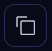

###############
Lattice Sidebar
###############

The Lattice sidebar shows details for the selected workflow dispatch. It displays the following:

The Lattice sidebar shows details for the selected workflow dispatch. It displays the following:

.. image:: ../images/Lattice_sidebar.png
   :width: 350px
   :align: left

Dispatch ID
    The ID of the selected dispatch. Click |copy| to copy the ID.

Description
    The description of the lattice, if provided as a docstring in the lattice definition.

Started - Ended
    The local time at which the dispatch started and ended. If the dispatch has not finished, the "Ended" time is omitted.

Runtime
    The run duration for the dispatch. Updated in real time if the dispatch is still running.

Directory
    The folder path where the result objects are stored for the lattice. Click |copy| to copy the folder path.

Input
   The input parameters passed to the lattice function. Click the parameter string to :ref:`copy a serialized representation <pickle_copy>` of the input.

Result
    The :code:`Result` object returned by the lattice execution. Click the result string to :ref:`copy a serialized representation <pickle_copy>` of the input.

Executor
    The type of executor to which the lattice is assigned.

Function String
    The :code:`lattice`-decorated Python function.

