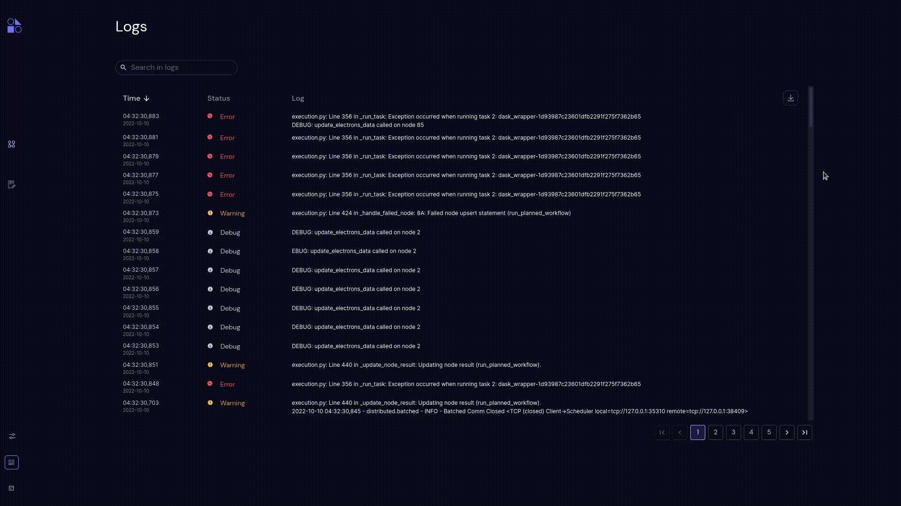
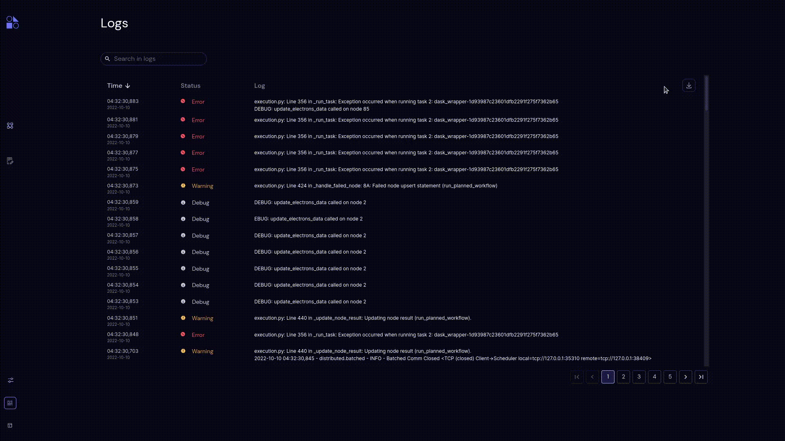
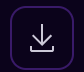

##########
Server Log
##########

To view the Covalent server log, click the |logs| icon.

Each log entry represents a single event; most are one line but some (such as tracebacks) are multi-line. An entry contains the following columns:

Time
    The time and date of the log entry. Time format for time and date are hh:mm:ss,ms and yyyy-mm-dd.

Status
    The status of the log entry, indicating the severity of the event. The available statuses are: INFO, DEBUG, WARNING, ERROR, and CRITICAL.

Messages
    The log message. Click on a log message to copy it to the clipboard. In the case of a multi-line message, all lines are copied.

Log Navigation
--------------

The following navigation tools are available for the Covalent server log:

* :doc:`search`
* :doc:`pagination`
* :doc:`sort`

Download
--------

Click |download| to download the Covalent server log as a text file.

