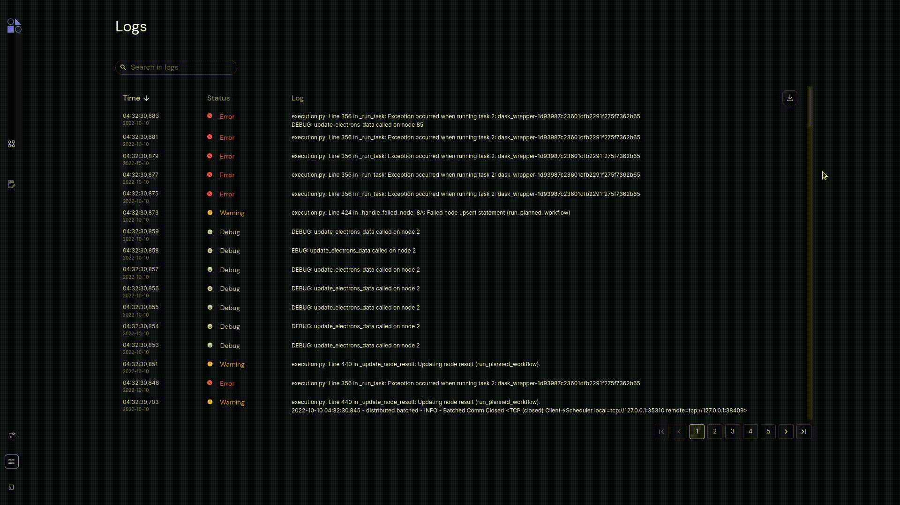

===================================================
Logs List
===================================================

**Time**

Shows the date & time of the log. Time format for time and date are hh:mm:ss,ms and yyyy-mm-dd.

**Status**

Shows the status of the log. The available statuses are: INFO, DEBUG, WARNING, WARN and ERROR.

**Message**

Shows the message of the log. log message can be copied to clipboard as the users click anywhere on the log record.
