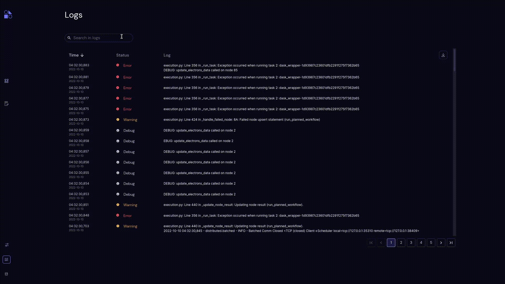

========
Search
========

.. |clear| image:: ../images/clear_search.png
    :width: 20px

- Search enables users to search through the set of pages to find a specific log, as the users type three or more characters in the search bar.
- Search enables users to filter the logs according to the status, as the users type any status name in the search bar.
- By clicking the |clear| icon in the search, a user can clear the search box.
