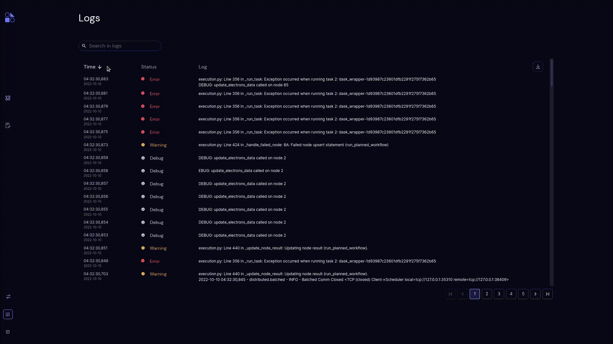

=======
Sort
=======

.. |ascending| image:: ../images/ascending_arrow.png
    :width: 20px

.. |descending| image:: ../images/descending_arrow.png
    :width: 20px

- Users can sort through a column by ascending |ascending| and descending |descending| orderings. By default, sorting is done in descending order of the time column.
- Users can sort by the Time and Status columns.
- Logs can be sorted by ascending and descending order of time; also logs can be sorted by alphabetical order and reverse alphabetical order of statuses such as **INFO**, **DEBUG**, **WARNING**, **WARN**, **ERROR** and **CRITICAL**.
