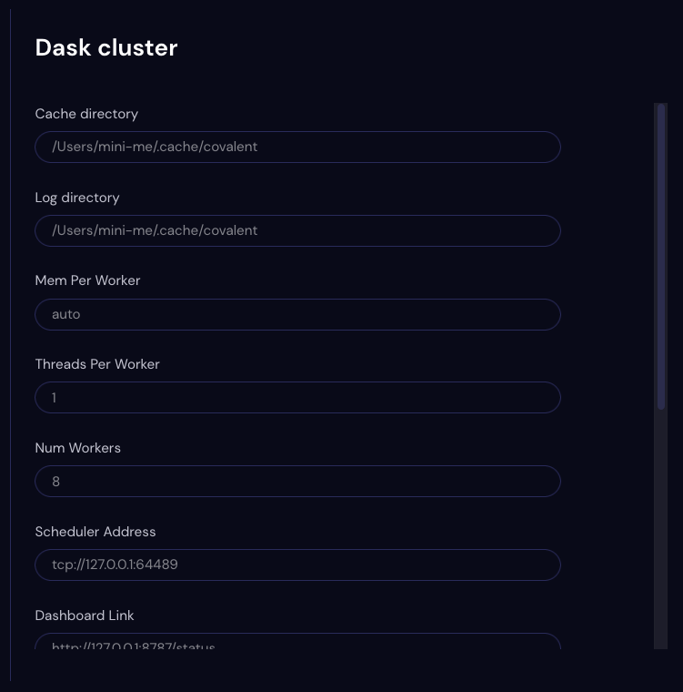

############
Dask Cluster
############

Use the Dask Cluster Settings page to view preferences for the Dask cluster that backs the Covalent default executor.

.. note:: If No Cluster is set to *True* in the :doc:`api` Settings page, then the Covalent server does not start the Dask cluster and instead uses the local executor as the default executor.

.. note:: The Dask Cluster settings are not editable.

In most cases there is no need to adjust the Dask configuration used with Covalent. If you need to modify the Dask cluster (or are just curious), see the `Dask documentation page <https://docs.dask.org/en/stable/index.html>`_.

Cache Directory
    The directory path that Dask uses for cacheing.
Log Directory
    The directory path of the Dask cluster logs.
Mem Per Worker
    The memory allocated per worker process ?? .
Threads Per Worker
    The number of threads allocated to each worker node in the Dask cluster.
Num Workers
    The number of workers in the Dask cluster.
Scheduler Address
    The IP address and port for the Dask scheduler.
Dashboard Link
    The URL of the Dask dashboard.
Process Info
    The name and parent process of the Dask cluster.
PID
    The process ID of the Dask cluster.
Admin Host
    The IP address of the Dask admin ??
Admin Port
    The port of the Dask admin ??
