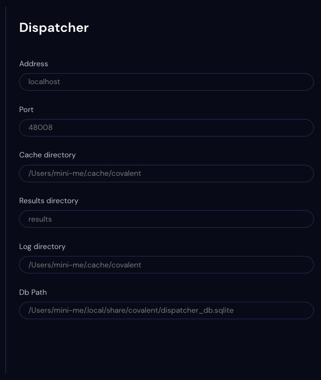

##########
Dispatcher
##########

Use the Dispatcher Settings page to view preferences for the Covalent workflow dispatcher service.

.. note:: The Dispatcher settings are not editable.

Address
    The IP address or name of the server on which the dispatcher is running, for example :code:`localhost`.
Port
    The port on which the dispatcher receives Covalent API calls. The default is port 48008 (this port also serves the Covalent GUI).
Cache Directory
    The directory used by the dispatcher to temporarily ?? cache  ??
Results Directory
    The name of the subdirectory, relative to a dispatch-specific directory in the execution directory, where the results of the dispatch are stored.
Log Directory
    Directory path of the dispatch log.
DB Path
    File path of the SQLite file containing the Covalent database.
